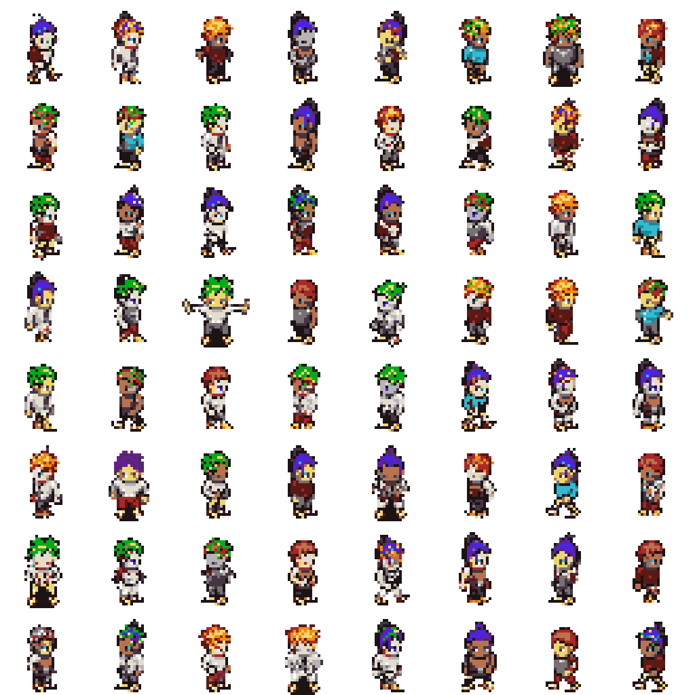
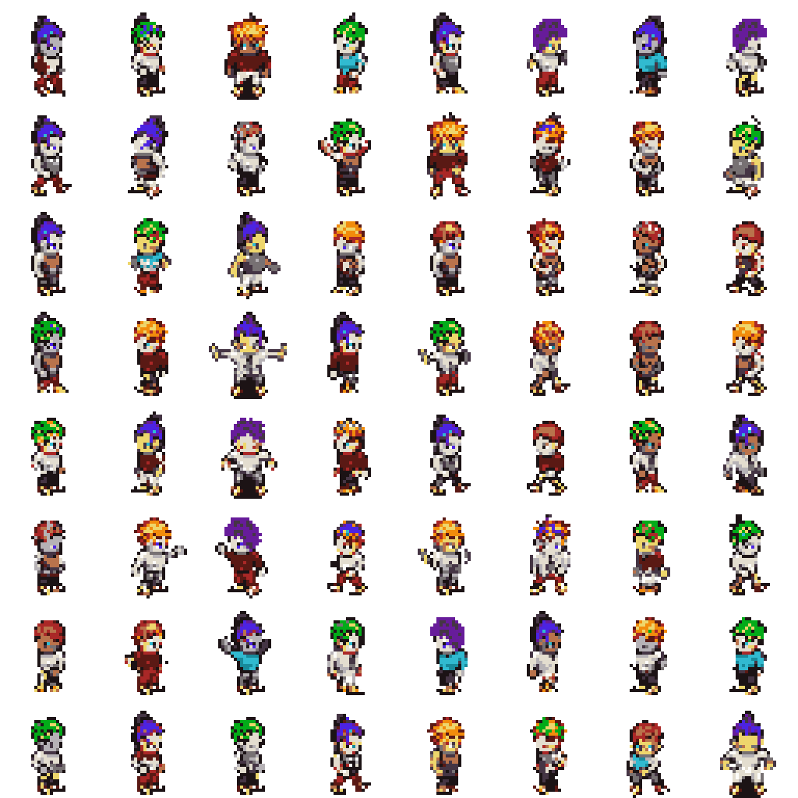
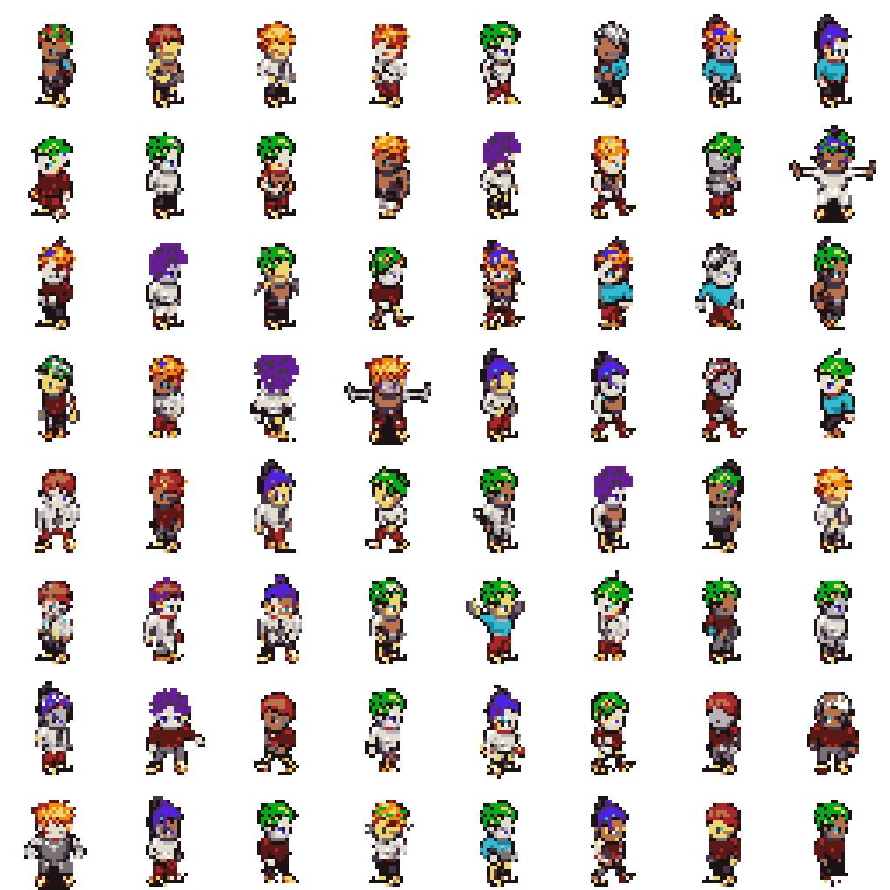
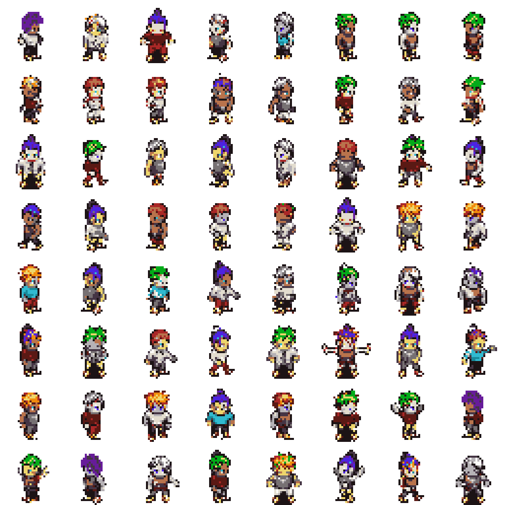
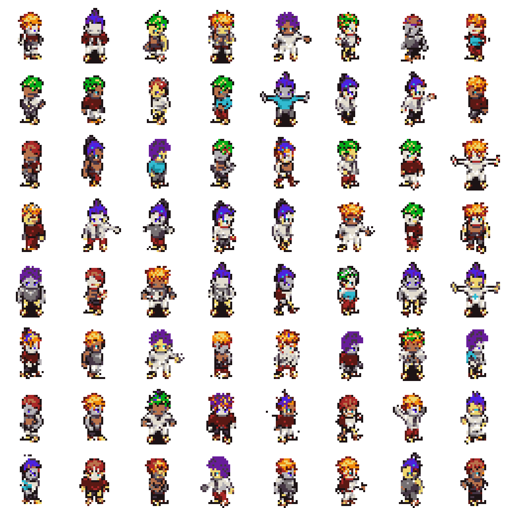
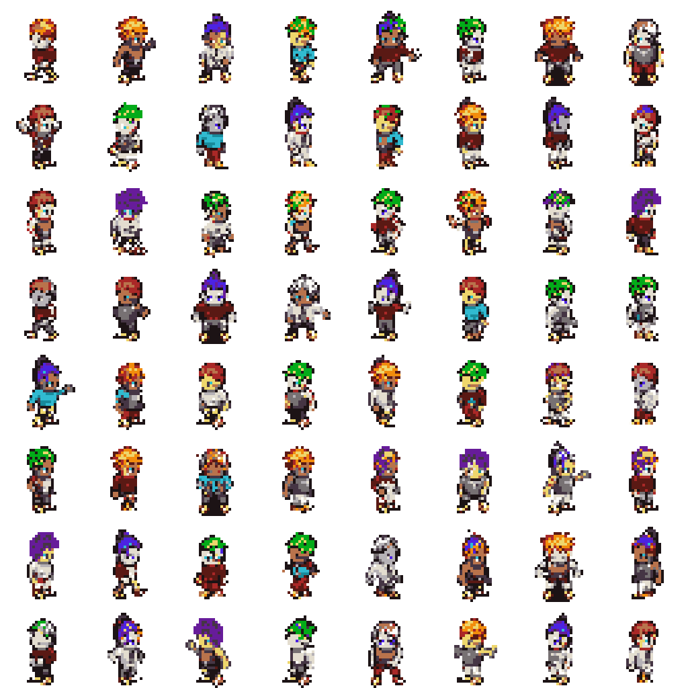
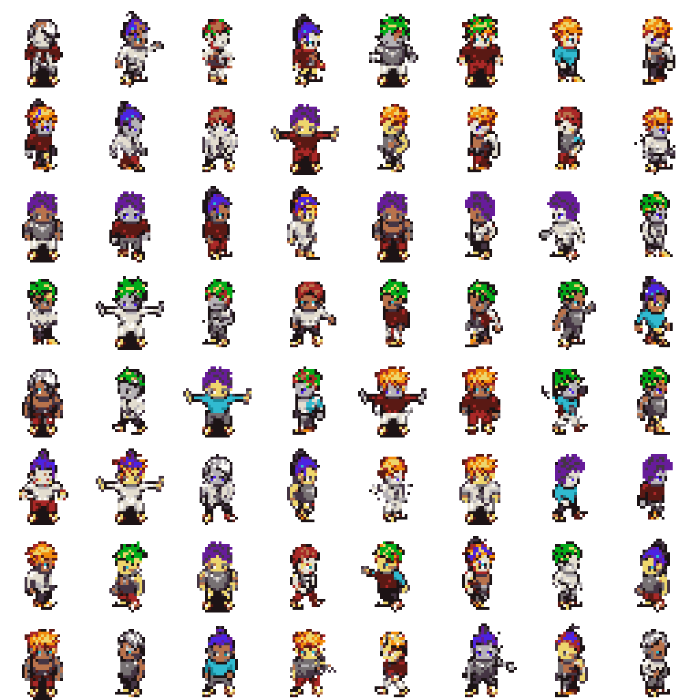
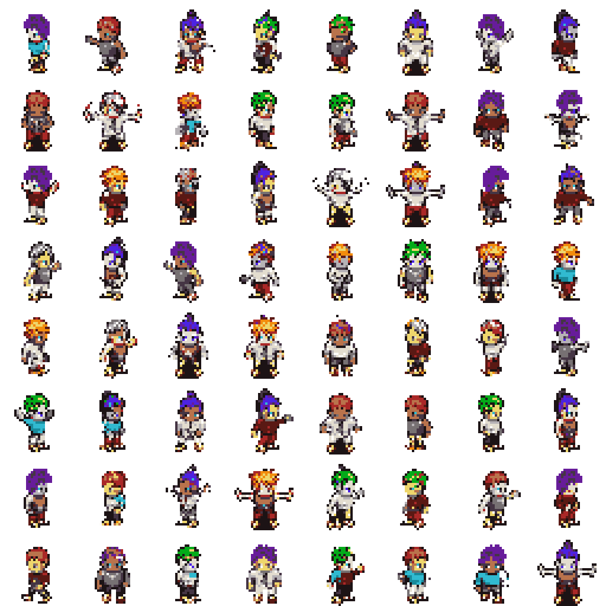
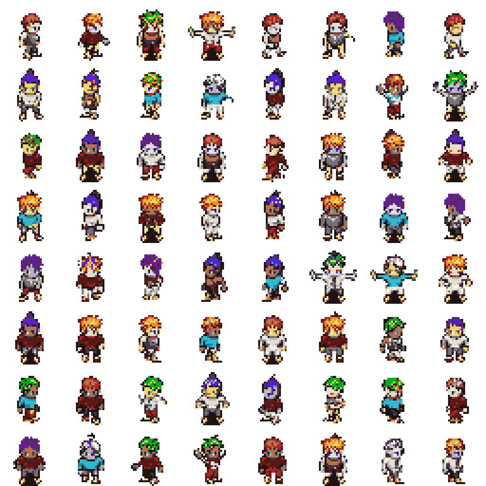

# PixelVAR Evaluation

This report evaluates generated HMAR Option B sprites against the validation split.
The FID-style score below is a lightweight Frechet distance over handcrafted
palette, transparency, silhouette, and edge features. It is not Inception FID.

## Reference Validation Summary

- Samples: `2048`
- Opaque ratio: `0.2354`
- Edge density: `0.1811`
- Palette consistency: `1.0000`

## Sweep Results

| Temp | Top-k | Feature FID | Palette consistency | Opaque ratio | Edge density |
| --- | --- | ---: | ---: | ---: | ---: |
| 0.8 | 8 | 0.00189 | 1.0000 | 0.2315 | 0.1833 |
| 1 | 8 | 0.00471 | 1.0000 | 0.2379 | 0.1888 |
| 1 | 16 | 0.00638 | 1.0000 | 0.2382 | 0.1870 |
| 0.8 | 16 | 0.00647 | 1.0000 | 0.2313 | 0.1831 |
| 1 | none | 0.00775 | 1.0000 | 0.2450 | 0.1923 |
| 0.8 | none | 0.00968 | 1.0000 | 0.2205 | 0.1755 |
| 0.6 | 16 | 0.00978 | 1.0000 | 0.2152 | 0.1728 |
| 0.6 | none | 0.01174 | 1.0000 | 0.2146 | 0.1725 |
| 0.6 | 8 | 0.01419 | 1.0000 | 0.2153 | 0.1738 |

## Best Setting

- Temperature: `0.8`
- Top-k: `8`
- Feature FID: `0.00189`

## Sample Grids

