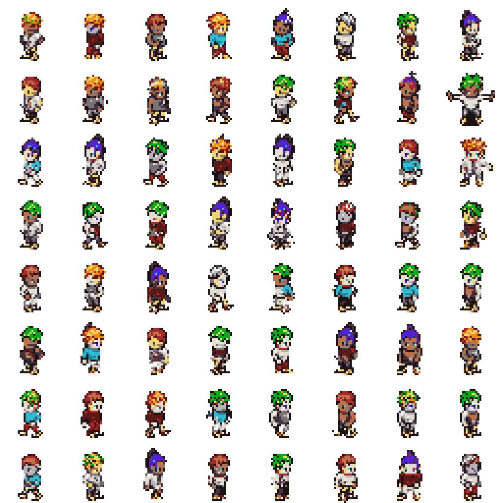
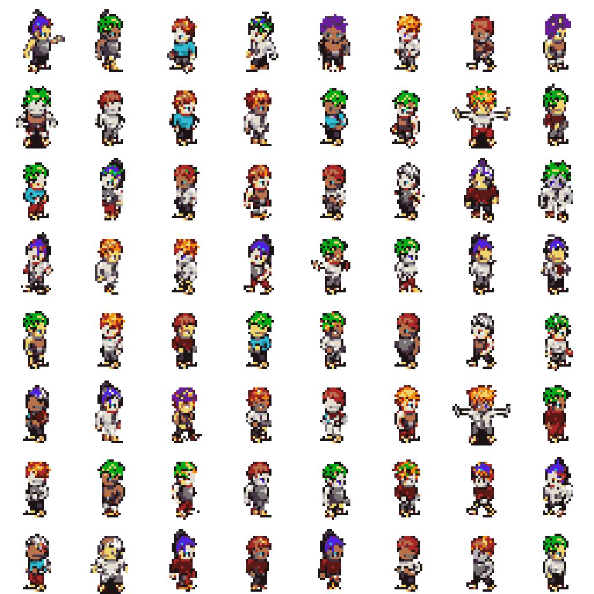
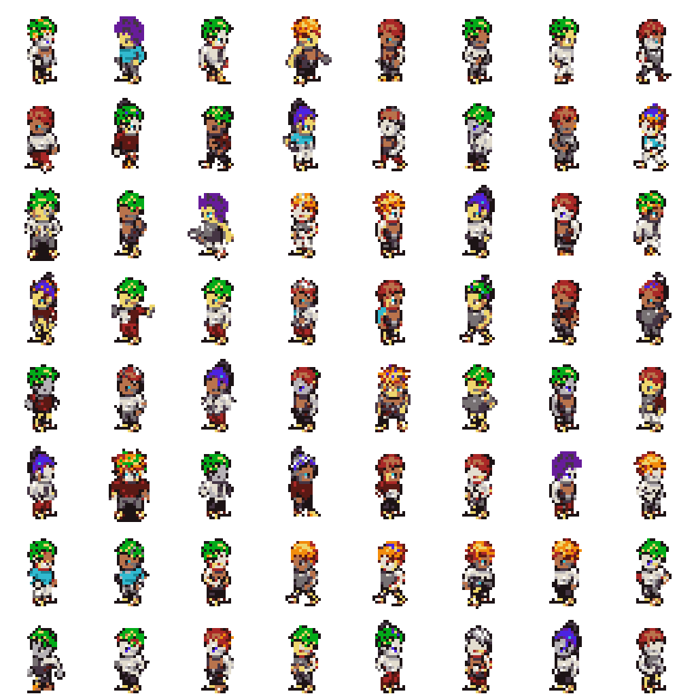
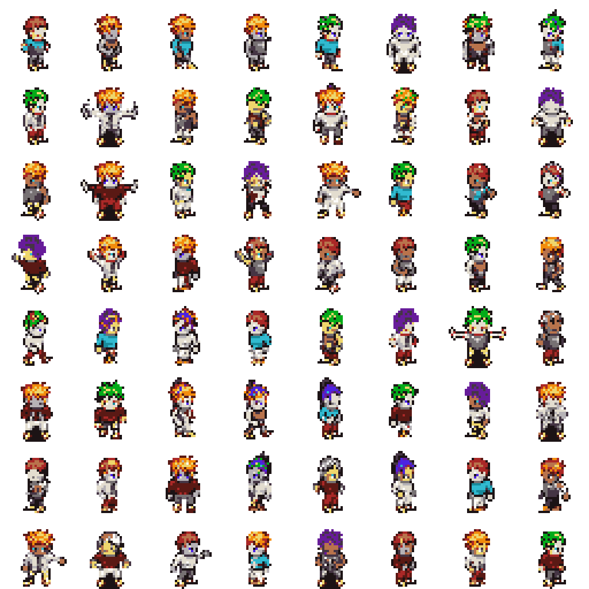
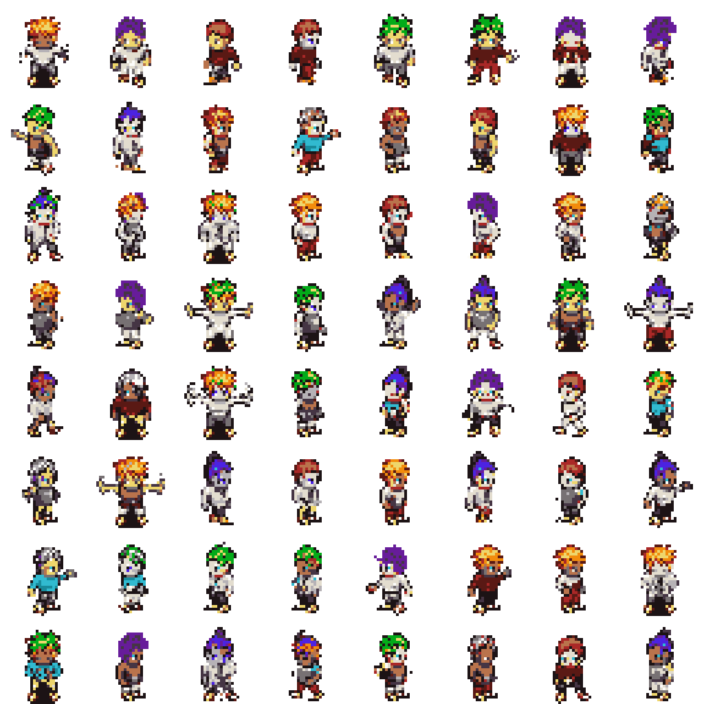
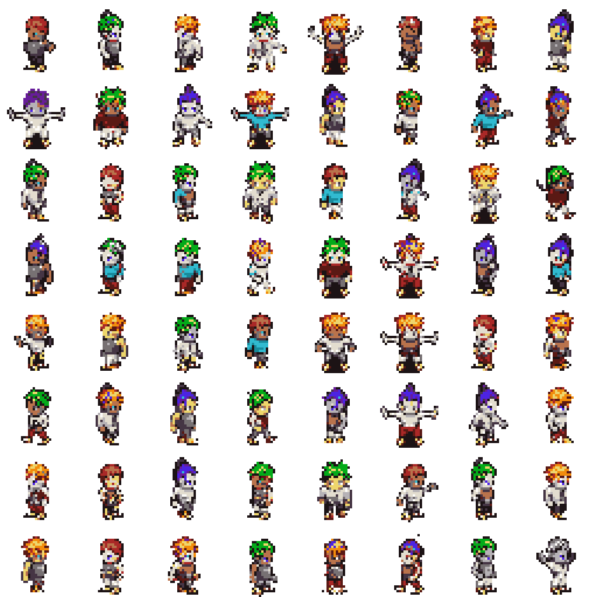
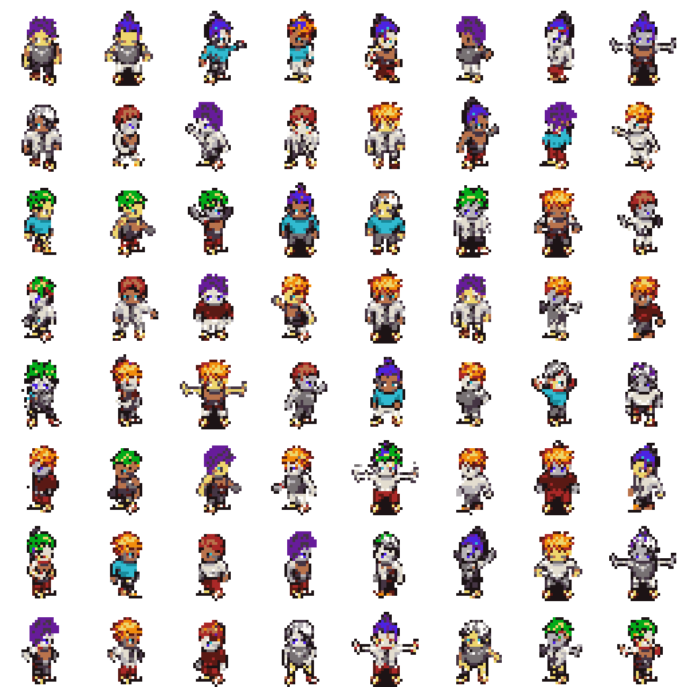
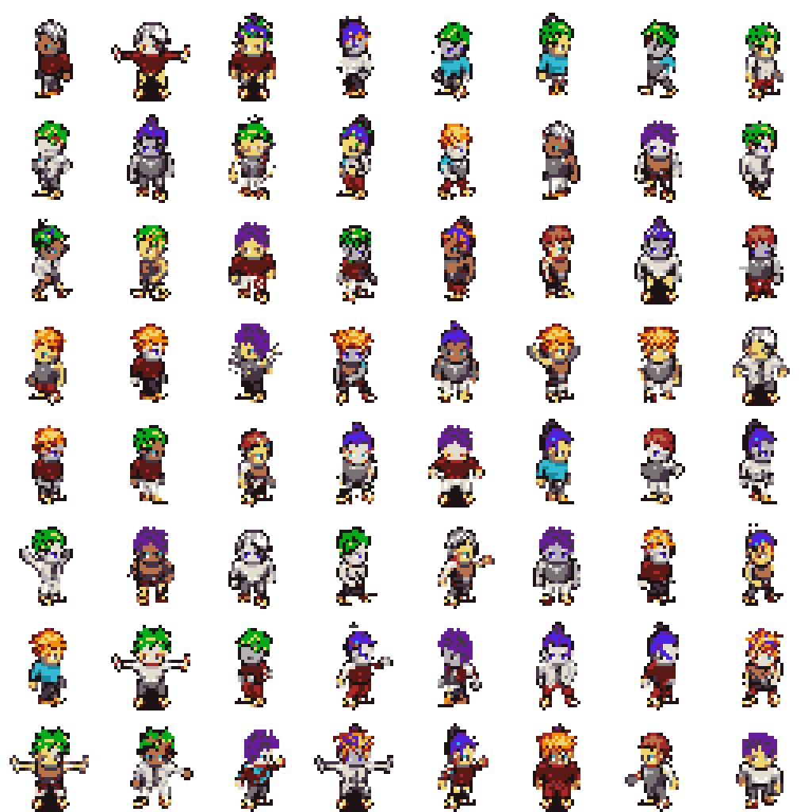
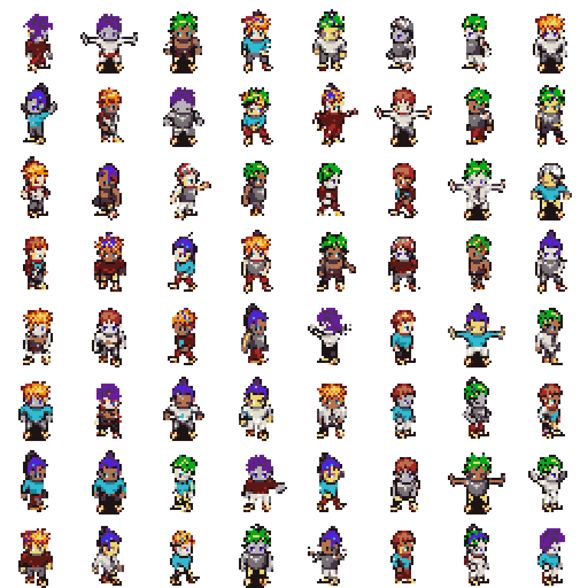

# PixelVAR Evaluation

This report evaluates generated HMAR Option B sprites against the validation split.
The FID-style score below is a lightweight Frechet distance over handcrafted
palette, transparency, silhouette, and edge features. It is not Inception FID.

## Reference Validation Summary

- Samples: `2048`
- Opaque ratio: `0.2354`
- Edge density: `0.1811`
- Palette consistency: `1.0000`

## Sweep Results

| Temp | Top-k | Feature FID | Palette consistency | Opaque ratio | Edge density |
| --- | --- | ---: | ---: | ---: | ---: |
| 0.8 | 16 | 0.00374 | 1.0000 | 0.2297 | 0.1831 |
| 1 | 16 | 0.00435 | 1.0000 | 0.2386 | 0.1892 |
| 1 | none | 0.00594 | 1.0000 | 0.2354 | 0.1884 |
| 1 | 8 | 0.00650 | 1.0000 | 0.2359 | 0.1864 |
| 0.8 | 8 | 0.00933 | 1.0000 | 0.2268 | 0.1813 |
| 0.8 | none | 0.00961 | 1.0000 | 0.2274 | 0.1831 |
| 0.6 | 16 | 0.01018 | 1.0000 | 0.2142 | 0.1713 |
| 0.6 | 8 | 0.01443 | 1.0000 | 0.2101 | 0.1692 |
| 0.6 | none | 0.01836 | 1.0000 | 0.2105 | 0.1688 |

## Best Setting

- Temperature: `0.8`
- Top-k: `16`
- Feature FID: `0.00374`

## Sample Grids

