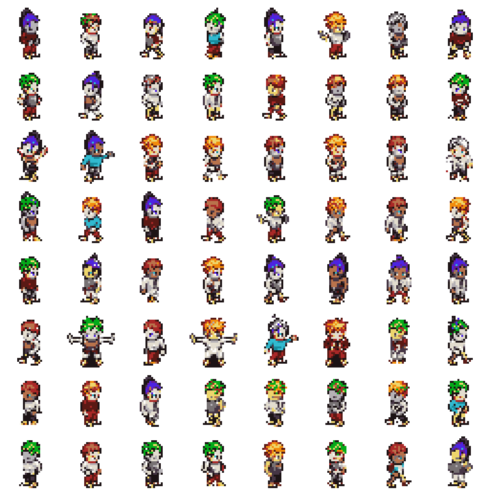
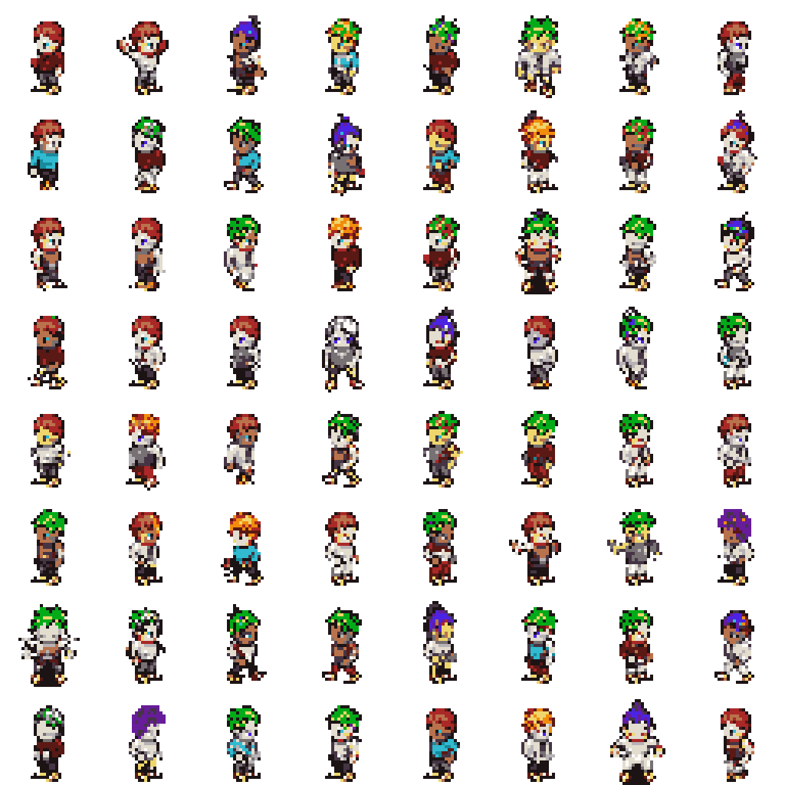
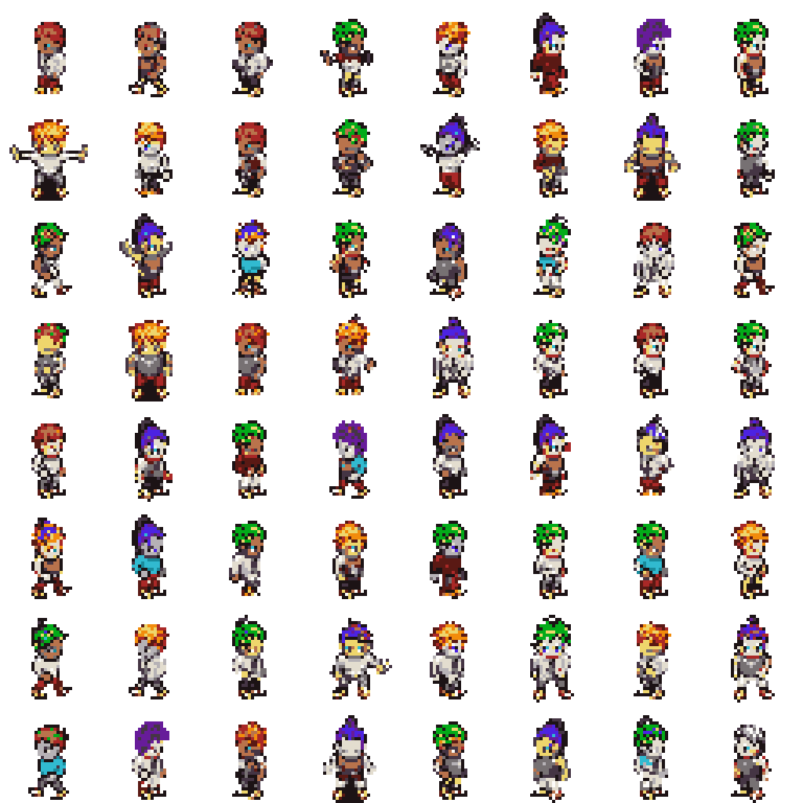
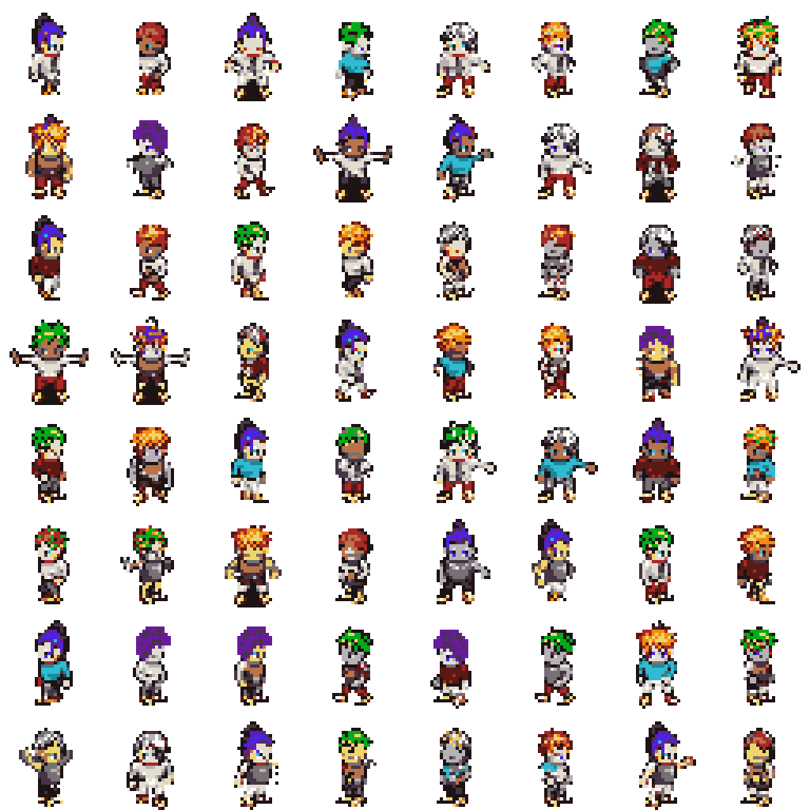
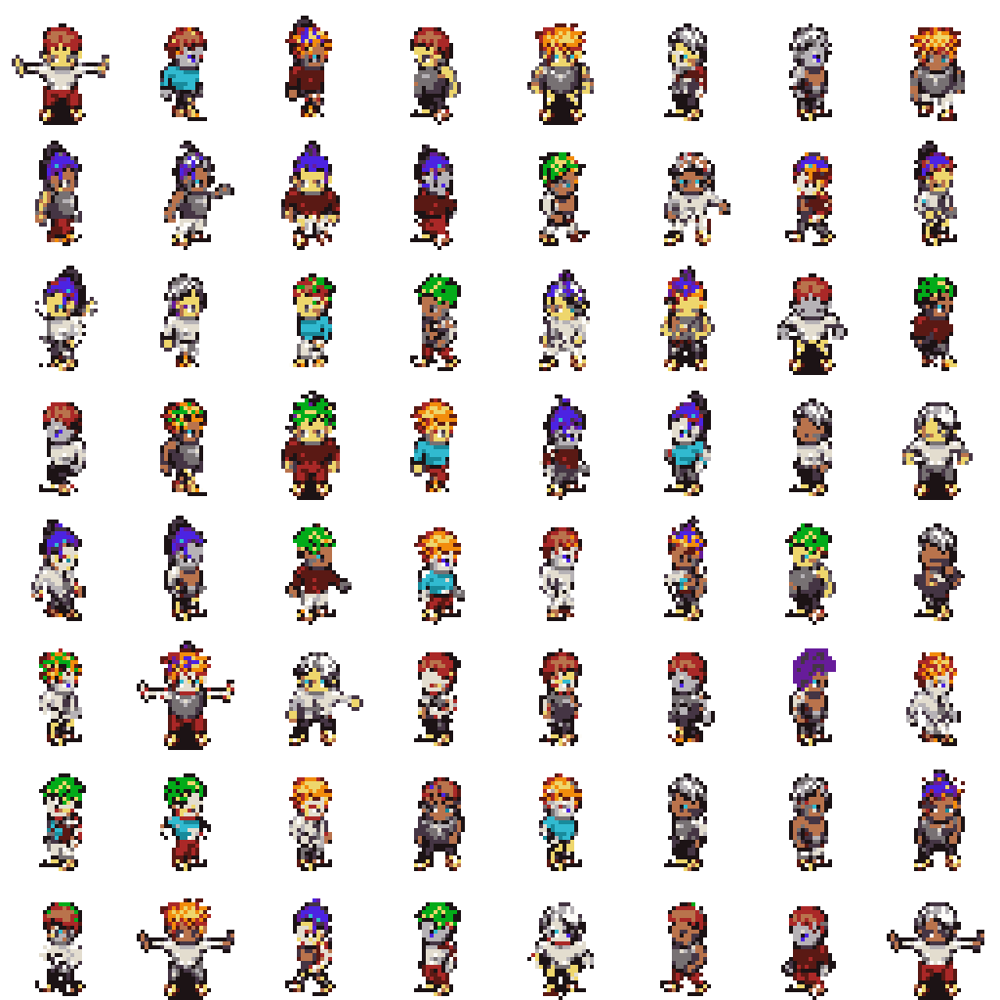
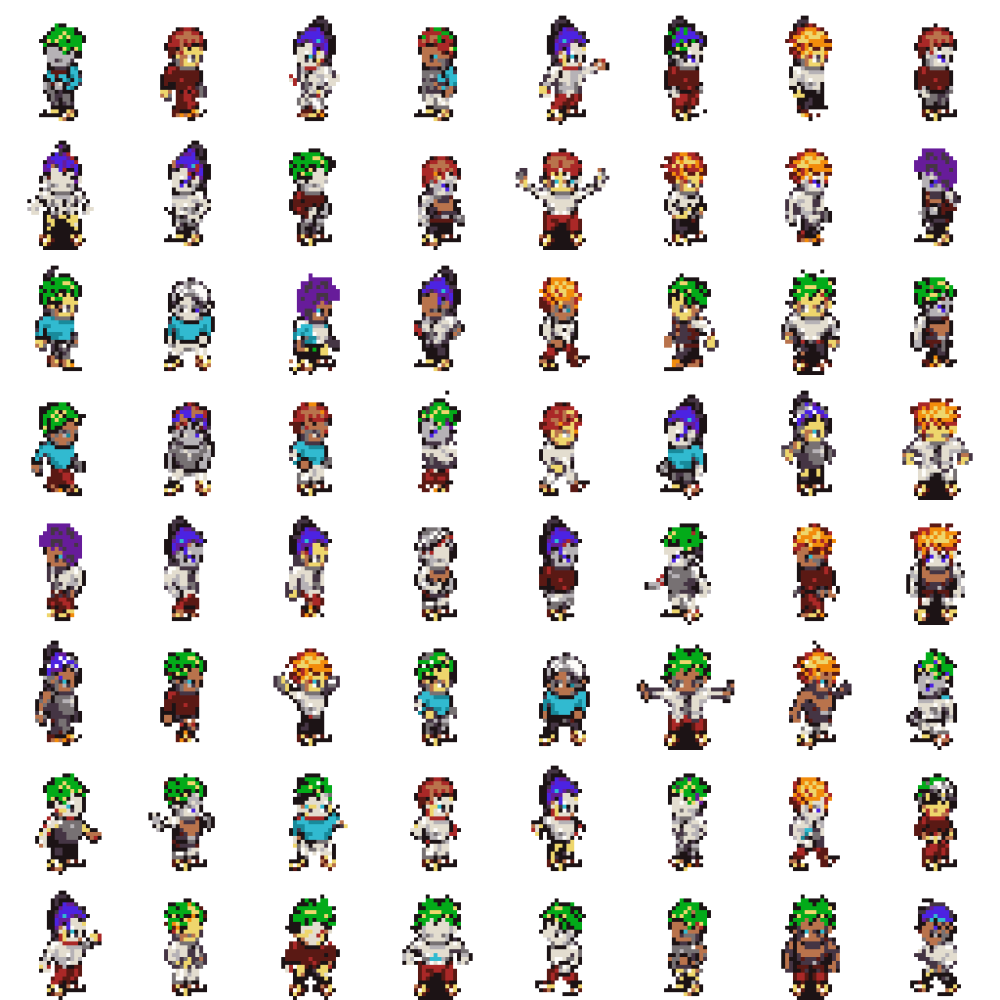
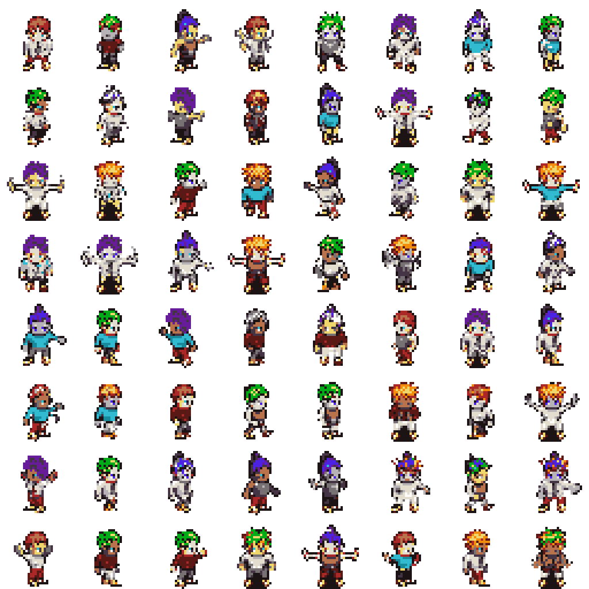
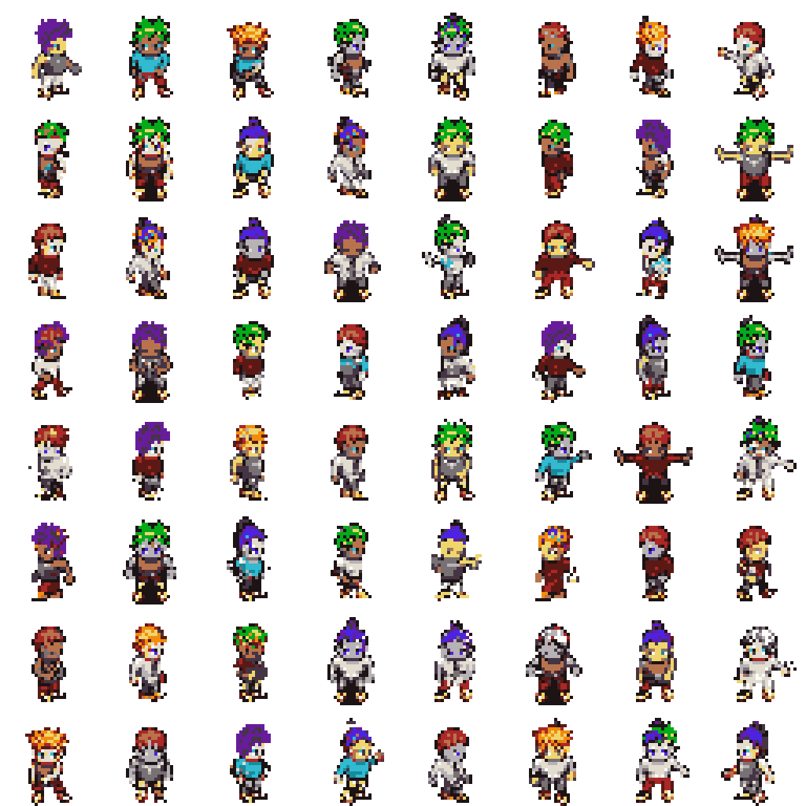
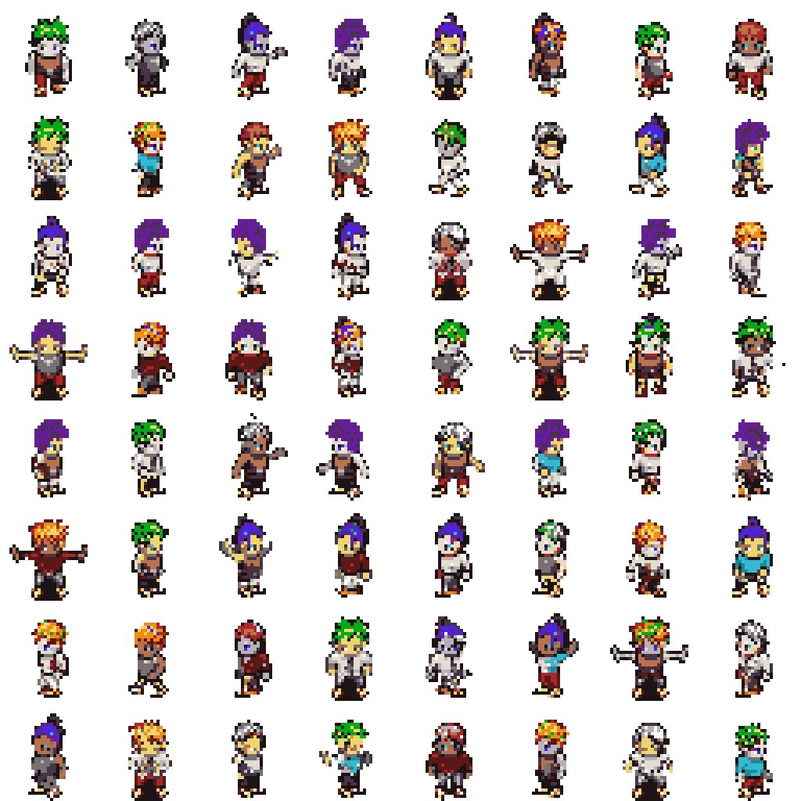

# PixelVAR Evaluation

This report evaluates generated HMAR Option B sprites against the validation split.
The FID-style score below is a lightweight Frechet distance over handcrafted
palette, transparency, silhouette, and edge features. It is not Inception FID.

## Reference Validation Summary

- Samples: `2048`
- Opaque ratio: `0.2354`
- Edge density: `0.1811`
- Palette consistency: `1.0000`

## Sweep Results

| Temp | Top-k | Feature FID | Palette consistency | Opaque ratio | Edge density |
| --- | --- | ---: | ---: | ---: | ---: |
| 0.8 | 16 | 0.00366 | 1.0000 | 0.2264 | 0.1823 |
| 1 | 16 | 0.00472 | 1.0000 | 0.2378 | 0.1885 |
| 1 | none | 0.00490 | 1.0000 | 0.2369 | 0.1891 |
| 0.8 | none | 0.00575 | 1.0000 | 0.2254 | 0.1783 |
| 0.8 | 8 | 0.00751 | 1.0000 | 0.2305 | 0.1852 |
| 1 | 8 | 0.00865 | 1.0000 | 0.2395 | 0.1912 |
| 0.6 | none | 0.01200 | 1.0000 | 0.2153 | 0.1728 |
| 0.6 | 16 | 0.01295 | 1.0000 | 0.2130 | 0.1710 |
| 0.6 | 8 | 0.01324 | 1.0000 | 0.2135 | 0.1724 |

## Best Setting

- Temperature: `0.8`
- Top-k: `16`
- Feature FID: `0.00366`

## Sample Grids

