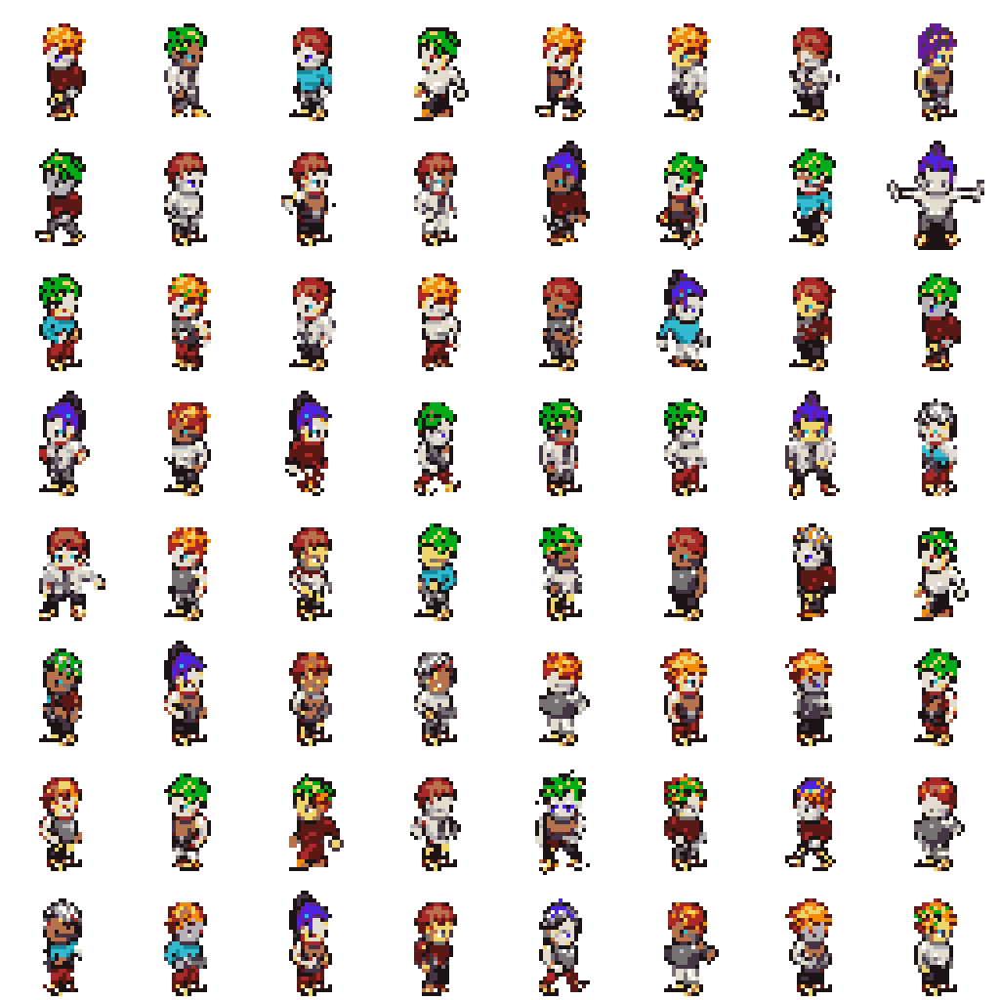
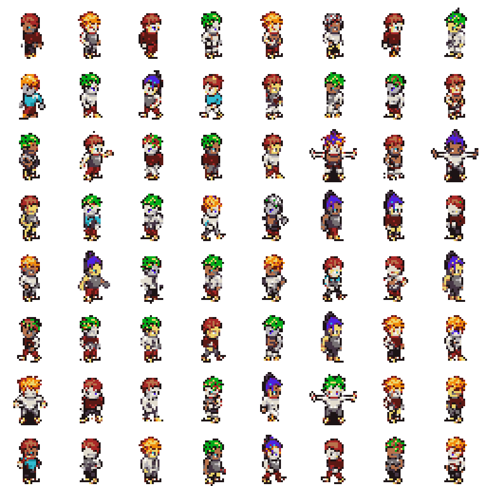
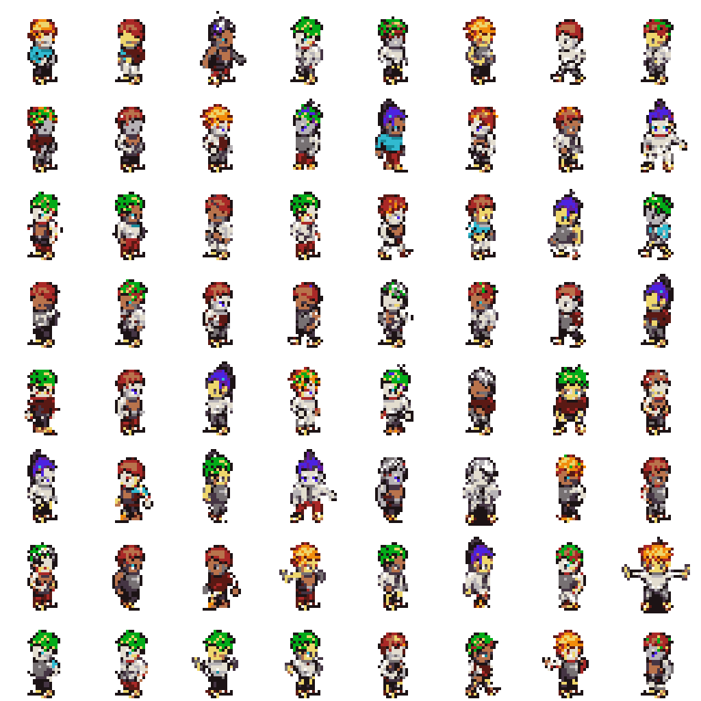
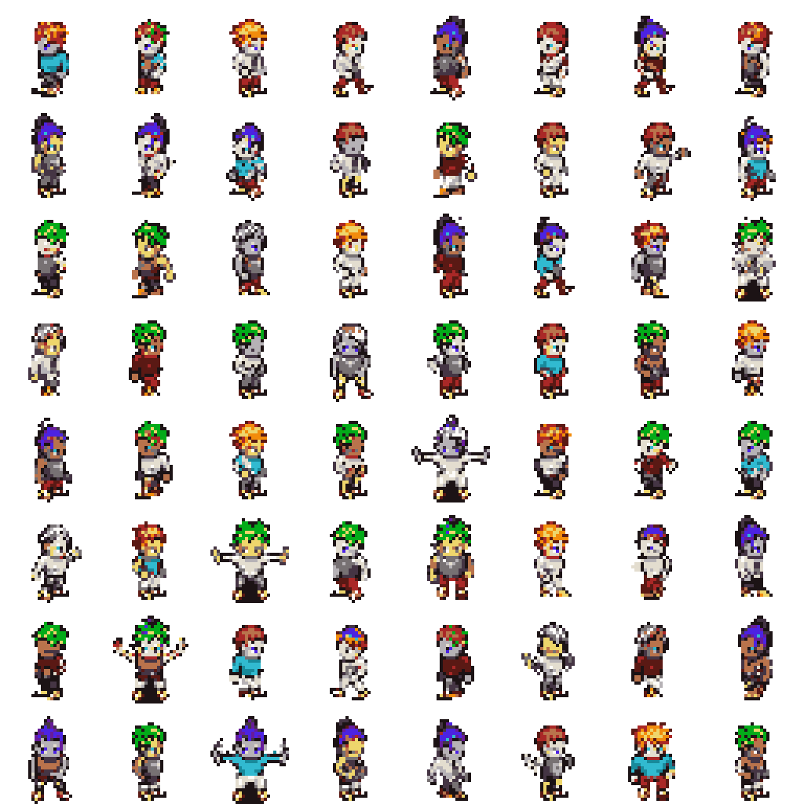
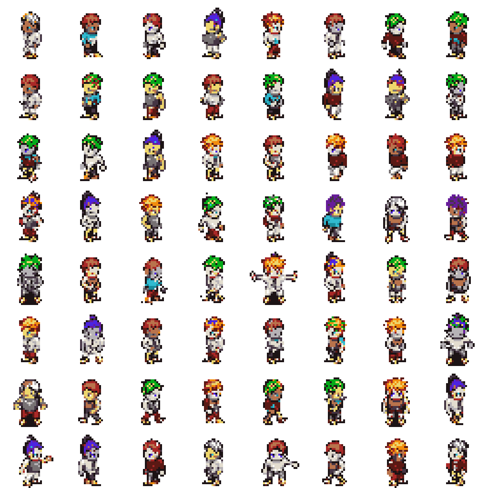
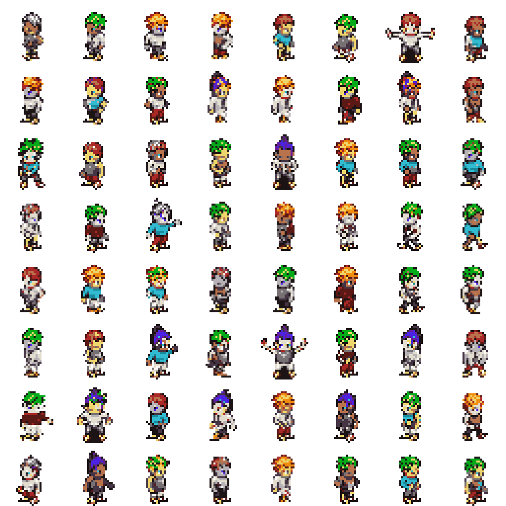
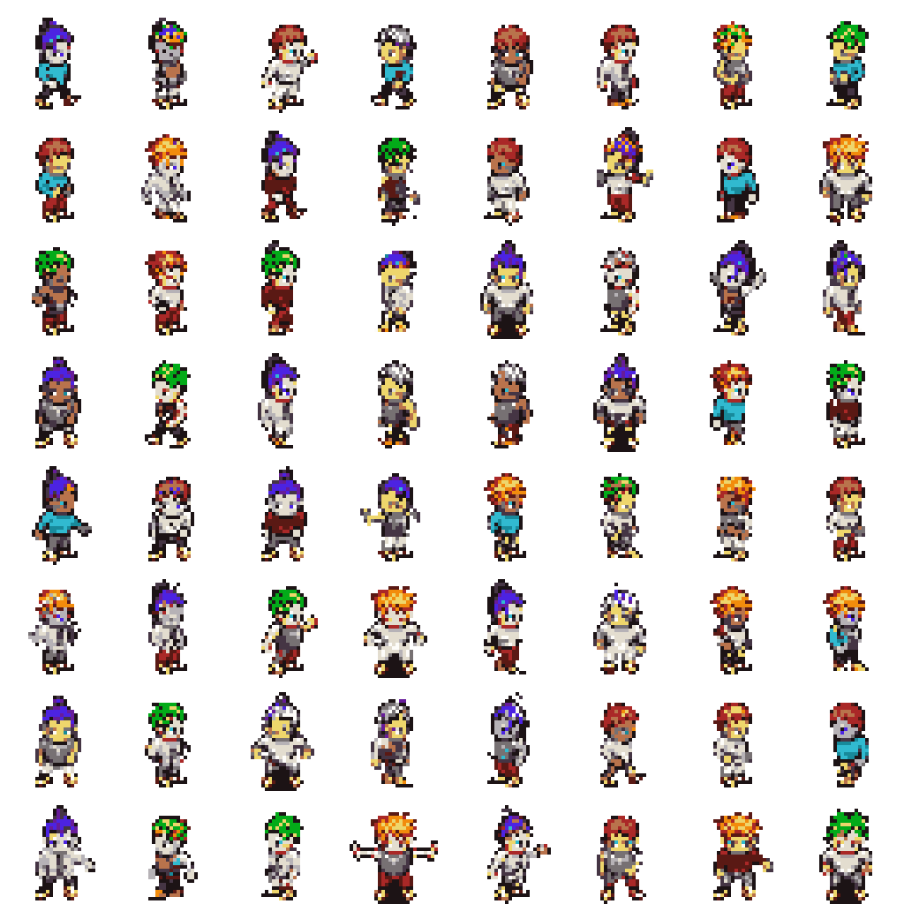
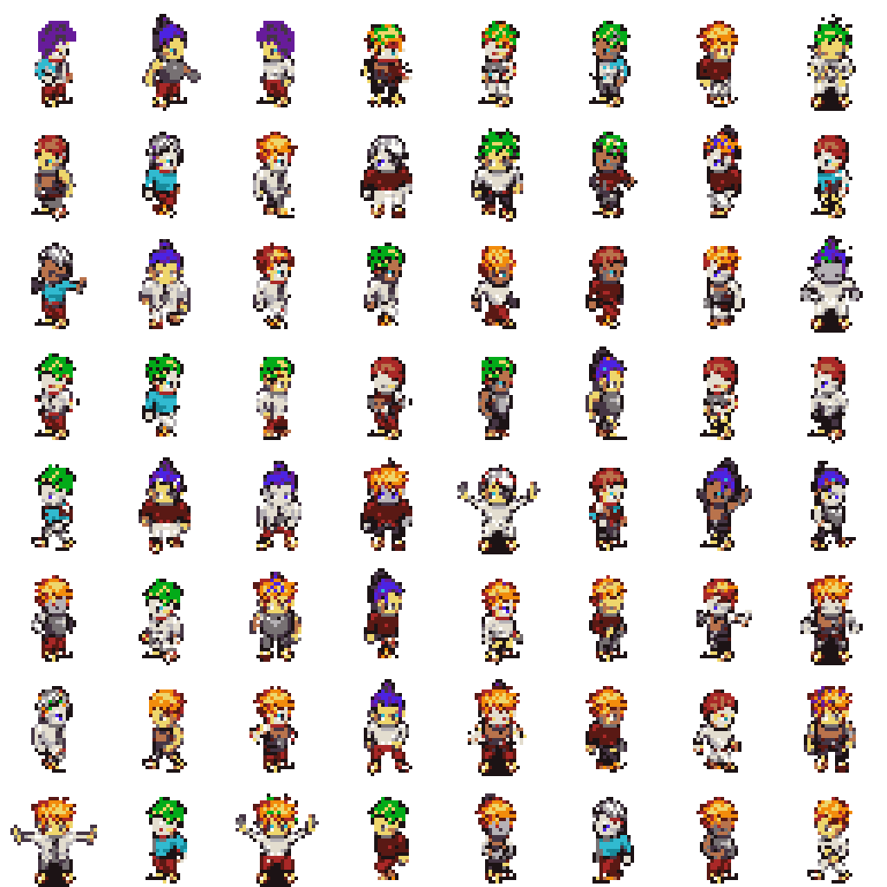
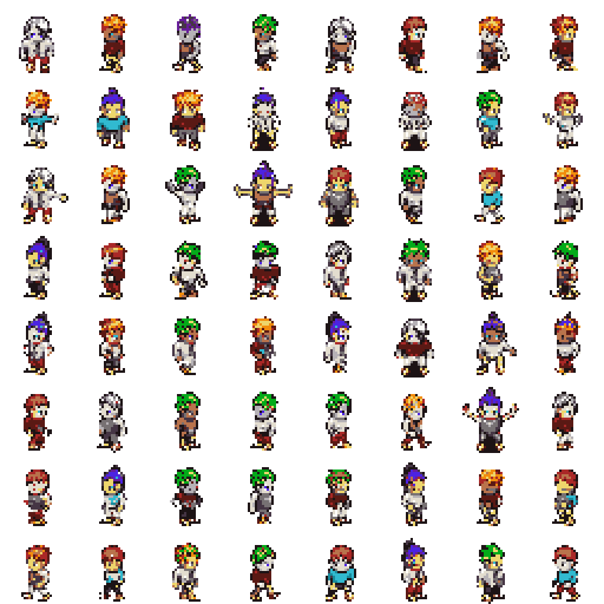

# PixelVAR Evaluation

This report evaluates generated HMAR Option B sprites against the validation split.
The FID-style score below is a lightweight Frechet distance over handcrafted
palette, transparency, silhouette, and edge features. It is not Inception FID.

## Reference Validation Summary

- Samples: `2048`
- Opaque ratio: `0.2354`
- Edge density: `0.1811`
- Palette consistency: `1.0000`

## Sweep Results

| Temp | Top-k | Feature FID | Palette consistency | Opaque ratio | Edge density |
| --- | --- | ---: | ---: | ---: | ---: |
| 1 | none | 0.00822 | 1.0000 | 0.2191 | 0.1747 |
| 1 | 8 | 0.00840 | 1.0000 | 0.2266 | 0.1830 |
| 0.8 | 16 | 0.01136 | 1.0000 | 0.2185 | 0.1762 |
| 0.8 | none | 0.01267 | 1.0000 | 0.2165 | 0.1745 |
| 0.8 | 8 | 0.01272 | 1.0000 | 0.2206 | 0.1781 |
| 1 | 16 | 0.01278 | 1.0000 | 0.2226 | 0.1796 |
| 0.6 | none | 0.01322 | 1.0000 | 0.2118 | 0.1711 |
| 0.6 | 16 | 0.01432 | 1.0000 | 0.2104 | 0.1704 |
| 0.6 | 8 | 0.02329 | 1.0000 | 0.2088 | 0.1688 |

## Best Setting

- Temperature: `1`
- Top-k: `none`
- Feature FID: `0.00822`

## Sample Grids

