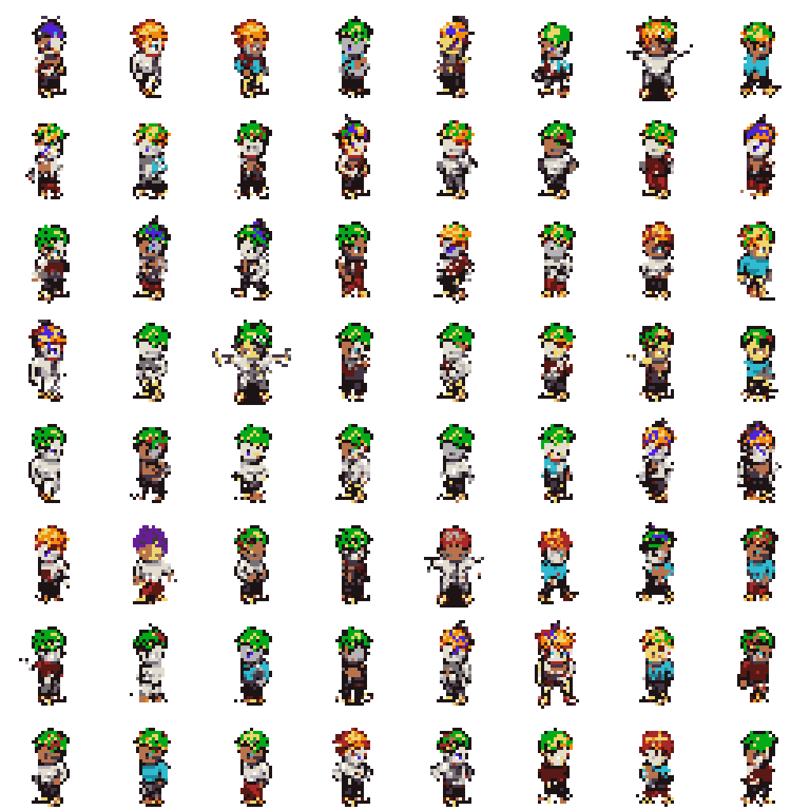
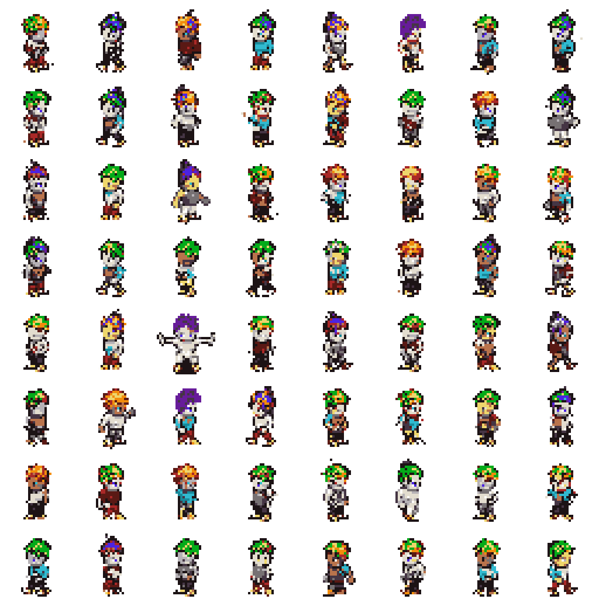
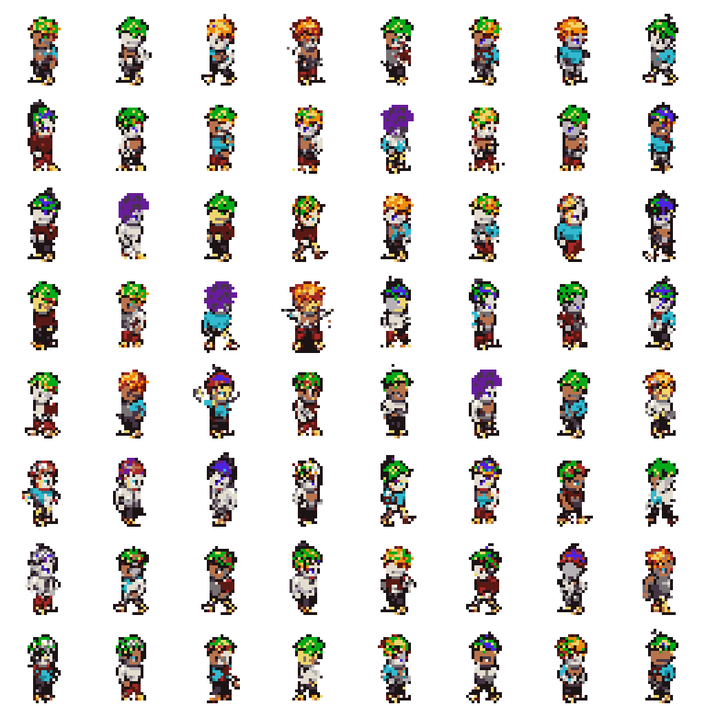
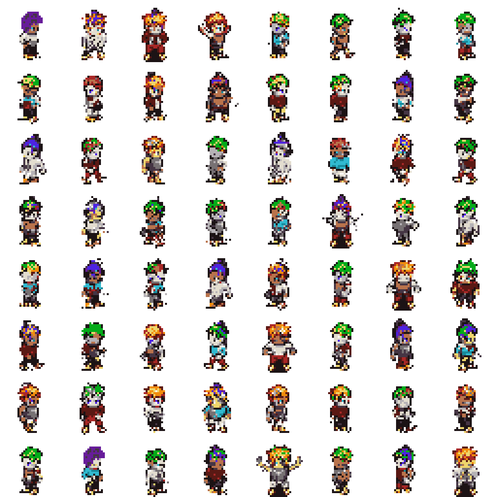
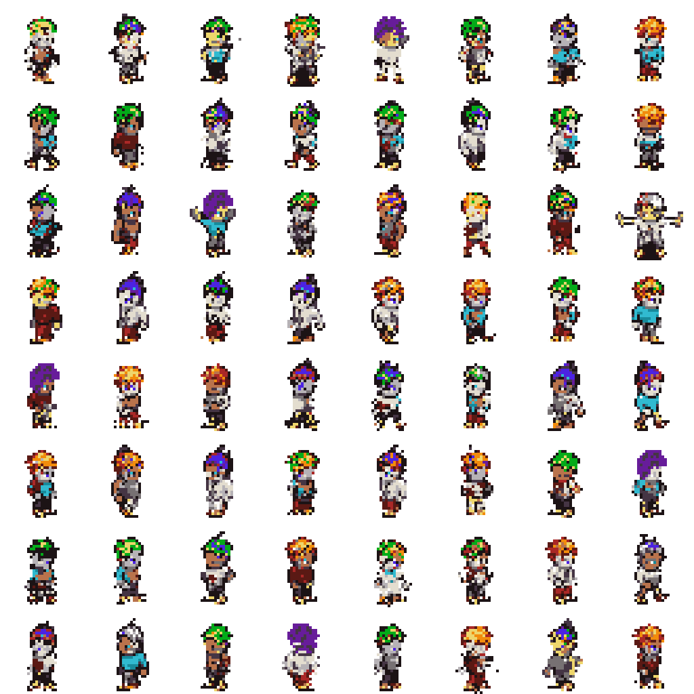
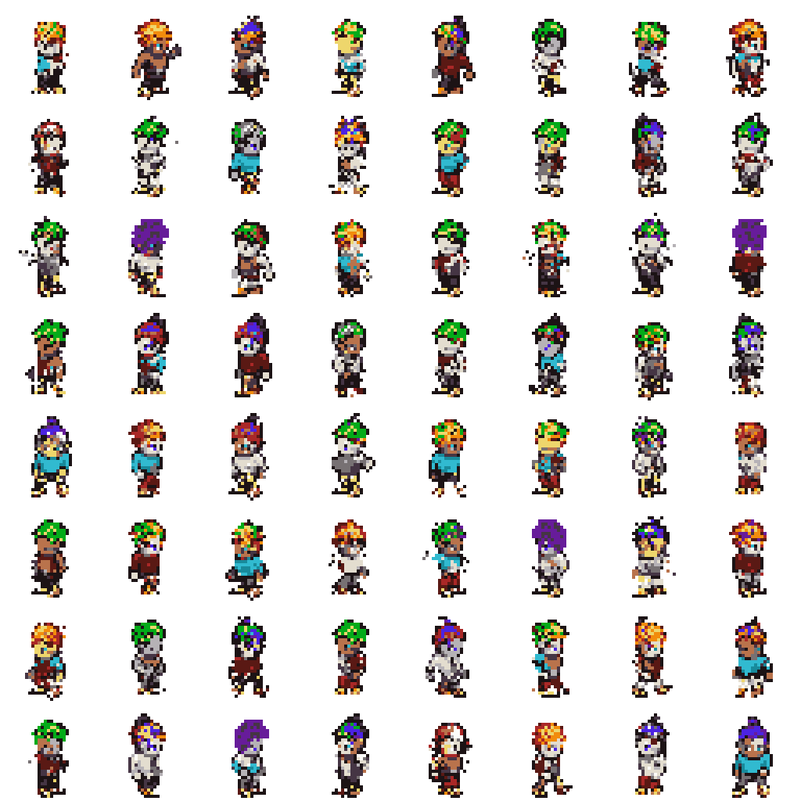
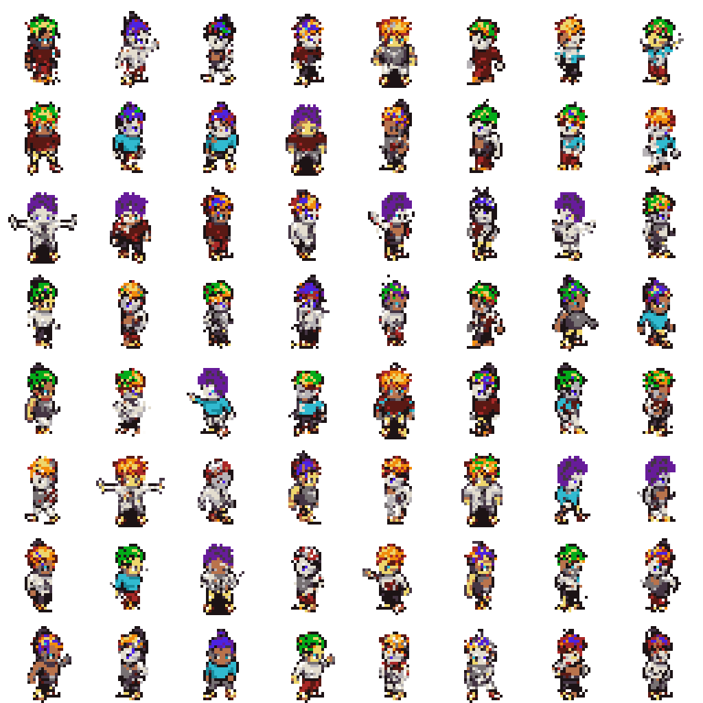
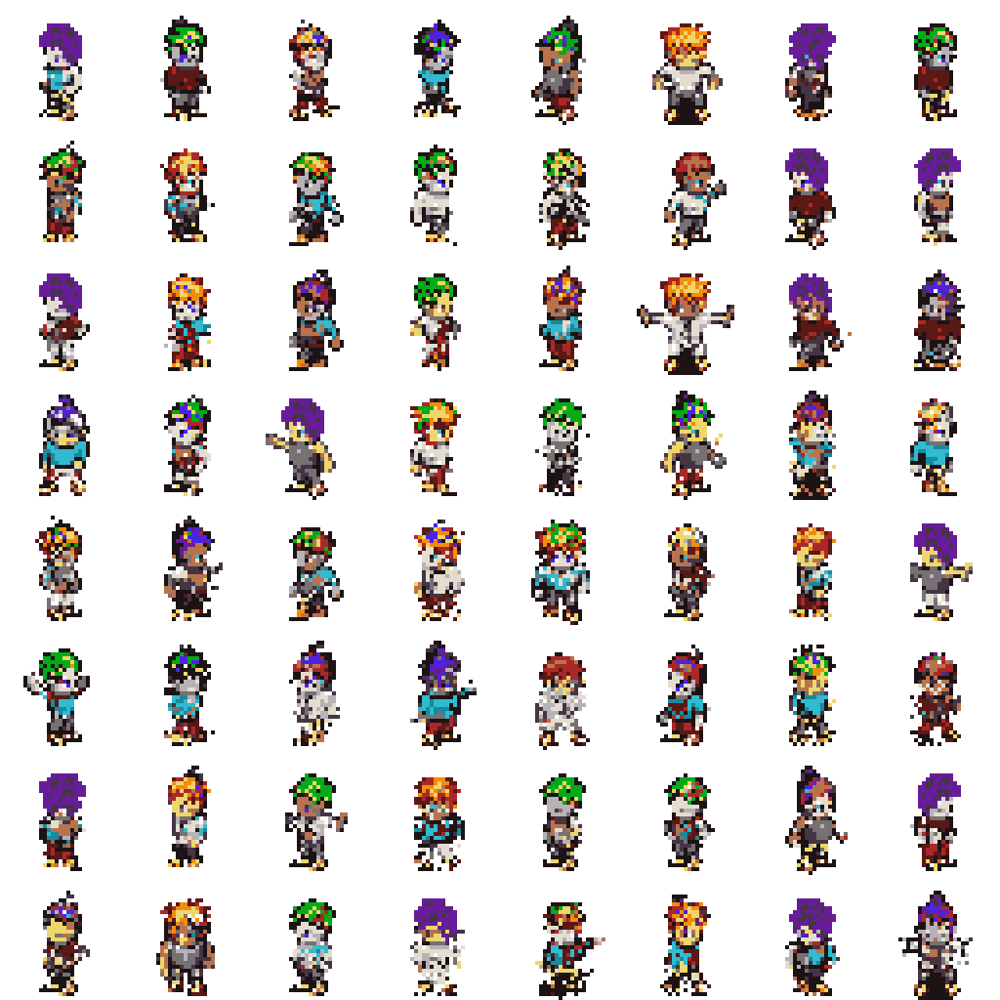
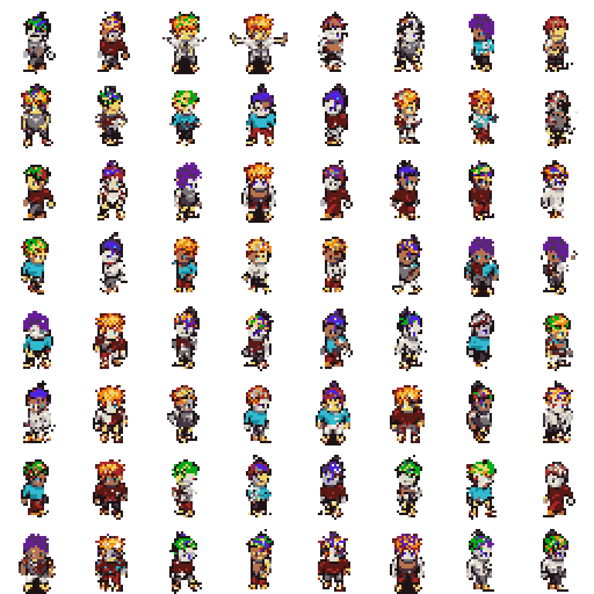

# Option A Evaluation

This report evaluates generated Option A sprites against the validation split.
The FID-style score below is a lightweight Frechet distance over handcrafted
palette, transparency, silhouette, and edge features. It is not Inception FID.

## Reference Validation Summary

- Samples: `2048`
- Opaque ratio: `0.2241`
- Edge density: `0.1772`
- Palette consistency: `1.0000`

## Sweep Results

| Temp | Top-k | Feature FID | Palette consistency | Opaque ratio | Edge density |
| --- | --- | ---: | ---: | ---: | ---: |
| 0.8 | 8 | 0.00157 | 1.0000 | 0.2181 | 0.1761 |
| 0.8 | 16 | 0.00394 | 1.0000 | 0.2157 | 0.1748 |
| 0.6 | 8 | 0.00482 | 1.0000 | 0.2082 | 0.1674 |
| 0.6 | 16 | 0.00673 | 1.0000 | 0.2052 | 0.1662 |
| 0.6 | none | 0.00835 | 1.0000 | 0.2080 | 0.1684 |
| 0.8 | none | 0.00977 | 1.0000 | 0.2097 | 0.1719 |
| 1 | 16 | 0.01473 | 1.0000 | 0.2277 | 0.1871 |
| 1 | 8 | 0.01510 | 1.0000 | 0.2235 | 0.1837 |
| 1 | none | 0.01690 | 1.0000 | 0.2291 | 0.1879 |

## Best Setting

- Temperature: `0.8`
- Top-k: `8`
- Feature FID: `0.00157`

## Sample Grids

