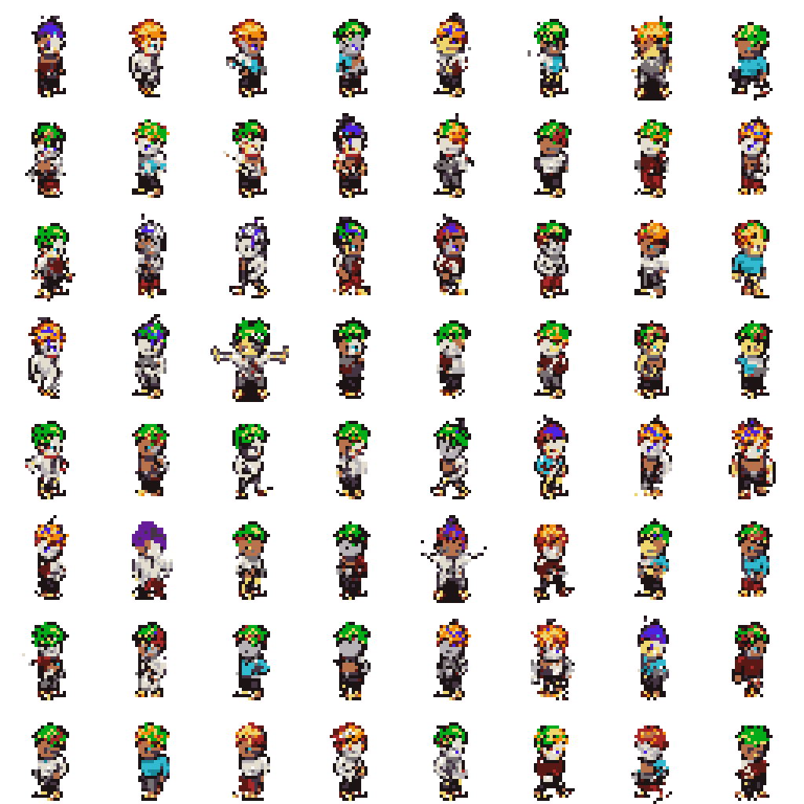
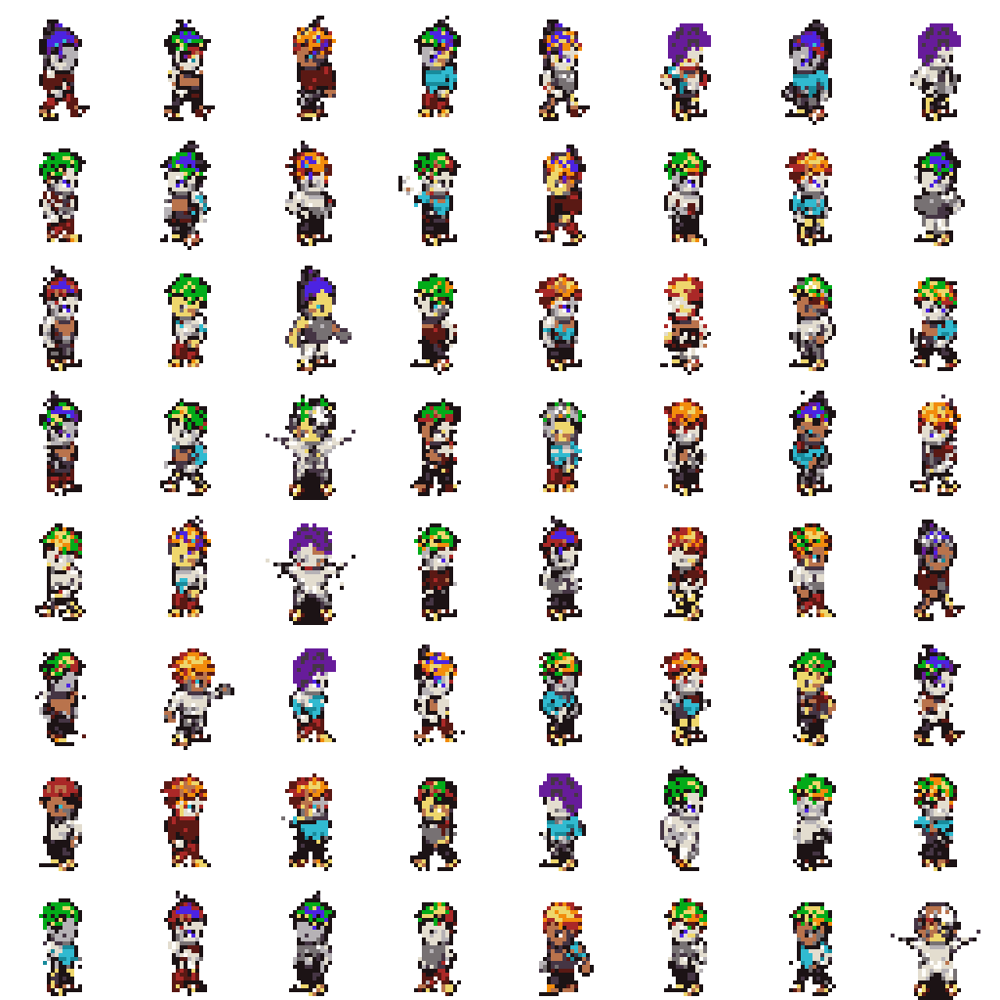
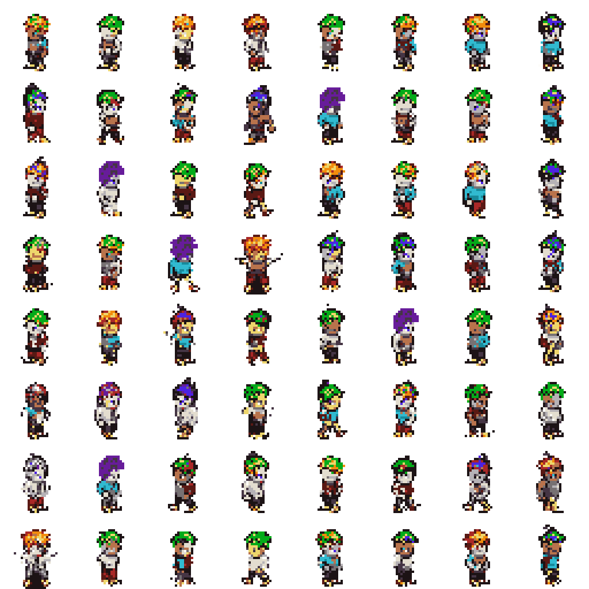
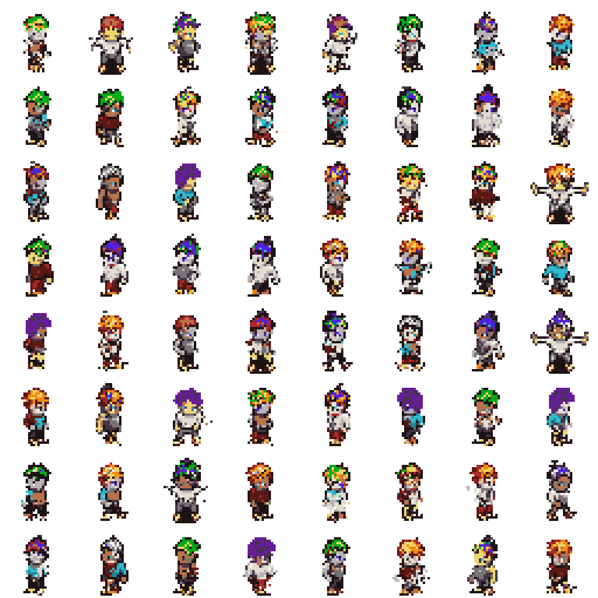
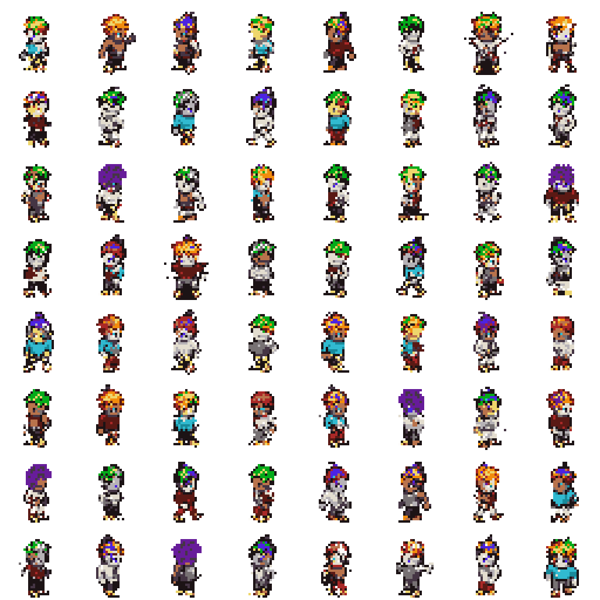
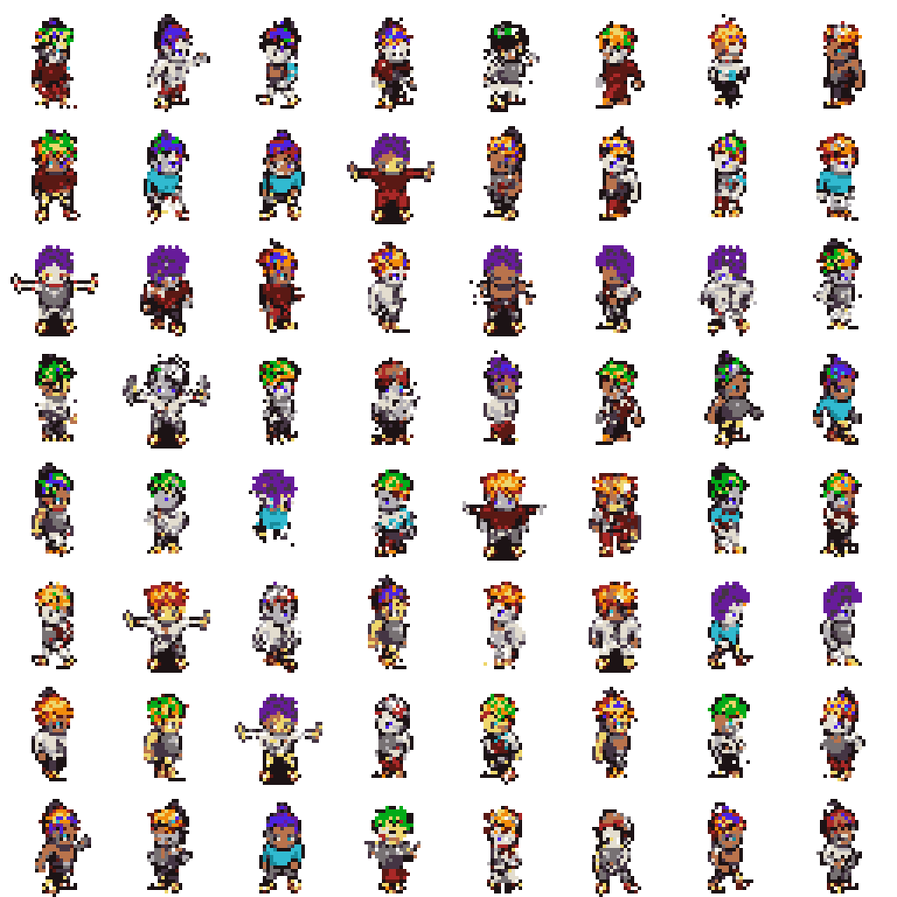
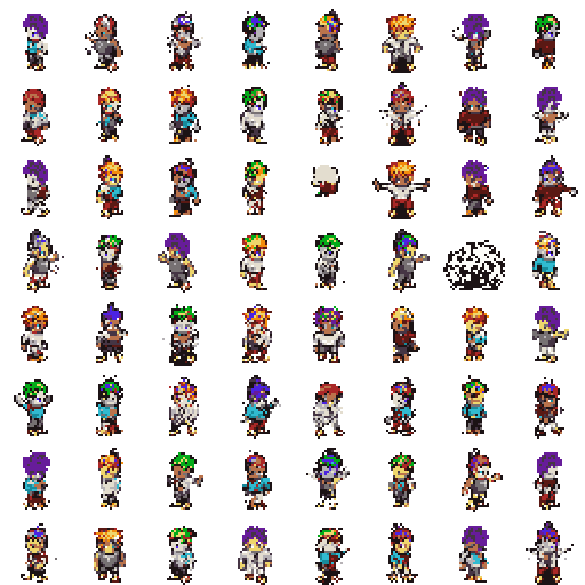
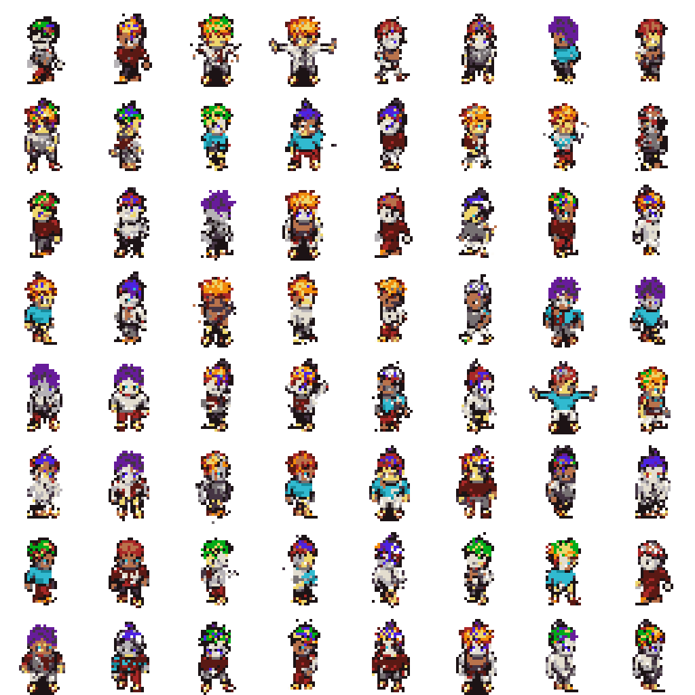

# Option A Evaluation

This report evaluates generated Option A sprites against the validation split.
The FID-style score below is a lightweight Frechet distance over handcrafted
palette, transparency, silhouette, and edge features. It is not Inception FID.

## Reference Validation Summary

- Samples: `2048`
- Opaque ratio: `0.2354`
- Edge density: `0.1811`
- Palette consistency: `1.0000`

## Sweep Results

| Temp | Top-k | Feature FID | Palette consistency | Opaque ratio | Edge density |
| --- | --- | ---: | ---: | ---: | ---: |
| 0.8 | 8 | 0.00778 | 1.0000 | 0.2200 | 0.1777 |
| 0.8 | 16 | 0.01234 | 1.0000 | 0.2202 | 0.1779 |
| 1 | 8 | 0.01629 | 1.0000 | 0.2287 | 0.1880 |
| 0.6 | 8 | 0.01652 | 1.0000 | 0.2094 | 0.1691 |
| 0.6 | 16 | 0.01689 | 1.0000 | 0.2087 | 0.1688 |
| 1 | 16 | 0.02012 | 1.0000 | 0.2318 | 0.1889 |
| 0.6 | none | 0.02145 | 1.0000 | 0.2081 | 0.1666 |
| 0.8 | none | 0.02284 | 1.0000 | 0.2122 | 0.1728 |
| 1 | none | 0.02584 | 1.0000 | 0.2358 | 0.1932 |

## Best Setting

- Temperature: `0.8`
- Top-k: `8`
- Feature FID: `0.00778`

## Sample Grids

