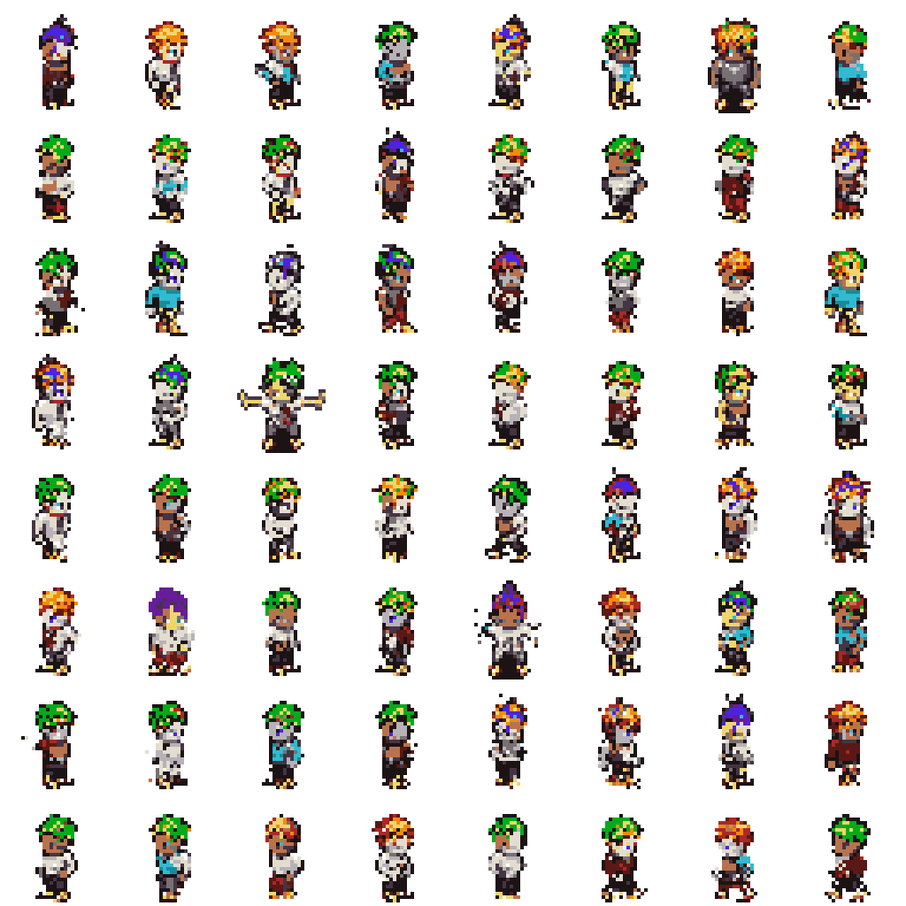
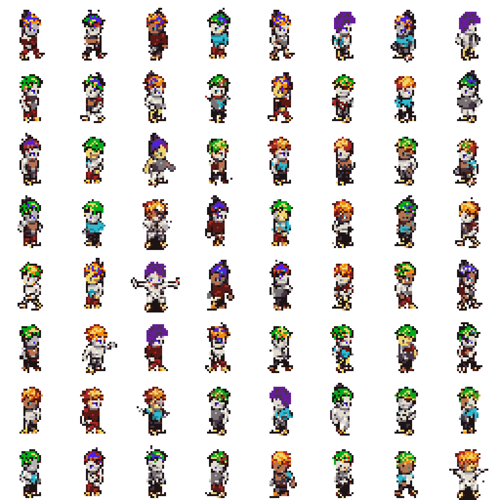
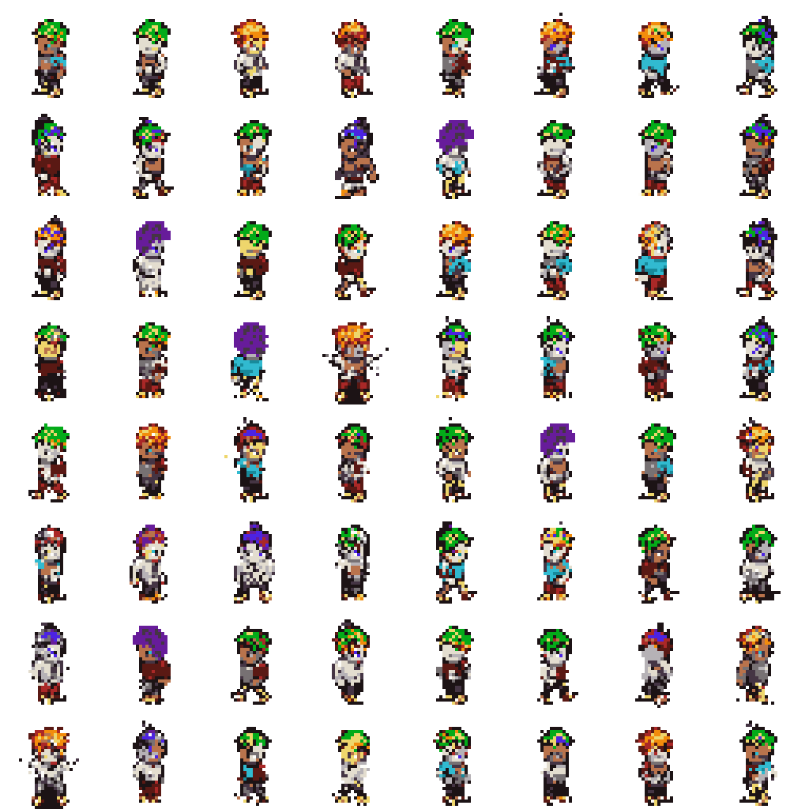
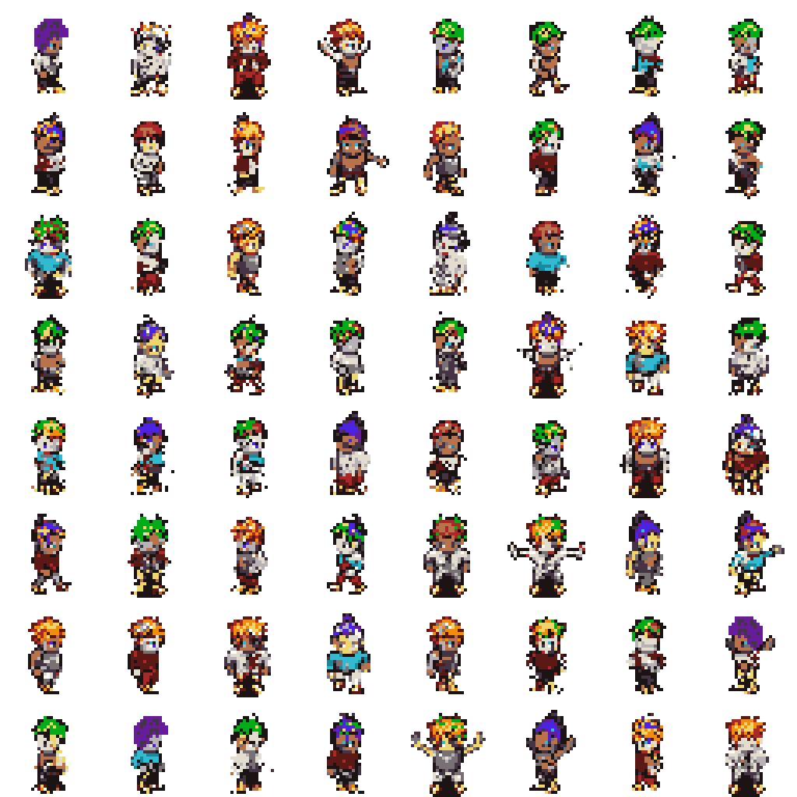
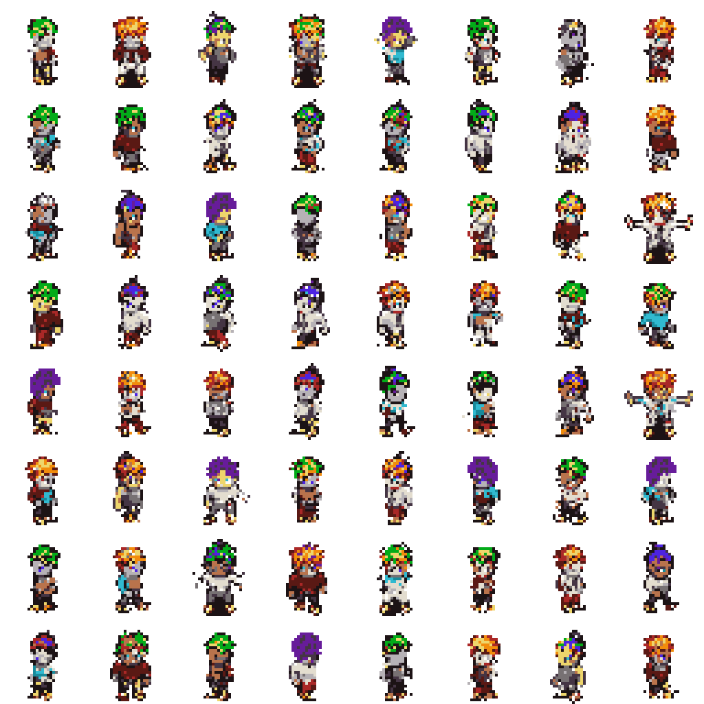
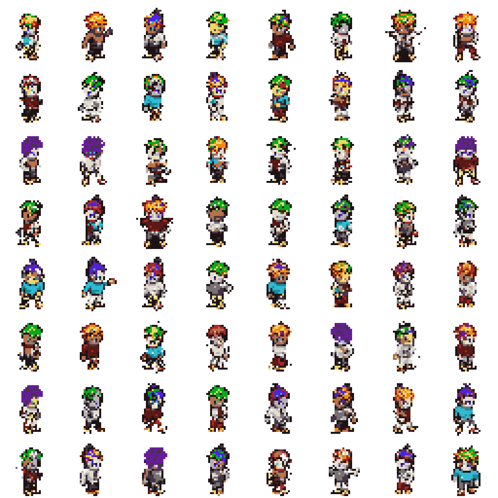
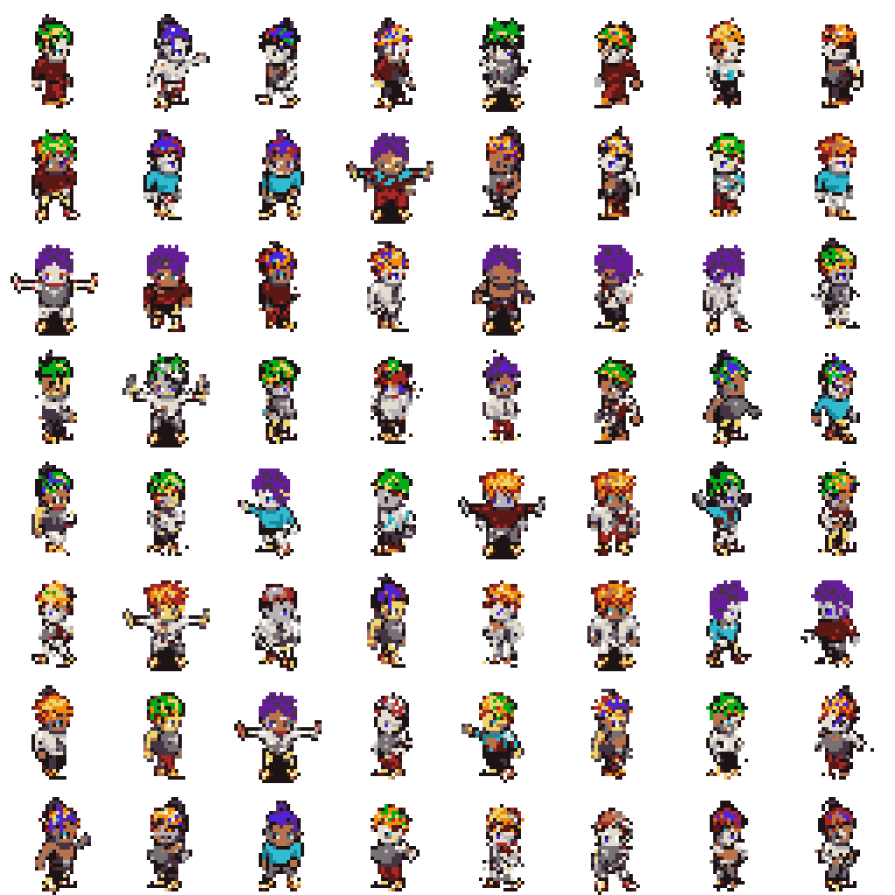
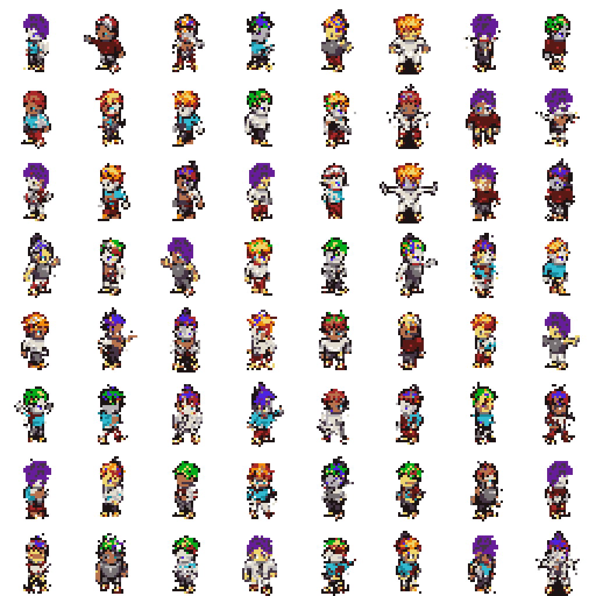
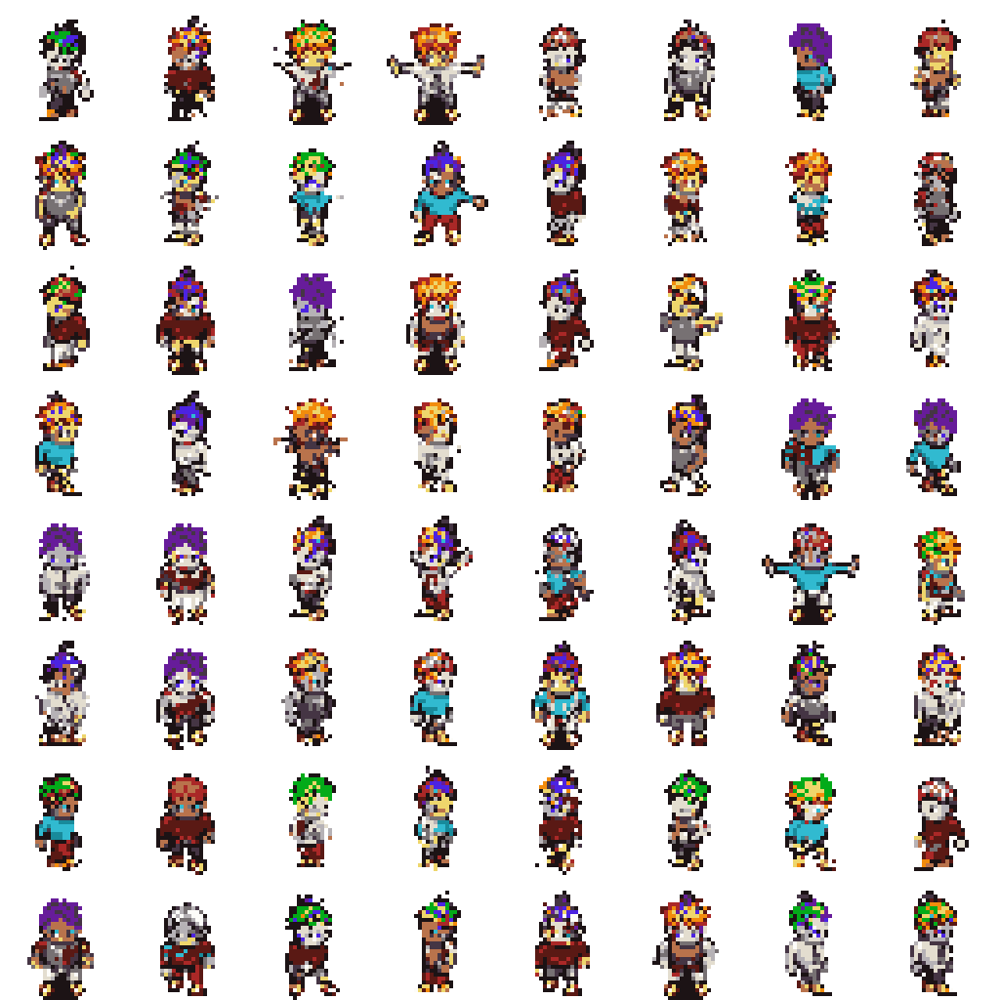

# Option A Evaluation

This report evaluates generated Option A sprites against the validation split.
The FID-style score below is a lightweight Frechet distance over handcrafted
palette, transparency, silhouette, and edge features. It is not Inception FID.

## Reference Validation Summary

- Samples: `2048`
- Opaque ratio: `0.2354`
- Edge density: `0.1811`
- Palette consistency: `1.0000`

## Sweep Results

| Temp | Top-k | Feature FID | Palette consistency | Opaque ratio | Edge density |
| --- | --- | ---: | ---: | ---: | ---: |
| 0.8 | 8 | 0.00755 | 1.0000 | 0.2220 | 0.1797 |
| 0.8 | 16 | 0.01047 | 1.0000 | 0.2215 | 0.1782 |
| 1 | 16 | 0.01548 | 1.0000 | 0.2292 | 0.1884 |
| 0.6 | 8 | 0.01813 | 1.0000 | 0.2096 | 0.1694 |
| 0.8 | none | 0.01904 | 1.0000 | 0.2132 | 0.1743 |
| 1 | 8 | 0.02043 | 1.0000 | 0.2297 | 0.1885 |
| 0.6 | none | 0.02101 | 1.0000 | 0.2090 | 0.1684 |
| 0.6 | 16 | 0.02127 | 1.0000 | 0.2080 | 0.1678 |
| 1 | none | 0.02438 | 1.0000 | 0.2358 | 0.1940 |

## Best Setting

- Temperature: `0.8`
- Top-k: `8`
- Feature FID: `0.00755`

## Sample Grids

