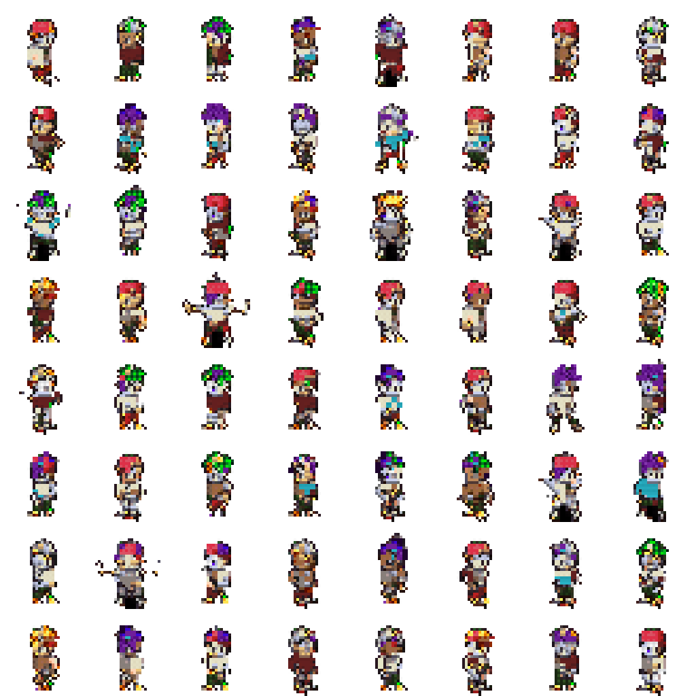
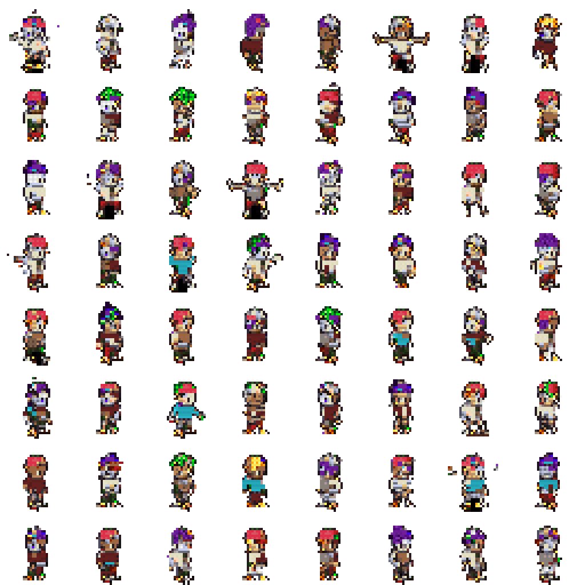
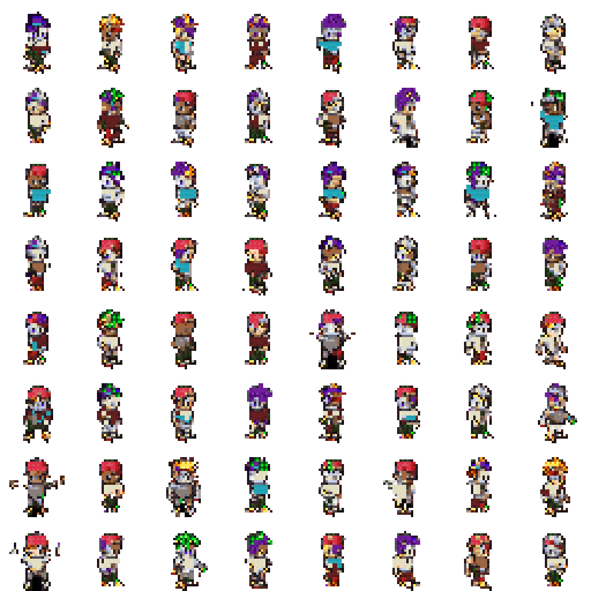
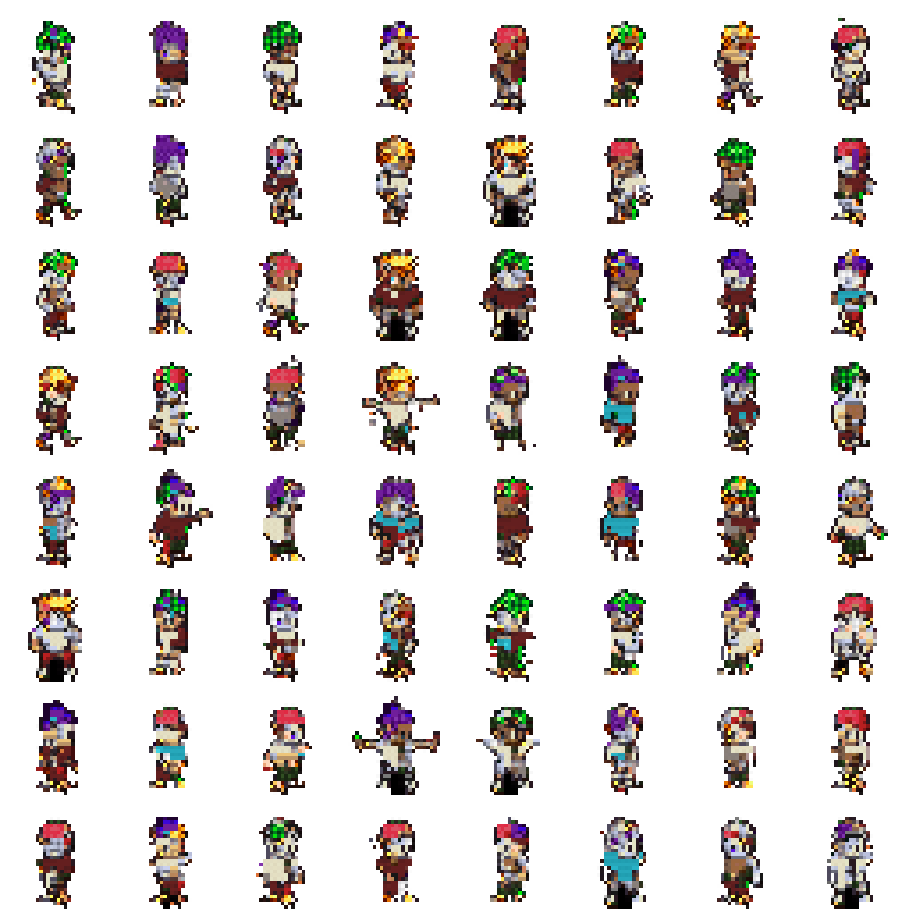
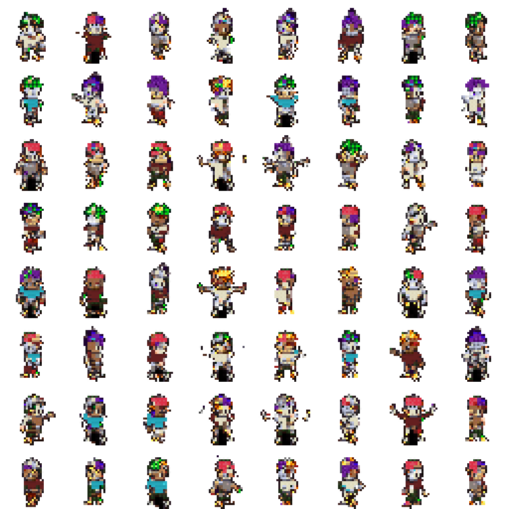
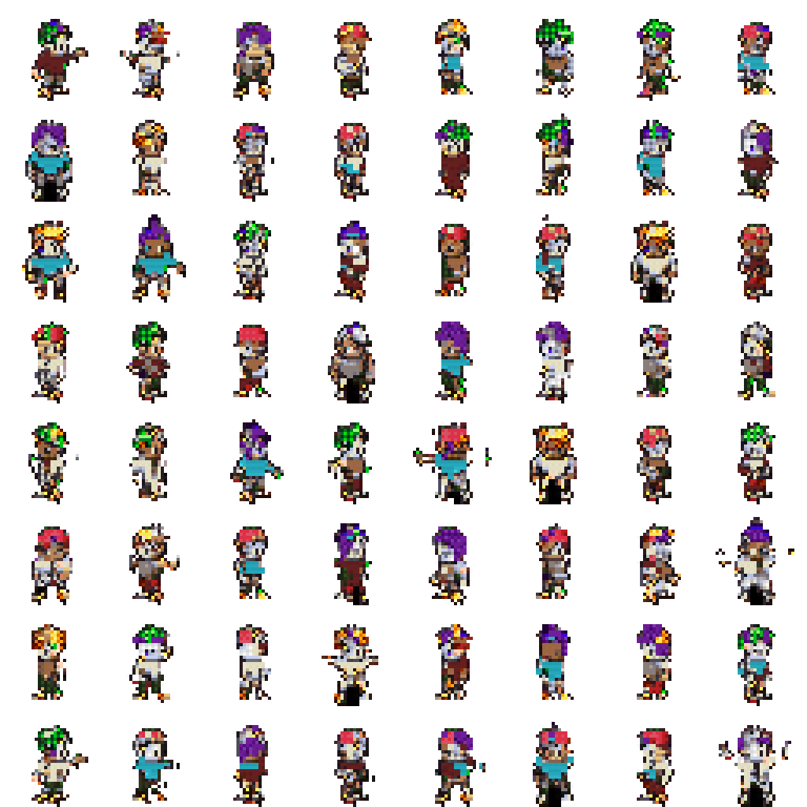
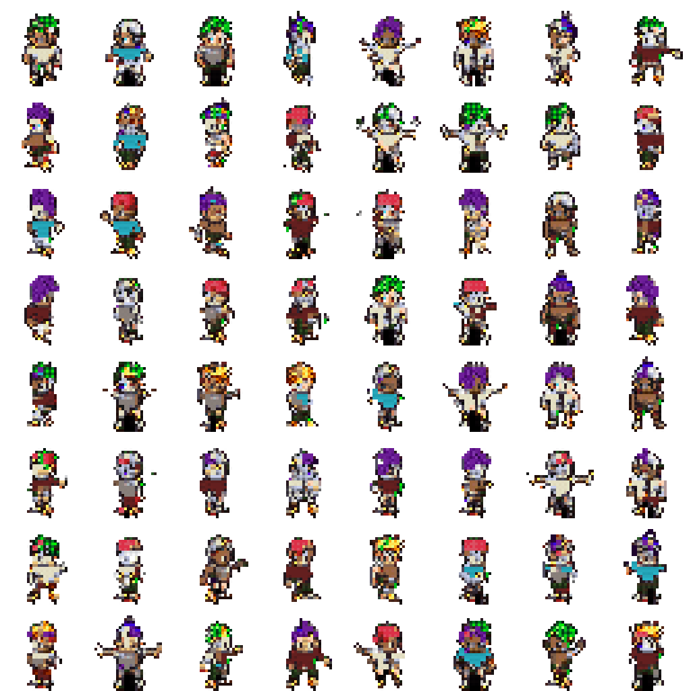
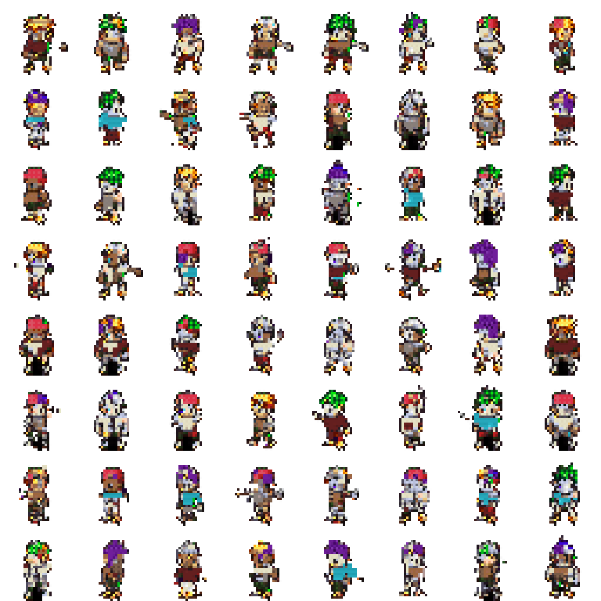
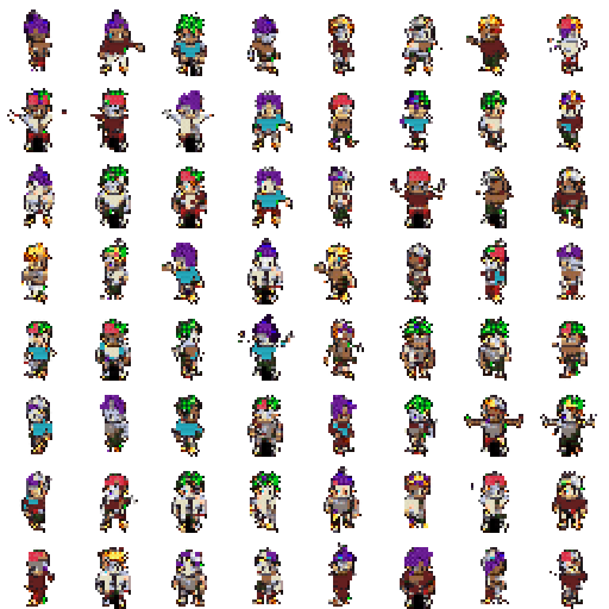

# Decoded Patch-VQ Evaluation

This report evaluates decoded RGBA samples against real validation sprites.
The score is a lightweight Frechet distance over alpha, silhouette, edge,
bounding-box, and coarse RGB-histogram features. It is not Inception FID.

## Reference Validation Summary

- Samples: `2048`
- Opaque ratio: `0.2354`
- Alpha edge density: `0.0487`
- RGB edge density: `0.1386`
- Color entropy: `3.2931`

## Sweep Results

| Temp | Top-k | Feature FID | Opaque | Alpha edge | RGB edge | Color entropy |
| --- | --- | ---: | ---: | ---: | ---: | ---: |
| 1 | 16 | 0.04689 | 0.2364 | 0.0526 | 0.1348 | 3.4266 |
| 1 | 64 | 0.05271 | 0.2361 | 0.0524 | 0.1360 | 3.4488 |
| 1 | 32 | 0.05403 | 0.2337 | 0.0519 | 0.1351 | 3.4667 |
| 0.8 | 32 | 0.06289 | 0.2240 | 0.0500 | 0.1290 | 3.4780 |
| 0.8 | 16 | 0.07695 | 0.2201 | 0.0490 | 0.1275 | 3.5117 |
| 0.6 | 64 | 0.07905 | 0.2094 | 0.0463 | 0.1206 | 3.5017 |
| 0.8 | 64 | 0.07954 | 0.2176 | 0.0496 | 0.1276 | 3.5221 |
| 0.6 | 32 | 0.09294 | 0.2074 | 0.0461 | 0.1205 | 3.5217 |
| 0.6 | 16 | 0.10577 | 0.2080 | 0.0472 | 0.1221 | 3.5459 |

## Best Setting

- Temperature: `1`
- Top-k: `16`
- Feature FID: `0.04689`

## Sample Grids

