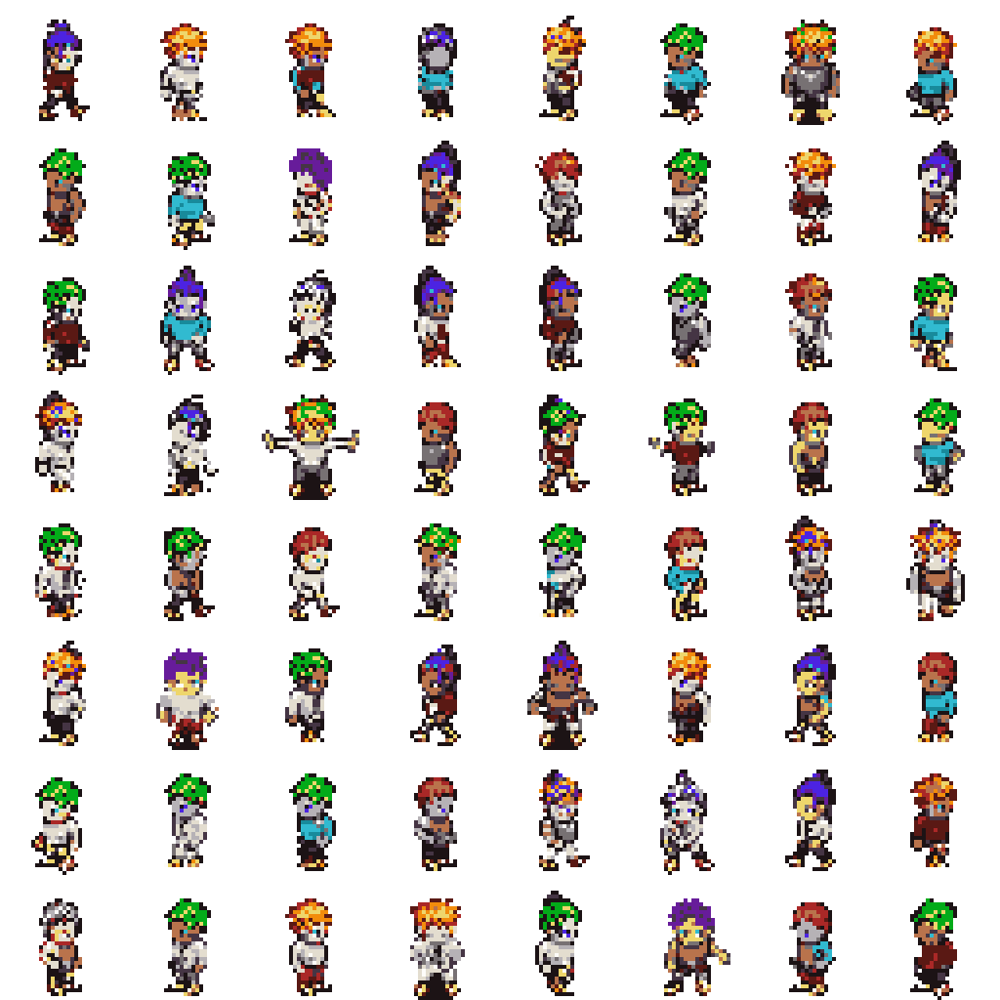
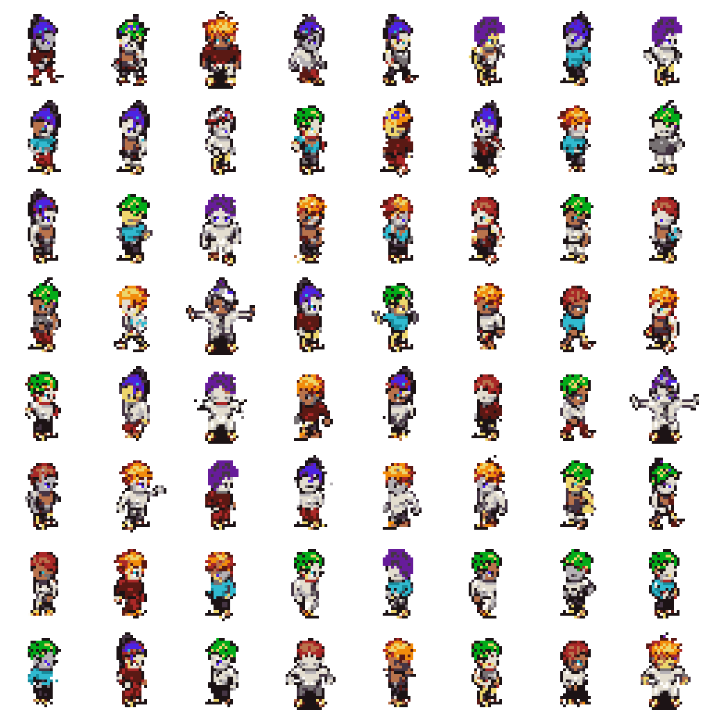
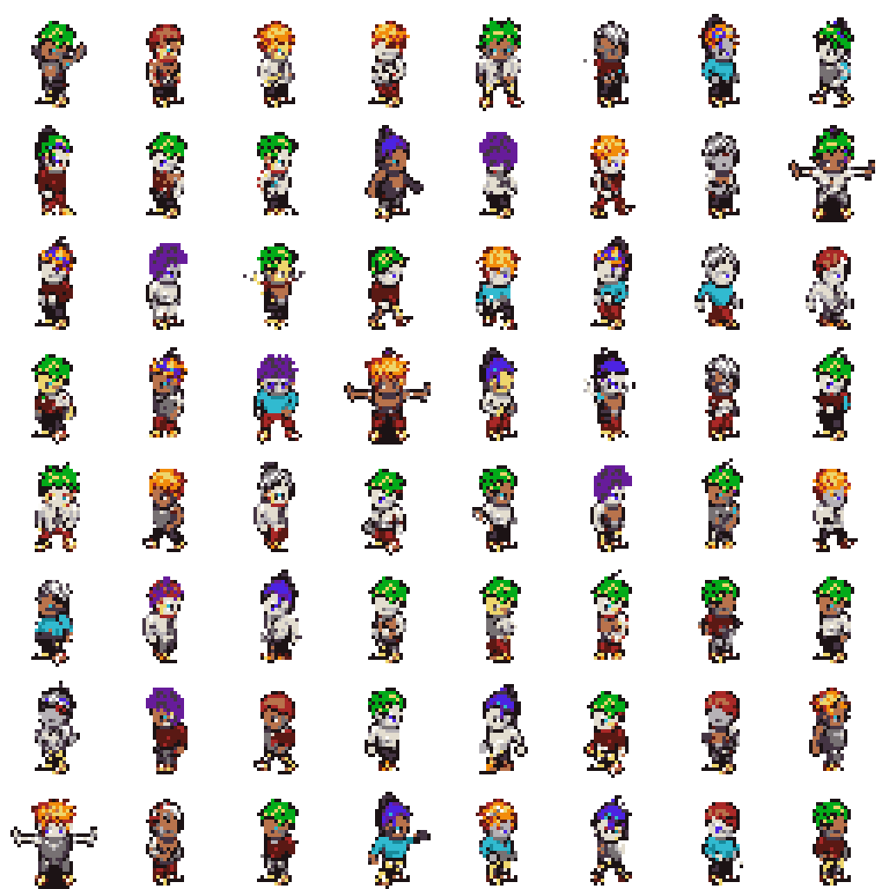
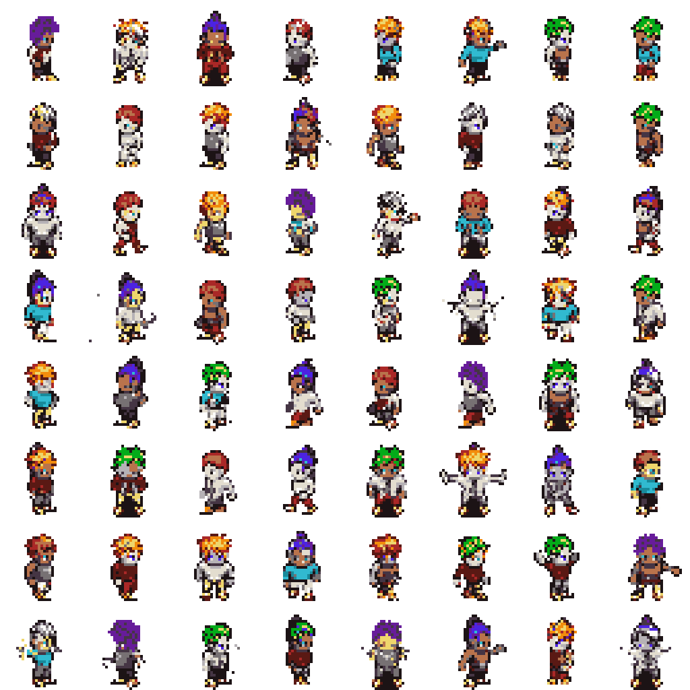
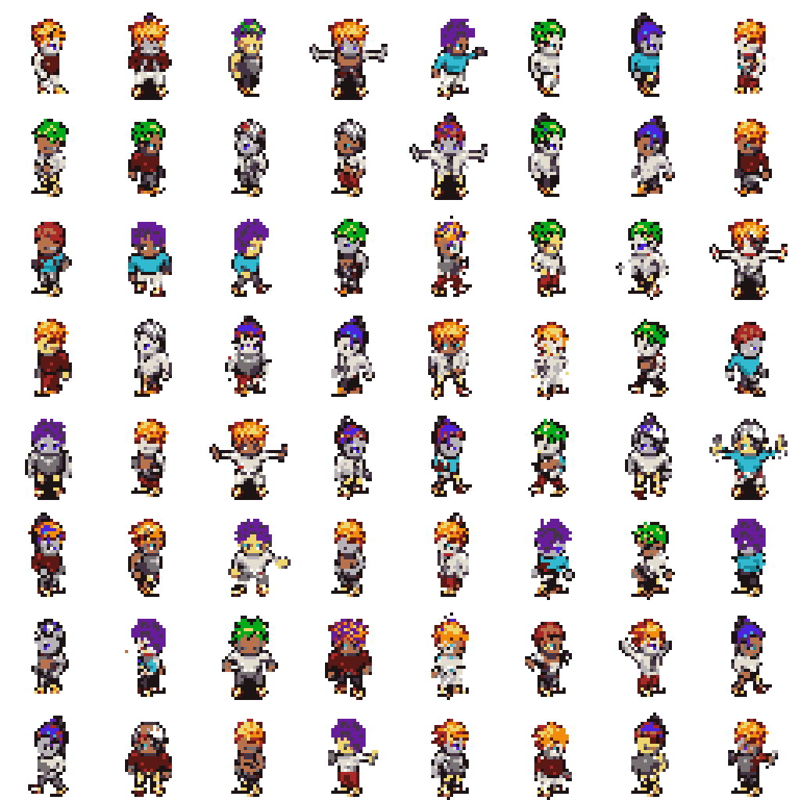
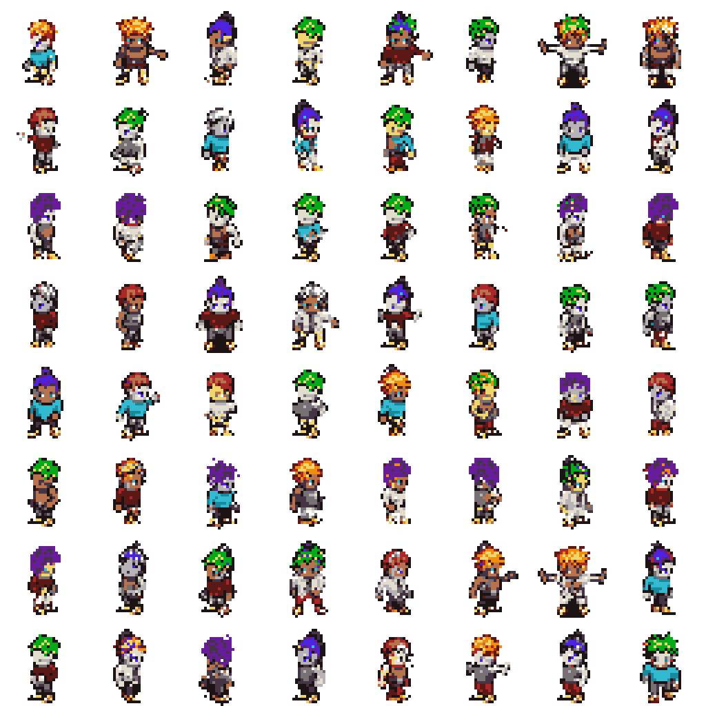
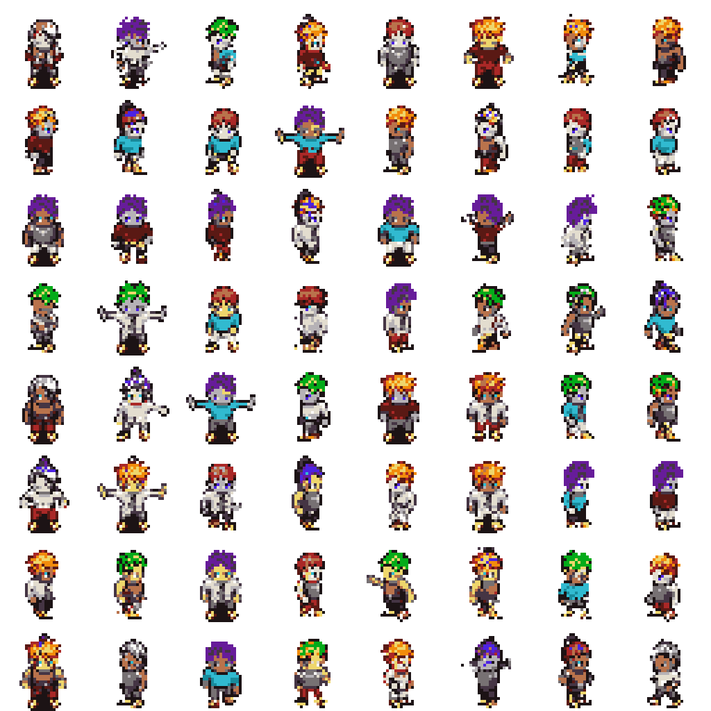
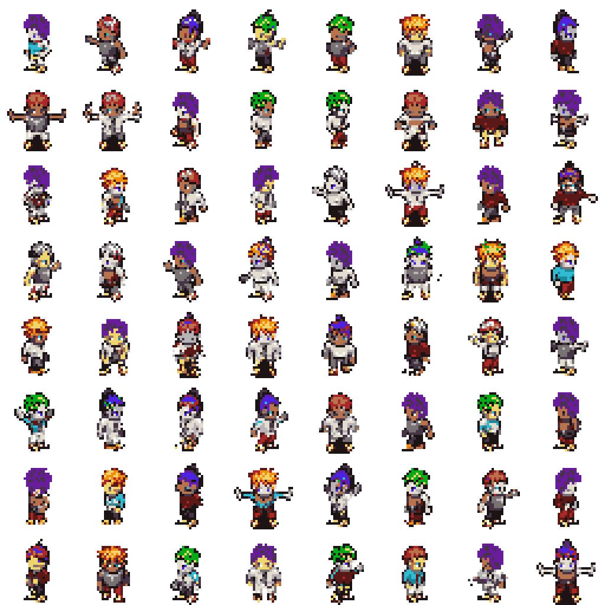
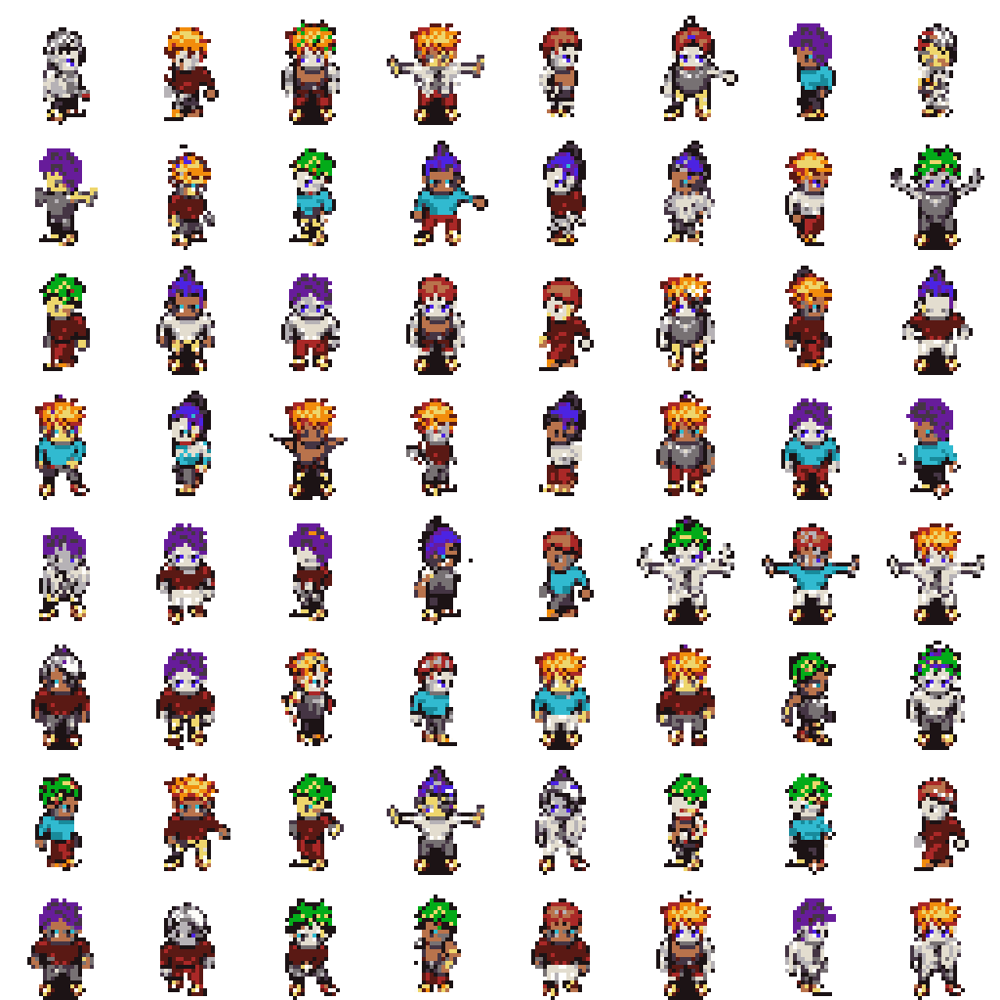

# Option A Evaluation

This report evaluates generated Option A sprites against the validation split.
The FID-style score below is a lightweight Frechet distance over handcrafted
palette, transparency, silhouette, and edge features. It is not Inception FID.

## Reference Validation Summary

- Samples: `2048`
- Opaque ratio: `0.2354`
- Edge density: `0.1811`
- Palette consistency: `1.0000`

## Sweep Results

| Temp | Top-k | Feature FID | Palette consistency | Opaque ratio | Edge density |
| --- | --- | ---: | ---: | ---: | ---: |
| 0.8 | 8 | 0.00147 | 1.0000 | 0.2291 | 0.1808 |
| 1 | 16 | 0.00299 | 1.0000 | 0.2381 | 0.1865 |
| 0.8 | 16 | 0.00392 | 1.0000 | 0.2311 | 0.1829 |
| 1 | 8 | 0.00402 | 1.0000 | 0.2335 | 0.1838 |
| 0.8 | none | 0.00596 | 1.0000 | 0.2220 | 0.1761 |
| 1 | none | 0.00637 | 1.0000 | 0.2459 | 0.1917 |
| 0.6 | none | 0.00659 | 1.0000 | 0.2172 | 0.1724 |
| 0.6 | 16 | 0.00856 | 1.0000 | 0.2164 | 0.1716 |
| 0.6 | 8 | 0.00956 | 1.0000 | 0.2172 | 0.1740 |

## Best Setting

- Temperature: `0.8`
- Top-k: `8`
- Feature FID: `0.00147`

## Sample Grids

