# PixelVAR Görsel Sonuçlar ve Sunum Belgesi

Tarih: 2026-06-07

Bu belge, PixelVAR projesini sunarken doğrudan kullanılabilecek görsel sonuçları,
tabloları, grafik yorumlarını ve önemli output'ları bir araya getirir. Amaç
sadece "hangi skor çıktı" demek değil; her skorun ne anlama geldiğini, hangi
sonucun güvenilir olduğunu ve hangi sonucun dikkatli yorumlanması gerektiğini
göstermektir.

## Slide 1 - Ana Mesaj

PixelVAR'ın ana sonucu: 32x32 pixel-art sprite'ları doğrudan ayrık palette-token
uzayında, coarse-to-fine şekilde üreten bir model çalışıyor.

Ana model:

- Model: `var_sprites_v0_full`
- Çözünürlük: `32x32`
- Token uzayı: şeffaf token + 16 renk tokenı
- Ölçekler: `[1, 2, 4, 8, 16, 32]`
- Toplam token: `1365`
- En iyi sampling: `temperature=0.8`, `top_k=8`
- Ana sprite-feature score: `0.00147`
- Palette consistency: `1.0000`

Sunumda söylenecek ana cümle:

> Ana iddiamız SOTA değil; 32x32 pixel-art sprite üretimi için palette-safe,
> coarse-to-fine ve memorization açısından daha kontrollü bir generative
> pipeline kurduğumuzdur.

## Slide 2 - Final Model Karşılaştırması

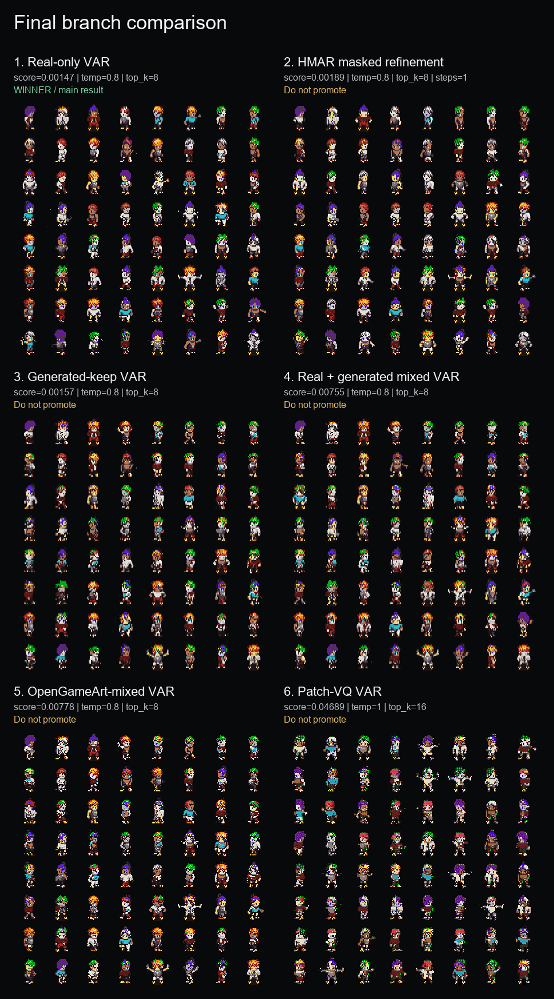

Bu görsel, finalde karşılaştırdığımız ana dalları yan yana gösteriyor:

- Real-only PixelVAR
- HMAR masked refinement
- Patch-VQ VAR
- Diğer ablation örnekleri

Yorum:

Real-only PixelVAR ana sonuç olarak kaldı. HMAR teknik olarak başarılı ve yakın
bir alternatif, ama proposal içi sprite-feature evaluator ana PixelVAR'ı seçti.
Patch-VQ learned-token yolunun çalıştığını gösterdi, fakat çıktılar daha blocky
ve ana palette-token PixelVAR kadar iyi değil.

## Slide 3 - Ana PixelVAR Çıktıları

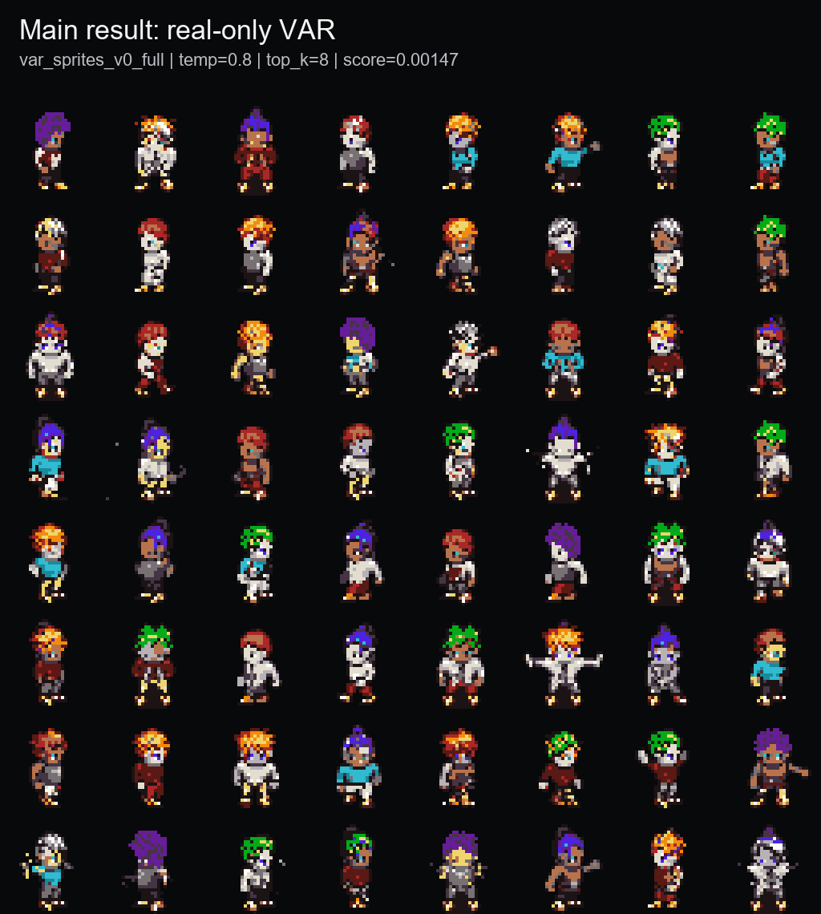

Bu görsel ana modelin seçilmiş sample sheet'idir.

Önemli yorum:

Bu örneklerde model genel olarak sprite formunu koruyor: arka plan şeffaf,
karakterler kompakt, kenarlar pixel-art yapısına uygun ve renkler palette içinde.
Ancak bunlar manuel seçilmiş final sheet olduğu için tek başına yeterli kanıt
değil. Bu yüzden sonraki slaytlarda metrikler ve audit sonuçları var.

## Slide 4 - HMAR Masked Refinement Çıktıları

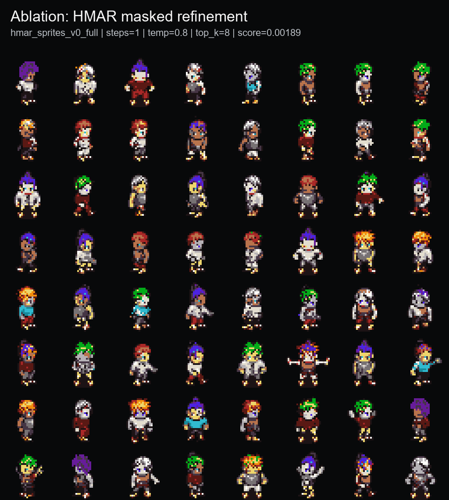

HMAR, proposal'daki Option B olarak denendi. Mantığı şu:

- Coarse-to-fine yapı korunuyor.
- Her scale içinde bazı tokenlar maskeleniyor.
- Model masked tokenları refine ediyor.
- Sampling sırasında refinement step sayısı değiştirilebiliyor.

En iyi HMAR ayarı:

- `refinement_steps=1`
- `temperature=0.8`
- `top_k=8`
- Feature score: `0.00189`

Yorum:

HMAR başarısız değil. Hatta Inception tabanlı bazı bilinen metriklerde PixelVAR'a
çok yakın, bazı değerlerde biraz daha iyi. Ama bizim sprite-feature evaluator'a
göre ana PixelVAR hâlâ daha iyi. Ayrıca refinement step sayısı arttıkça skor
kötüleşti; bu da "daha fazla refinement her zaman daha iyi" varsayımının burada
geçerli olmadığını gösteriyor.

## Slide 5 - Patch-VQ / Learned Token Denemesi

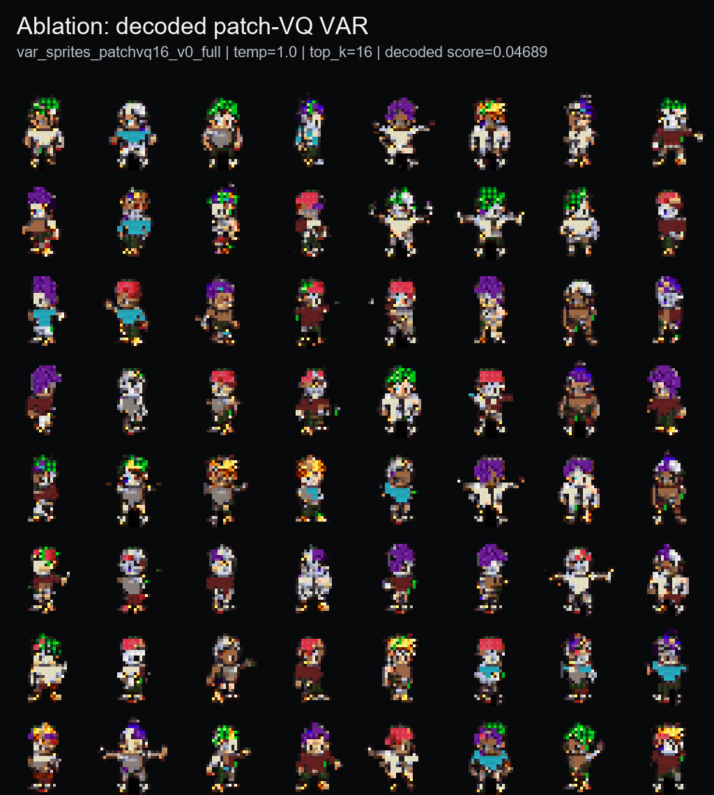

Patch-VQ, learned-token yönünü kurtarmak için denediğimiz alternatifti. Neural
VQ-VAE reconstruction kalitesi yeterli olmadığı için, 2x2 patch'leri KMeans
codebook ile tokenlaştıran daha deterministik bir yol denendi.

Patch-VQ sonucu:

- Token map: `(93,312, 16, 16)`
- Vocab size: `512`
- Kullanılan code: `143 / 512`
- VAR validation loss: `0.10122`
- VAR validation accuracy: `0.96905`
- Decoded best score: `0.04689`

Yorum:

Patch-VQ teknik olarak çalıştı, ama ana model olmadı. Çıktılar coherent ama daha
blocky. Bu yüzden learned-token fikrinin tamamen imkansız olduğunu söylemiyoruz;
ama şu anki en iyi çalışan yol deterministic palette-token PixelVAR.

## Slide 6 - Patch-VQ Reconstruction Kontrolü

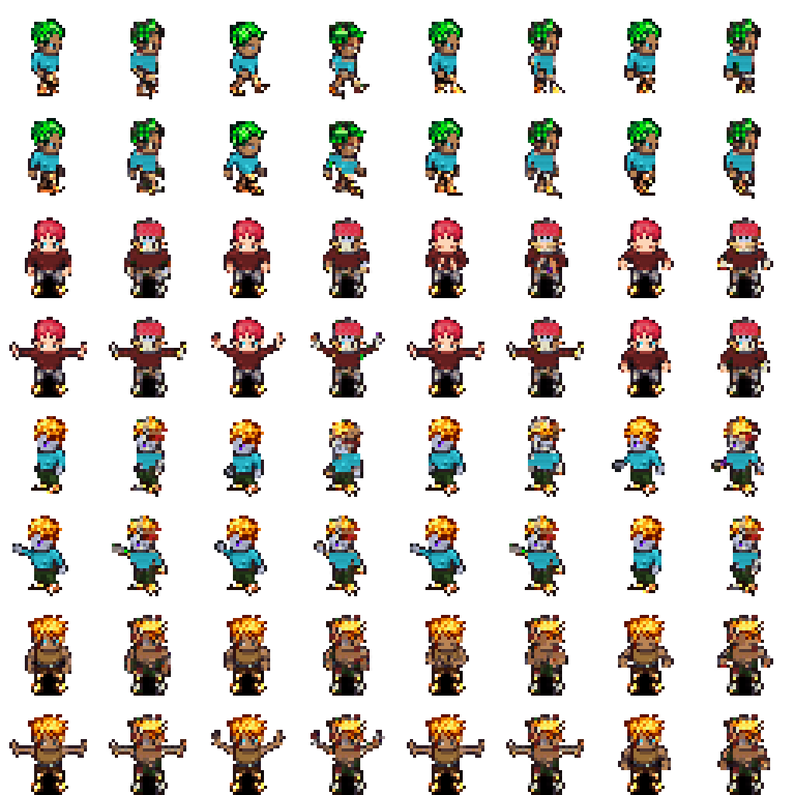

Bu görselde Patch-VQ reconstruction tarafı görülüyor.

Yorum:

Patch-VQ, sprite'ın genel formunu koruyor ama patch tabanlı temsil doğal olarak
blok etkisi yaratıyor. Pixel-art için bloklu görünüm bazen kabul edilebilir gibi
dursa da burada ana palette-token modelden daha az zengin ve daha az temiz
sonuç verdi.

## Slide 7 - Model Karar Skoru Grafiği

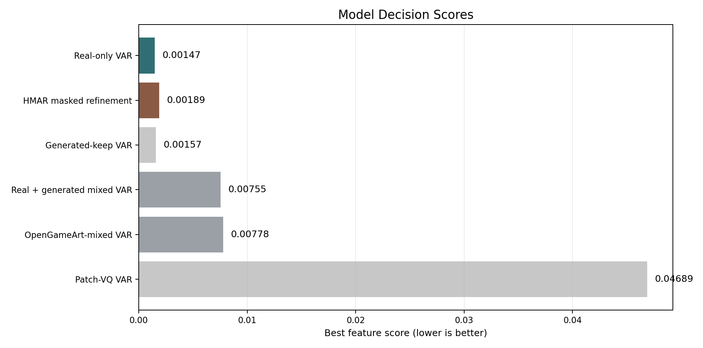

Bu grafikte düşük skor daha iyi.

| Rank | Branch | Best score | Comparable? | Decision |
| ---: | --- | ---: | --- | --- |
| 1 | Real-only VAR | `0.00147` | yes | Main result |
| 2 | HMAR masked refinement | `0.00189` | yes | Strong ablation |
| 3 | Generated-keep VAR | `0.00157` | no | Self-reference only |
| 4 | Real + generated mixed VAR | `0.00755` | yes | Worse than main |
| 5 | OpenGameArt-mixed VAR | `0.00778` | yes | Worse than main |
| 6 | Patch-VQ VAR | `0.04689` | no | Learned-token ablation |

Önemli not:

Generated-keep VAR'ın `0.00157` skoru düşük görünse de doğrudan ana modelle
aynı referansa göre karşılaştırılmıyor. Patch-VQ skoru da decoded RGBA evaluator
üzerinden geldiği için birebir winner karşılaştırması değildir.

Sunumda söylenecek ana cümle:

> Doğrudan karşılaştırılabilir gerçek validation skorlarında ana PixelVAR en iyi
> sonucu verdi; HMAR yakın ama geçemedi.

## Slide 8 - Pixel-Art Yapısal Metrikleri

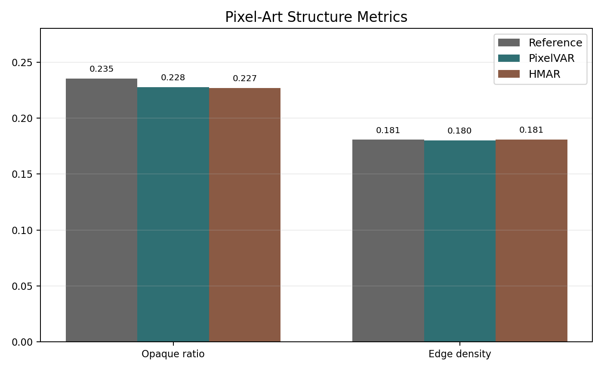

Bu grafikte reference, PixelVAR ve HMAR için iki önemli yapısal metrik var:

- Opaque ratio
- Edge density

Ana PixelVAR:

- Opaque ratio: `0.2276`
- Reference opaque ratio: `0.2353`
- Edge density: `0.1802`
- Reference edge density: `0.1807`

Yorum:

Opaque ratio'nun referansa yakın olması modelin karakter doluluğunu doğru
öğrendiğini gösteriyor. Çok düşük olsaydı karakterler eksik/boş, çok yüksek
olsaydı fazla dolu veya sprite dışı bloklar üretiyor olabilirdi.

Edge density'nin referansa çok yakın olması pixel-art için iyi bir sinyal.
Bu, modelin aşırı blur veya aşırı noisy üretmediğini gösterir. Ama edge density
tek başına semantik kalite kanıtı değildir; sadece yapısal uyumu destekleyen
bir metriktir.

## Slide 9 - Palette Consistency Yorumu

Known metrics run'da tüm iç modeller için palette consistency `1.0000`.

| Model | Palette consistency | Yorum |
| --- | ---: | --- |
| PixelVAR main | `1.0000` | Beklenen ve iyi |
| HMAR step=1 | `1.0000` | Beklenen ve iyi |
| Flat AR | `1.0000` | Beklenen ve iyi |
| Flat MaskGIT | `1.0000` | Beklenen ve iyi |

Bu sonucu abartmamak gerekiyor.

Palette consistency'nin `1.0000` gelmesi çok iyi görünür, ama bizim mimarimizde
büyük ölçüde beklenen bir sonuçtur. Çünkü model continuous RGB üretmiyor.
Model sadece sabit token setinden seçim yapıyor ve decode sırasında bu tokenlar
sabit palette renklerine çevriliyor.

Sunumda söylenecek ana cümle:

> Palette consistency'nin 1.0000 olması kalite mucizesi değil; discrete
> palette-token tasarımımızın doğru çalıştığını gösteren önemli bir doğrulama.

## Slide 10 - 170K Generation Hedefi

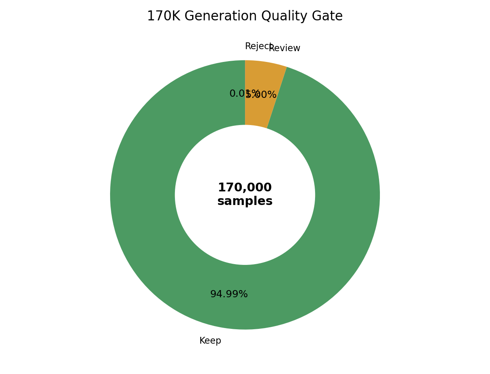

170K generation sonucu:

| Kategori | Sayı | Oran |
| --- | ---: | ---: |
| Keep | `161,479` | `94.99%` |
| Review | `8,500` | `5.00%` |
| Reject | `21` | `0.01%` |
| Total | `170,000` | `100%` |

Yorum:

Bu sonuç modelin large-scale sampling sırasında tamamen dağılmadığını gösteriyor.
Ancak bu gate otomatik kalite kurallarıyla yapıldı. Yani "161K örnek insan
tarafından kusursuz bulundu" demiyoruz. Daha doğru yorum:

> 170K örnek üretildi ve otomatik kalite kontrolüne göre büyük çoğunluğu
> kullanılabilir sınıfta kaldı.

## Slide 11 - 170K Keep Örnekleri

Bu görsel, 170K üretimden keep sınıfına düşen rastgele örnekleri gösteriyor.

Yorum:

Örnekler genel olarak sprite formunu koruyor. Şeffaf arka plan, kompakt karakter
gövdesi ve sınırlı palette korunuyor. Fakat bu görsel yine de otomatik gate
sonucu seçilmiş bir alt küme; tek başına bütün dağılımı kanıtlamaz.

## Slide 12 - 170K Review ve Reject Örnekleri

Review örnekleri:

Reject örnekleri:

Yorum:

Review örnekleri otomatik kurallara göre daha dikkatli bakılması gereken
örneklerdir. Reject sayısının çok düşük olması iyi bir sinyal, ama bu yine de
otomatik kurallara bağlıdır. İnsan değerlendirmesi yapılmadığı için reject
sayısını final human-quality sonucu gibi sunmamak gerekir.

## Slide 13 - Bilinen Metrikler: FID

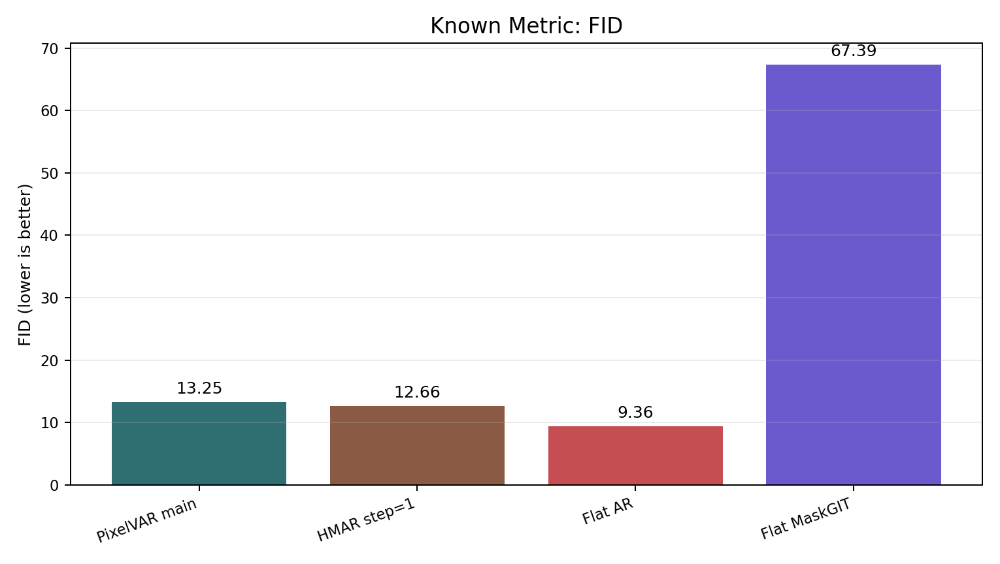

4096 sample üzerinden Inception V3 feature space ile ölçülen FID:

| Model | FID ↓ | KID ↓ | Precision ↑ | Recall ↑ | Coverage ↑ | MS-SSIM ↓ |
| --- | ---: | ---: | ---: | ---: | ---: | ---: |
| Flat raster AR | `9.3558` | `0.002975` | `0.9172` | `0.9541` | `0.8518` | `0.8281` |
| HMAR step=1 | `12.6555` | `0.005209` | `0.6494` | `0.9314` | `0.6165` | `0.8309` |
| PixelVAR main | `13.2516` | `0.006010` | `0.6406` | `0.9292` | `0.6050` | `0.8323` |
| Flat MaskGIT | `67.3908` | `0.061825` | `0.1545` | `0.0317` | `0.0454` | `0.9426` |

İlk bakışta Flat raster AR en iyi görünüyor. Ama bu tablo tek başına karar için
yeterli değil; çünkü memorization audit Flat AR'ın ciddi şekilde ezberlediğini
gösterdi.

Sunumda söylenecek ana cümle:

> Raw FID tablosunda Flat AR en iyi, ama audit sonrası bu temiz bir generative
> başarı olarak kabul edilemiyor.

## Slide 14 - Precision / Recall Karşılaştırması

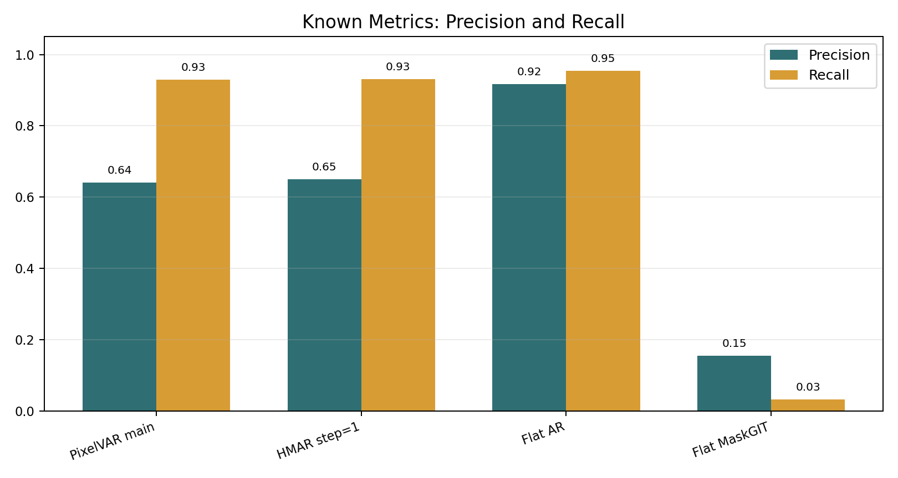

Yorum:

Flat AR precision ve recall'da çok yüksek. Normalde bu iyi görünür. Ama
memorization audit ile birlikte okunduğunda, bu yüksek skorların önemli bir
kısmının training örneklerine çok yakın üretimden kaynaklanabileceğini görüyoruz.

HMAR ve PixelVAR birbirine yakın. HMAR Inception metriklerinde hafif önde,
PixelVAR ise sprite-feature evaluator'da önde. Bu yüzden ikisini birlikte
"en güçlü non-memorizing adaylar" olarak anlatmak en dürüst çerçeve.

## Slide 15 - Memorization Audit

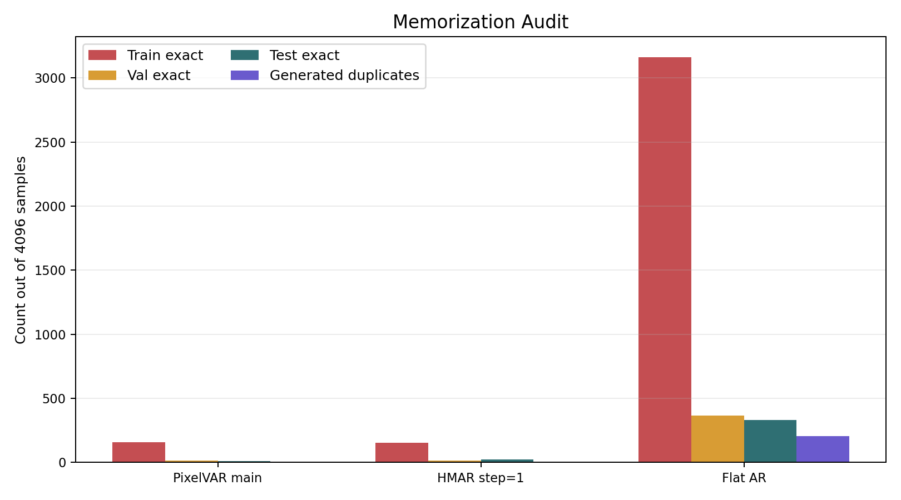

4096 generated sample üzerinde exact token-map karşılaştırması:

| Model | Train exact | Val exact | Test exact | Generated duplicates | Yorum |
| --- | ---: | ---: | ---: | ---: | --- |
| PixelVAR main | `157` | `13` | `11` | `4` | Düşük ama sıfır değil |
| HMAR step=1 | `154` | `15` | `22` | `5` | Düşük ama sıfır değil |
| Flat AR | `3162` | `365` | `333` | `206` | Memorizing |

Bu proje için en önemli metodolojik sonuçlardan biri bu tablodur.

Flat AR, FID/KID gibi bilinen metriklerde en iyi göründü. Ama 4096 üretimin
3162 tanesi training set ile birebir eşleşiyor. Bu yüzden Flat AR'ı temiz winner
olarak sunmak doğru olmaz.

PixelVAR ve HMAR'da exact match sıfır değil; bunu da saklamamak gerekir. Ancak
Flat AR ile kıyaslandığında davranış niteliksel olarak çok farklı.

Sunumda söylenecek ana cümle:

> Flat AR suspiciously good çıktı; audit bunun ezberleme kaynaklı olduğunu
> gösterdi. PixelVAR ve HMAR düşük exact-match oranıyla daha temiz adaylar.

## Slide 16 - Flat AR Neden Dikkatli Yorumlanmalı?

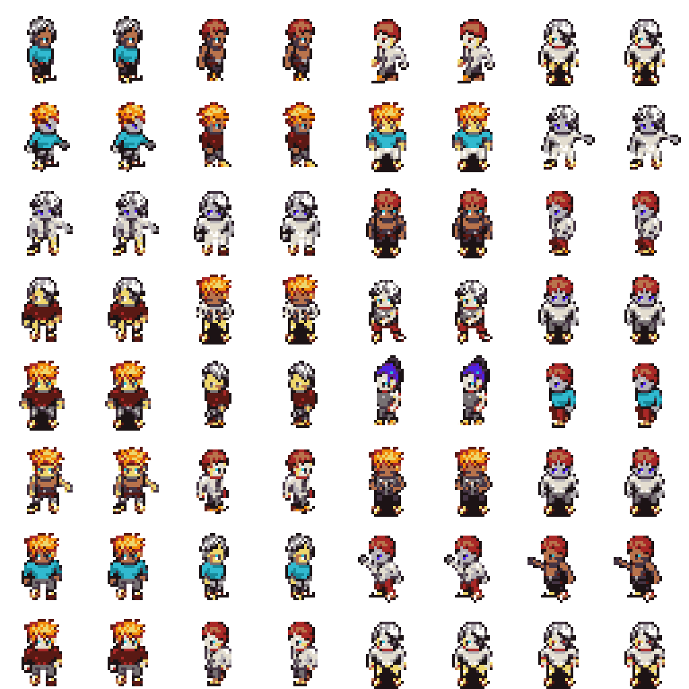

Bu görsel Flat AR için nearest-pair / memorization kontrolünden geliyor.

Yorum:

Flat AR'ın güzel görünen FID sonucu tek başına güvenilir değil. Çünkü modelin
ürettiği örneklerin çok büyük kısmı training örnekleriyle birebir aynı veya çok
yakın. Bu, modelin gerçekten yeni sprite dağılımı öğrendiğini değil, veriyi
ezberlediğini gösteriyor.

Bu yüzden final anlatıda Flat AR:

- Raw metrics winner
- Audit-adjusted disqualified
- Memorization riskini gösteren baseline

olarak sunulmalı.

## Slide 17 - Flat MaskGIT Sonucu

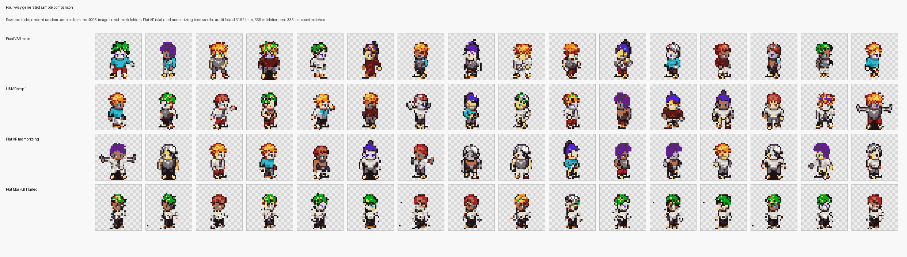

Flat MaskGIT mevcut setup'ta zayıf kaldı.

Önemli metrikler:

- FID: `67.3908`
- KID: `0.061825`
- Precision: `0.1545`
- Recall: `0.0317`
- Coverage: `0.0454`
- MS-SSIM: `0.9426`

Yorum:

MaskGIT fikri genel olarak kötü demiyoruz. Ama bizim mevcut flat setup ve
training ayarlarımızda distribution coverage çok düşük, FID/KID kötü ve
diversity sinyali zayıf. Bu yüzden bu haliyle güçlü bir baseline değil.

## Slide 18 - Mixed Data Deneyleri

Mixed training sonuçları:

| Deney | Training data | Real-val score | Karar |
| --- | --- | ---: | --- |
| Real-only VAR | Real MSD Sprites | `0.00147` | Main result |
| Generated-keep VAR | Filtered generated data | `0.00157` | Direct comparison değil |
| Real + generated mixed VAR | Real + generated | `0.00755` | Ana modeli geçmedi |
| OpenGameArt-mixed VAR | Real + generated + OGA | `0.00778` | Ana modeli geçmedi |

Generated-keep örnekleri:

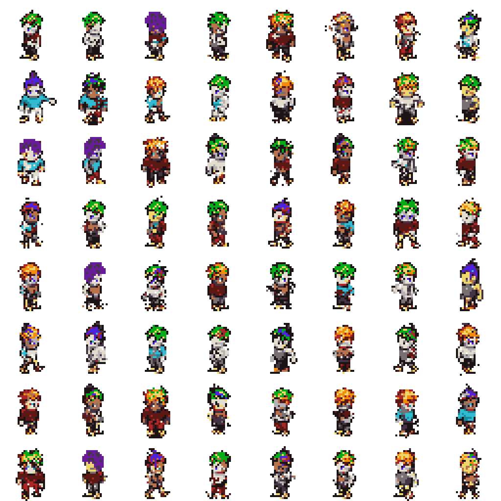

Mixed model örnekleri:

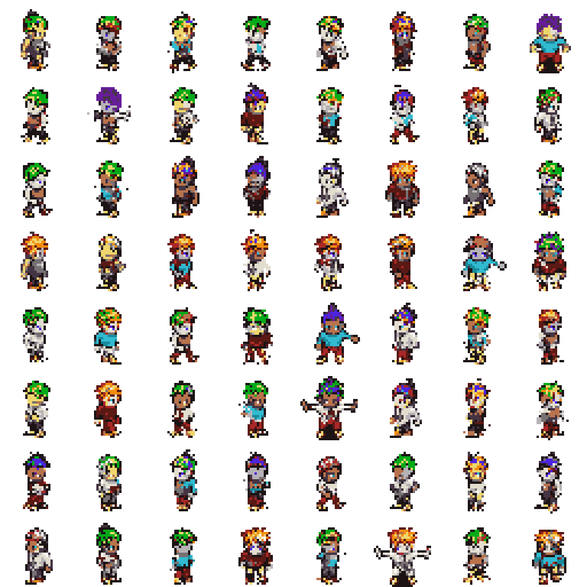

OpenGameArt-mixed örnekleri:

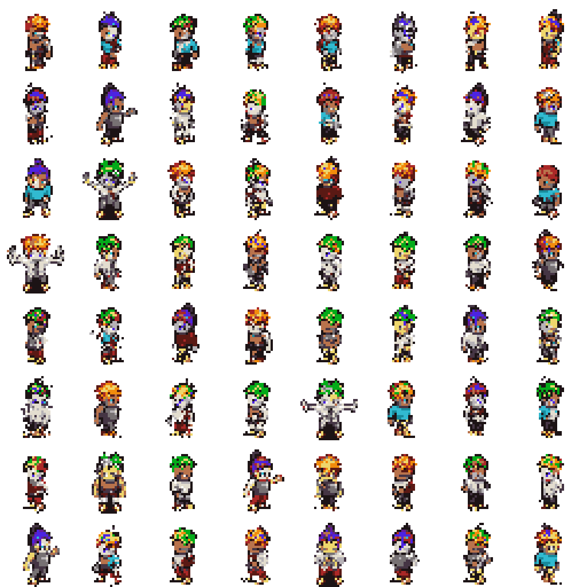

Yorum:

Bu sonuçlar bize "daha fazla veri otomatik olarak daha iyi model demek değildir"
dersini verdi. Generated data ve OpenGameArt eklemek training'i çalıştırdı, ama
gerçek validation dağılımında ana PixelVAR'ı geçmedi.

## Slide 19 - OpenGameArt Veri Kontrolü

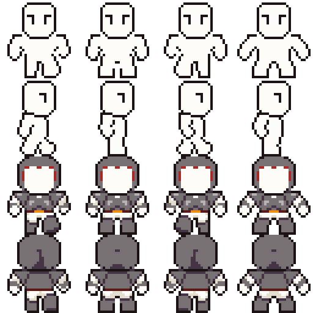

OpenGameArt curated veri:

- Curated frame: `4,659`
- Group: `105`
- Train: `3,493`
- Validation: `502`
- Test: `664`

Yorum:

OpenGameArt public veri olarak faydalı bir ek kaynak oldu, ama ana MSD Sprites
validation dağılımına birebir uymadı. Bu yüzden veri çeşitliliği artsa bile ana
skoru iyileştirmedi.

## Slide 20 - 64x64 / Larger Dimension Neden Yok?

Bu sunumda özellikle sorulabilecek bir nokta: "Neden 64x64 denemediniz?"

Kısa cevap:

Önce proposal'daki 32x32 ana hedefi bitirmek istedik. 64x64'e geçmek teknik
olarak mümkün, ama maliyet ciddi artıyor.

Token sayısı:

| Resolution | Pyramid | Token count |
| --- | --- | ---: |
| 32x32 | `1+4+16+64+256+1024` | `1365` |
| 64x64 | `1+4+16+64+256+1024+4096` | `5461` |

64x64 yaklaşık 4 kat daha uzun sequence demek. Transformer tarafında bu eğitim
zamanı, bellek, sampling ve evaluation maliyetini büyütüyor.

Ayrıca süreçte Lightning AI ve Modal tarafında limit, uzun job ve harcama sınırı
problemleri yaşandı. Bu yüzden 64x64'i ana proposal sonuçları bitmeden yapmak
yerine, sonraki aşamaya ertelemek daha doğru bir engineering kararıydı.

Sunumda söylenecek ana cümle:

> 64x64 yapılmadı çünkü öncelik proposal'daki 32x32 sistemi, baselineları,
> metrikleri ve audit'i tamamlamaktı; 64x64 daha pahalı bir next-stage deneydir.

## Slide 21 - External Baseline Durumu

External baseline için SD-piXL tarafında repo-side setup hazırlandı:

- Prompt dosyası hazırlandı.
- Palette export script'i eklendi.
- External image normalization script'i eklendi.
- SD-piXL baseline preparation script'i eklendi.
- Modal action'ları eklendi.
- Sample sheet / evaluation pipeline yolu hazırlandı.

Ama actual SD-piXL smoke veya batch run henüz tamamlanmadı.

Doğru sunum cümlesi:

> External baseline pipeline'ı hazır, fakat gerçek SD-piXL üretim sonuçları
> henüz metrik tablosuna eklenmedi. Bu yüzden external comparison tamamlandı
> demiyoruz.

## Slide 22 - Final Sonuç Yorumu

Sonuçları kalite seviyesine göre dürüstçe şöyle özetleyebiliriz:

| Model / Deney | Durum | Yorum |
| --- | --- | --- |
| PixelVAR main | İyi ve savunulabilir | Ana winner, palette-safe, düşük exact-match |
| HMAR step=1 | İyi alternatif | Inception metriklerinde yakın, sprite-feature'da ana modeli geçmedi |
| Flat AR | Suspiciously good | Raw metriklerde iyi, memorization nedeniyle temiz winner değil |
| Flat MaskGIT | Zayıf | Mevcut setup'ta başarısız |
| Generated/mixed data | Moderate | Dataset büyüdü ama real-val kalite artmadı |
| Patch-VQ | Teknik olarak çalıştı | Learned-token yönünü gösterdi, ama blocky ve ana sonucu geçmedi |
| SD-piXL external | Eksik | Setup var, actual run yok |

Final claim:

> PixelVAR, 32x32 pixel-art sprite generation için çalışan, palette-safe ve
> coarse-to-fine bir generative modeldir. Şu ana kadar ölçülen modeller içinde
> ana sprite-feature evaluator'a göre en güçlü non-memorizing sonuçtur. Ancak
> external diffusion baseline ve 64x64 deneyleri tamamlanmadan daha geniş bir
> SOTA iddiası yapılmamalıdır.

## Slide 23 - Output ve Artifact Listesi

Sunumda gerekirse açılabilecek ana dosyalar:

| İçerik | Dosya |
| --- | --- |
| Ana final sample sheet | `reports/final/final_main_var_sample_sheet.png` |
| HMAR sample sheet | `reports/final/final_hmar_sample_sheet.png` |
| Patch-VQ sample sheet | `reports/final/final_patchvq_sample_sheet.png` |
| Final branch comparison | `reports/final/final_branch_comparison_sheet.png` |
| Four-way model comparison | `reports/final/four_way_sample_sheet.png` |
| Model decision table | `reports/final/model_decision_table.md` |
| Known metrics comparison | `reports/final/known_metrics_comparison.md` |
| Memorization audit summary | `reports/final/memorization_audit_summary.md` |
| Detailed Turkish report | `reports/final/turkish_project_status_report.md` |
| Three-person Turkish script | `reports/final/turkish_three_person_presentation_script.md` |
| This visual deck | `reports/final/turkish_visual_results_deck.md` |

Grafik dosyaları:

| Grafik | Dosya |
| --- | --- |
| Model decision scores | `reports/final/visuals/chart_model_decision_scores.png` |
| FID comparison | `reports/final/visuals/chart_known_fid.png` |
| Precision / Recall | `reports/final/visuals/chart_precision_recall.png` |
| Structure metrics | `reports/final/visuals/chart_structure_metrics.png` |
| Memorization audit | `reports/final/visuals/chart_memorization_audit.png` |
| 170K quality gate | `reports/final/visuals/chart_170k_gate.png` |

## Slide 24 - En Kısa Kapanış

Bu projede proposal'ın ana 32x32 PixelVAR hattı çalışır hale getirildi. Model
palette dışına çıkmadan sprite üretiyor, opaque ratio ve edge density gibi
pixel-art yapısal metriklerde referansa yakın kalıyor ve HMAR, Flat AR,
Flat MaskGIT, Patch-VQ gibi iç karşılaştırmalarla değerlendirildi.

En önemli uyarı Flat AR sonucudur: FID/KID gibi metriklerde iyi görünmesine
rağmen memorization audit onu temiz winner olmaktan çıkarıyor. Bu yüzden
PixelVAR ve HMAR şu ana kadar daha güvenilir non-memorizing adaylar olarak
duruyor.

Eksikler açık: external SD-piXL run, bazı ablationlar, user study ve 64x64.
Bunlar özellikle compute, altyapı ve zaman nedenleriyle sonraki aşamaya bırakıldı.
