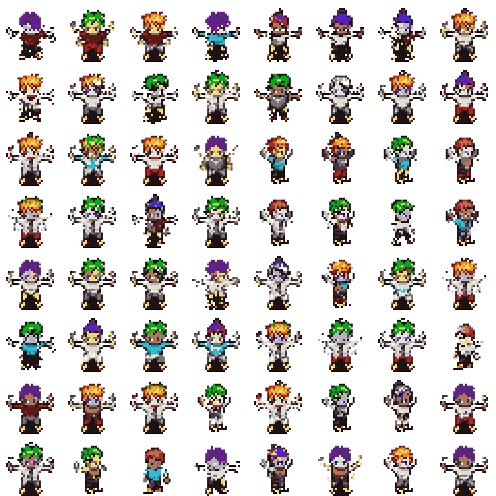

# Generated Set Inspection

This report conservatively filters obvious failures and flags unusual samples for human review.

## Counts

- Total: `170000`
- Keep: `161479`
- Review: `8500`
- Reject: `21`

## Key Metrics

- Opaque ratio mean: `0.2276`
- Edge density mean: `0.1803`
- Largest component ratio mean: `0.9982`
- Component count p95: `3.0`

## Contact Sheets

Keep/random sample:

Highest-score review samples:

Rejected samples:

