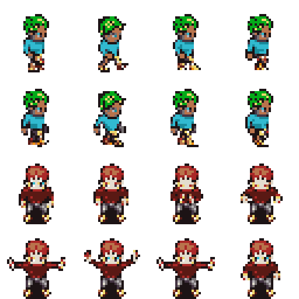
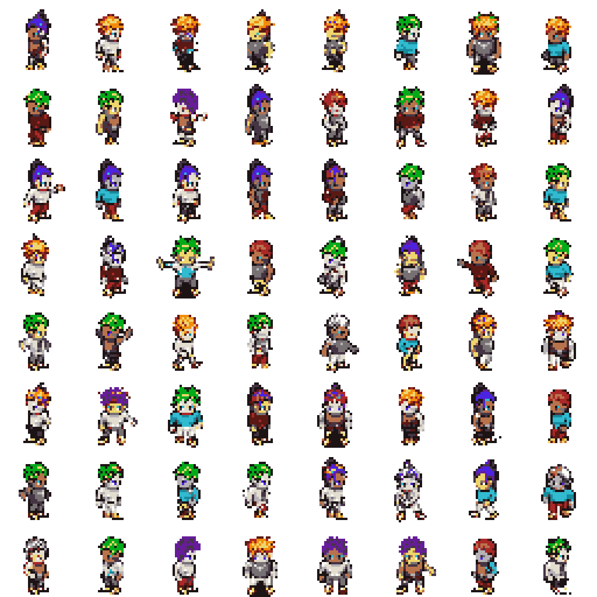
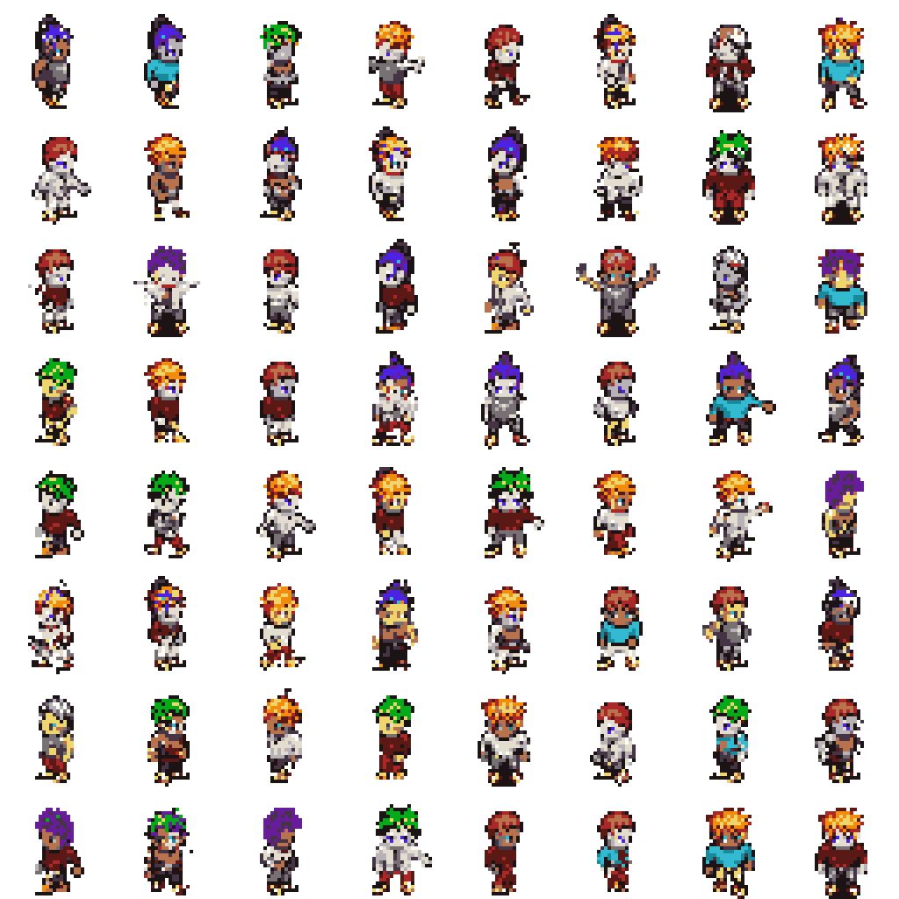
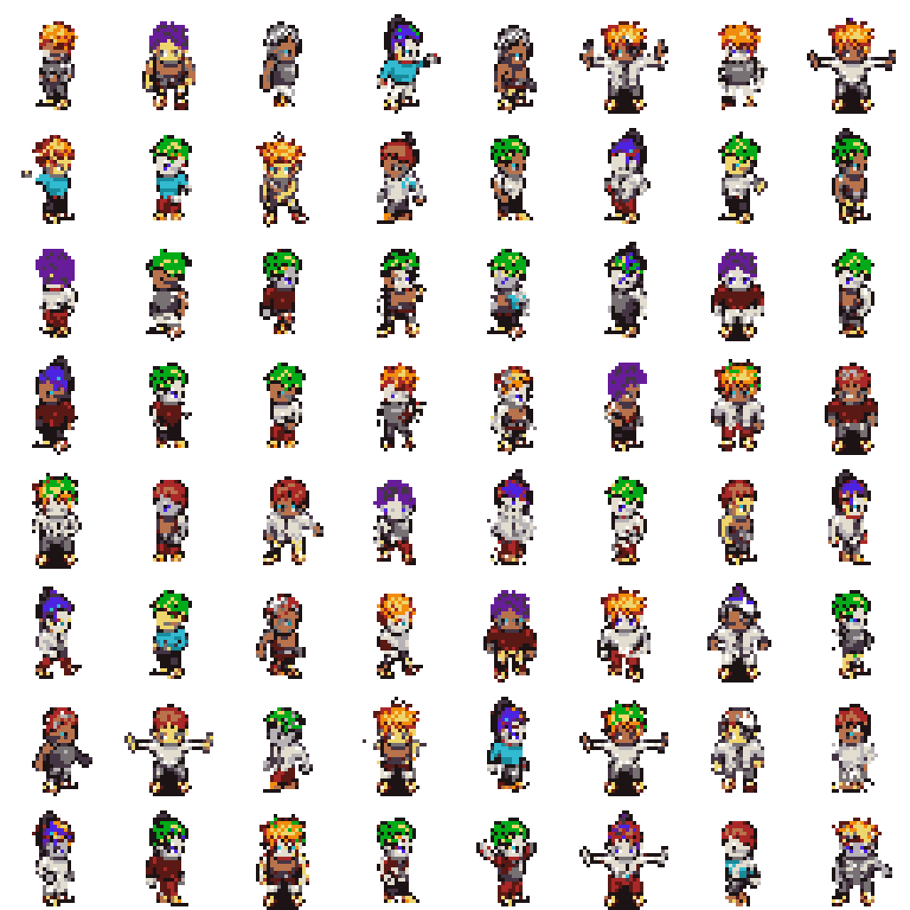
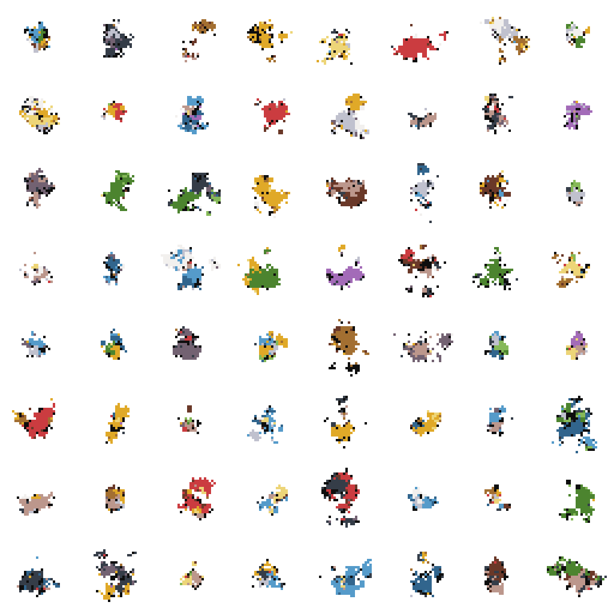
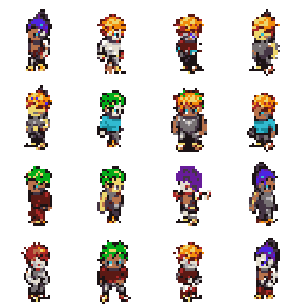
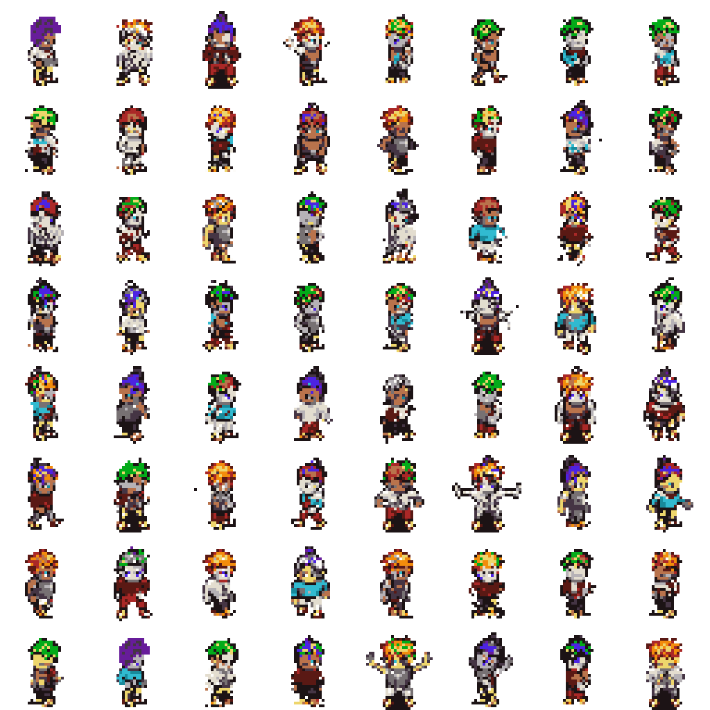
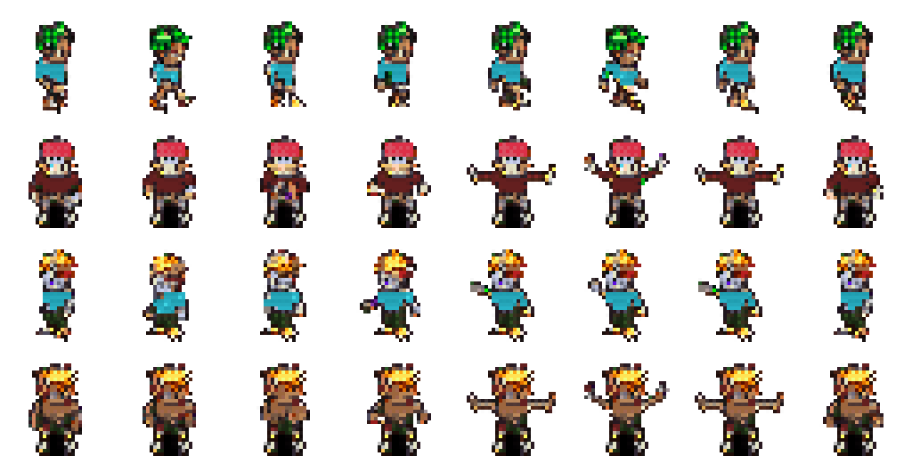
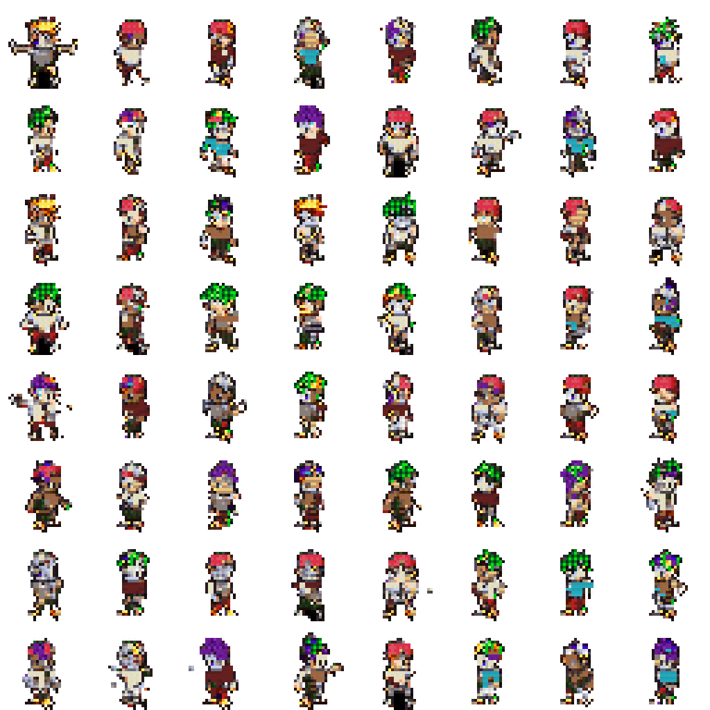
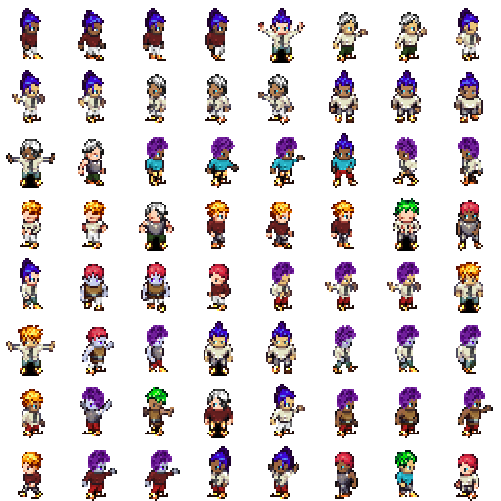

# PixelVAR Option A Progress Report

Date: 2026-06-05

## Summary

The practical Option A mainline is now running end to end on Modal B200:

- deterministic transparent palette-token preprocessing
- group-safe train/val/test splits
- VAR-style scale-wise autoregressive training
- checkpointed training ladder
- sample generation from best checkpoints

The original `brentspell/sprites-dataset` Kaggle page is unavailable. Kaggle API access works for other datasets, but that specific slug returns `403 Forbidden` and the browser page is missing. For the proposal-scale Sprites run, we used `TalBarami/msd_sprites` as the main replacement because it is a live modified variant of the original YingzhenLi Sprites dataset.

## Dataset

Main replacement dataset:

- Source: `TalBarami/msd_sprites`
- Curated frames: `93,312`
- Train: `74,664`
- Val: `9,360`
- Test: `9,288`
- Grouping rule: static character attributes `body`, `bottom`, `top`, `hair`
- Transparency: connected black corner background converted to alpha before palette preprocessing

Processed data check:



## Training Results

| Run | Purpose | Best / final result |
| --- | --- | --- |
| `var_sprites_overfit32` | Memorization gate | final `train_loss=0.04542`, `train_acc=0.98361` |
| `var_sprites_debug1k` | Sanity run | best `val_loss=0.12671`, `val_acc=0.96116` at epoch 90 |
| `var_sprites_v0_full` | Full replacement dataset | best `val_loss=0.01991`, `val_acc=0.99223` at epoch 14 |
| `var_pokemon_v0_full` | Earlier Pokemon baseline | best `val_loss=0.34376`, `val_acc=0.90941` at epoch 31 |

The Sprites full run completed cleanly and saved both `best.ckpt` and `last.ckpt` in the Modal checkpoint volume.

## Evaluation Sweep

Step 2 is complete. The B200 evaluation sweep sampled the Sprites full checkpoint across temperatures `0.6`, `0.8`, `1.0` and top-k values `8`, `16`, `none`, with `128` samples per setting and `2,048` validation sprites as the reference set.

Best setting by the lightweight feature Frechet score:

- Temperature: `0.8`
- Top-k: `8`
- Feature FID-style score: `0.00147`
- Palette consistency: `1.0000`
- Opaque ratio: `0.2291` vs reference `0.2354`
- Edge density: `0.1808` vs reference `0.1811`

Best evaluation grid:


Full evaluation report:

- `reports/eval/sprites_v0_full/evaluation_report.md`
- `reports/eval/sprites_v0_full/metrics.csv`

## Generated Set

Step 3 is complete. Using the selected setting from the evaluation sweep, Modal B200 generated and packaged a larger Sprites sample set:

- Samples: `8,192`
- Temperature: `0.8`
- Top-k: `8`
- Seed: `42`
- Token arrays: `tokens.npy`, shape `(8192, 1365)`, uint8
- Final maps: `index_maps.npy`, shape `(8192, 32, 32)`, uint8
- Inspection PNGs: first `2,048` samples
- Contact sheets: `16`
- Package zip: `reports/generated/sprites_v0_full_t08_top8_8192.zip`

Generated-set summary:

- Opaque ratio mean: `0.2281`
- Opaque ratio std: `0.0317`
- Edge density mean: `0.1808`
- Edge density std: `0.0254`
- Token range: `0` to `16`

First generated-set contact sheet:



Full generated-set report:

- `reports/generated/sprites_v0_full_t08_top8_8192/generation_report.md`
- `reports/generated/sprites_v0_full_t08_top8_8192/summary.json`
- `reports/generated/sprites_v0_full_t08_top8_8192/manifest.json`

## Generated Set Inspection

The generated package was inspected with conservative hard-fail thresholds and a separate top-5% review bucket.

Inspection result:

- Total: `8,192`
- Keep: `7,782`
- Review: `410`
- Reject: `0`
- Largest component ratio mean: `0.9983`
- Component count p95: `3.0`

No hard rejects were found. The review bucket is mostly broad-arm or slightly unusual silhouettes, not obvious failures, so the selected setting is clean enough to scale or use for the next pass.

Random keep grid:



Highest-score review grid:


Inspection artifacts:

- `reports/generated/sprites_v0_full_t08_top8_8192_inspection/inspection_report.md`
- `reports/generated/sprites_v0_full_t08_top8_8192_inspection/inspection_summary.json`
- `reports/generated/sprites_v0_full_t08_top8_8192_inspection/quality_scores.csv`
- `reports/generated/sprites_v0_full_t08_top8_8192_inspection/keep_package.zip`

## Proposal-Scale Generated Set

The selected setting was scaled to the proposal target count on Modal B200.

Generation result:

- Samples: `170,000`
- Temperature: `0.8`
- Top-k: `8`
- Seed: `42`
- Full package zip: `reports/generated/sprites_v0_full_t08_top8_170000.zip`
- Opaque ratio mean: `0.2276`
- Edge density mean: `0.1803`
- Token range: `0` to `16`

Inspection/filter result:

- Keep: `161,479`
- Review: `8,500`
- Reject: `21`
- Keep package zip: `reports/generated/sprites_v0_full_t08_top8_170000_inspection/keep_package.zip`

The hard rejects are mostly samples with extra detached components. The review bucket is mainly unusual wide-arm silhouettes, still mostly usable.

170k keep grid:


170k review grid:


170k reject grid:


170k artifacts:

- `reports/generated/sprites_v0_full_t08_top8_170000/generation_report.md`
- `reports/generated/sprites_v0_full_t08_top8_170000/summary.json`
- `reports/generated/sprites_v0_full_t08_top8_170000/manifest.json`
- `reports/generated/sprites_v0_full_t08_top8_170000_inspection/inspection_report.md`
- `reports/generated/sprites_v0_full_t08_top8_170000_inspection/inspection_summary.json`
- `reports/generated/sprites_v0_full_t08_top8_170000_inspection/quality_scores.csv`

## Samples

Sprites full model, `temperature=0.8`, `top_k=16`:



Pokemon full model, `temperature=0.8`, `top_k=16`:



## Artifacts

Sample images:

- `reports/assets/sprites_v0_full_best_t08_top16.png`
- `reports/assets/sprites_eval_temp_0.8_topk_8_grid.png`
- `reports/assets/sprites_generated_t08_top8_8192_grid_000.png`
- `reports/assets/sprites_inspection_keep_random.png`
- `reports/assets/sprites_inspection_review_highest_score.png`
- `reports/assets/sprites_generated_t08_top8_170000_grid_000.png`
- `reports/assets/sprites_170k_inspection_keep_random.png`
- `reports/assets/sprites_170k_inspection_review_highest_score.png`
- `reports/assets/sprites_170k_inspection_rejects.png`
- `reports/assets/pokemon_v0_full_best_t08_top16.png`
- `reports/assets/sprites_data_check_grid.png`

Metrics CSVs:

- `reports/metrics/var_sprites_overfit32_metrics.csv`
- `reports/metrics/var_sprites_debug1k_metrics.csv`
- `reports/metrics/var_sprites_v0_full_version_0_metrics.csv`
- `reports/metrics/var_sprites_v0_full_version_1_metrics.csv`
- `reports/metrics/var_pokemon_v0_full_metrics.csv`

Local checkpoint copy:

- `modal_checkpoints/var_sprites_v0_full_best.ckpt`

Modal checkpoint path:

- `checkpoints/var_sprites_v0_full/best.ckpt`

## Reproduction Commands

Prepare the MSD Sprites replacement:

```bash
python -m modal run modal_train.py --action prepare-sprites
```

Run the training ladder:

```bash
python -m modal run modal_train.py --action train-sprites-overfit32
python -m modal run modal_train.py --action train-sprites-debug1k
python -m modal run modal_train.py --action train-sprites-v0-full
```

Run the evaluation sweep:

```bash
python -m modal run modal_train.py --action eval-sprites
```

Generate the selected-setting package:

```bash
python -m modal run modal_train.py --action generate-sprites-selected
python -m modal run modal_train.py --action generate-sprites-selected --num-samples 170000
```

Inspect/filter the generated package after downloading it:

```bash
python scripts/inspect_generated_set.py \
  --generated-dir modal_outputs/generated/sprites_v0_full_t08_top8_8192 \
  --output-dir reports/generated/sprites_v0_full_t08_top8_8192_inspection \
  --palette data/processed/sprites/palette.json \
  --reference-summary reports/eval/sprites_v0_full/reference_summary.json \
  --write-keep-package
```

Prepare and train the generated-keep dataset on Modal:

```bash
python -m modal run modal_train.py --action prepare-sprites-generated-keep --num-samples 170000
python -m modal run modal_train.py --action train-sprites-generated-keep-overfit32
python -m modal run modal_train.py --action train-sprites-generated-keep-debug1k
python -m modal run modal_train.py --action train-sprites-generated-keep-v0-full
python -m modal run modal_train.py --action sample \
  --config configs/train/sprites_generated_keep_v0_full.yaml \
  --checkpoint checkpoints/var_sprites_generated_keep_v0_full/best.ckpt \
  --num-samples 64 \
  --temperature 0.8 \
  --top-k 8 \
  --output outputs/samples/sprites_generated_keep_v0_full_t08_top8.png
python -m modal run modal_train.py --action eval-sprites \
  --config configs/train/sprites_generated_keep_v0_full.yaml \
  --checkpoint checkpoints/var_sprites_generated_keep_v0_full/best.ckpt \
  --output outputs/eval/sprites_generated_keep_v0_full \
  --num-samples 128
```

Generate the sample grid:

```bash
python -m modal run modal_train.py --action sample \
  --config configs/train/sprites_v0_full.yaml \
  --checkpoint checkpoints/var_sprites_v0_full/best.ckpt \
  --num-samples 64 \
  --temperature 0.8 \
  --top-k 16 \
  --output outputs/samples/sprites_v0_full_best_t08_top16.png
```

Download key artifacts:

```bash
python -m modal volume get pixelvar-outputs /samples/sprites_v0_full_best_t08_top16.png modal_outputs/samples/sprites_v0_full_best_t08_top16.png --force
mkdir -p modal_outputs/eval
python -m modal volume get pixelvar-outputs eval/sprites_v0_full modal_outputs/eval --force
mkdir -p modal_outputs/generated
python -m modal volume get pixelvar-outputs generated/sprites_v0_full_t08_top8_8192 modal_outputs/generated --force
python -m modal volume get pixelvar-outputs generated/sprites_v0_full_t08_top8_8192.zip modal_outputs/generated/sprites_v0_full_t08_top8_8192.zip --force
python -m modal volume get pixelvar-outputs generated/sprites_v0_full_t08_top8_170000.zip modal_outputs/generated/sprites_v0_full_t08_top8_170000.zip --force
python -m modal volume get pixelvar-checkpoints /var_sprites_v0_full/best.ckpt modal_checkpoints/var_sprites_v0_full_best.ckpt --force
```

## Generated-Keep Training Pass

The clean 170k keep package was imported into the Modal data volume as a normal processed dataset:

- Dataset: `data/processed/sprites_generated_keep_170k`
- Samples: `161,479`
- Train: `129,183`
- Val: `16,148`
- Test: `16,148`
- Data check: passed

Training ladder:

| Run | Purpose | Best / final result |
| --- | --- | --- |
| `var_sprites_generated_keep_overfit32` | Memorization gate | final `train_loss=0.01814`, `train_acc=0.99528` |
| `var_sprites_generated_keep_debug1k` | Sanity run | best `val_loss=0.15800`, `val_acc=0.95091` at epoch 95 |
| `var_sprites_generated_keep_v0_full` | Full generated-keep pass | best `val_loss=0.06441`, `val_acc=0.97924` at epoch 18 |

Evaluation sweep for `var_sprites_generated_keep_v0_full` again selected `temperature=0.8`, `top_k=8`:

- Feature FID-style score: `0.00157`
- Palette consistency: `1.0000`
- Opaque ratio: `0.2181` vs generated-keep validation `0.2241`
- Edge density: `0.1761` vs generated-keep validation `0.1772`

Generated-keep full model samples:


Generated-keep data check:



Generated-keep artifacts:

- `reports/eval/sprites_generated_keep_v0_full/evaluation_report.md`
- `reports/eval/sprites_generated_keep_v0_full/metrics.csv`
- `reports/metrics/var_sprites_generated_keep_overfit32_metrics.csv`
- `reports/metrics/var_sprites_generated_keep_debug1k_metrics.csv`
- `reports/metrics/var_sprites_generated_keep_v0_full_metrics.csv`
- `modal_checkpoints/var_sprites_generated_keep_v0_full_best.ckpt`

## Mixed Real + Generated Training Pass

The real MSD Sprites dataset and the clean generated-keep set were mixed into a standard processed dataset:

- Dataset: `data/processed/sprites_mixed_real_generated`
- Sources: `93,312` real Sprites + `161,479` generated-keep
- Total: `254,791`
- Train: `203,847`
- Val: `25,508`
- Test: `25,436`
- Data check: passed

Training ladder:

| Run | Purpose | Best / final result |
| --- | --- | --- |
| `var_sprites_mixed_overfit32` | Memorization gate | final `train_loss=0.00681`, `train_acc=0.99654` |
| `var_sprites_mixed_debug1k` | Sanity run | best `val_loss=0.12671`, `val_acc=0.96116` at epoch 90 |
| `var_sprites_mixed_v0_full` | Full mixed pass, resumed | best `val_loss=0.05028`, `val_acc=0.98388` at epoch 14 |

The full mixed run was interrupted once by the local 2-hour command limit after epoch 3, then resumed from `last.ckpt` after the Modal spend limit was raised. The resumed run finished with final `train_loss=0.04698`, `train_acc=0.98412`, `val_loss=0.05030`, and `val_acc=0.98394`.

Real-validation evaluation for the resumed mixed checkpoint:

- Best setting by the lightweight feature score: `temperature=0.8`, `top_k=8`
- Feature FID-style score: `0.00755`
- Palette consistency: `1.0000`
- Opaque ratio: `0.2220` vs real validation `0.2354`
- Edge density: `0.1797` vs real validation `0.1811`

This is still worse than the real-only checkpoint on the same metric (`0.00147`), so the real-only checkpoint remains the current best model. The mixed pass is structurally working and trains cleanly, but this mixture did not improve sample-quality metrics.

Mixed resumed model samples:


Mixed data check:


Mixed artifacts:

- `reports/eval/sprites_mixed_v0_full_realval/evaluation_report.md`
- `reports/eval/sprites_mixed_v0_full_realval/metrics.csv`
- `reports/metrics/var_sprites_mixed_overfit32_metrics.csv`
- `reports/metrics/var_sprites_mixed_debug1k_metrics.csv`
- `reports/metrics/var_sprites_mixed_v0_full_partial_metrics.csv`
- `reports/metrics/var_sprites_mixed_v0_full_resumed_metrics.csv`
- `modal_checkpoints/var_sprites_mixed_v0_full_best.ckpt`

## OpenGameArt Multi-Dataset Stretch Pass

The OpenGameArt stretch path is now reproducible without manual upload. The
public curation script downloads a small set of character-focused OpenGameArt
assets, records source/license metadata, slices sheets into sprite frames, and
quantizes the result through the existing Sprites palette so it can be mixed
with the current processed datasets.

OpenGameArt curated dataset:

- Frames: `4,659`
- Groups: `105`
- Train: `3,493`
- Val: `502`
- Test: `664`
- Sources: `7` public OpenGameArt assets, mostly `CC0`
- Data check: passed

The combined processed dataset adds OpenGameArt to the previous real +
generated-keep mixture:

- Dataset: `data/processed/sprites_mixed_real_generated_opengameart`
- Sources: `93,312` real Sprites + `161,479` generated-keep + `4,659` OpenGameArt
- Total: `259,450`
- Train: `207,340`
- Val: `26,010`
- Test: `26,100`
- Data check: passed

Training ladder:

| Run | Purpose | Best / final result |
| --- | --- | --- |
| `var_sprites_mixed_oga_overfit32` | Memorization gate | final `train_loss=0.007`, `train_acc=0.997` |
| `var_sprites_mixed_oga_debug1k` | Sanity run | final `val_loss=0.127`, `val_acc=0.961` |
| `var_sprites_mixed_oga_v0_full` | Full OpenGameArt-mixed pass, resumed | best `val_loss=0.05408`, `val_acc=0.98295` at epoch 14 |

The full run was interrupted once after checkpoints were written, then resumed
from `last.ckpt`. The resumed run stopped after epoch 16 with final
`train_loss=0.04828`, `train_acc=0.98371`, `val_loss=0.05452`, and
`val_acc=0.98302`.

Real-validation evaluation for the OpenGameArt-mixed checkpoint:

- Best setting by the lightweight feature score: `temperature=0.8`, `top_k=8`
- Feature FID-style score: `0.00778`
- Palette consistency: `1.0000`
- Opaque ratio: `0.2200` vs real validation `0.2354`
- Edge density: `0.1777` vs real validation `0.1811`

This is slightly worse than the previous mixed checkpoint (`0.00755`) and still
worse than the real-only checkpoint (`0.00147`). OpenGameArt/multi-dataset
training is now implemented and working, but it should remain a stretch result.
The real-only checkpoint remains the main Option A model.

OpenGameArt-mixed samples:


OpenGameArt data check:


OpenGameArt-mixed data check:


OpenGameArt-mixed evaluation best grid:



OpenGameArt artifacts:

- `reports/eval/sprites_mixed_oga_v0_full_realval/evaluation_report.md`
- `reports/eval/sprites_mixed_oga_v0_full_realval/metrics.csv`
- `reports/metrics/var_sprites_mixed_oga_overfit32_metrics.csv`
- `reports/metrics/var_sprites_mixed_oga_debug1k_metrics.csv`
- `reports/metrics/var_sprites_mixed_oga_v0_full_partial_metrics.csv`
- `reports/metrics/var_sprites_mixed_oga_v0_full_resumed_metrics.csv`
- `reports/metadata/opengameart_source_manifest.json`
- `reports/metadata/opengameart_curated_manifest.json`
- `modal_checkpoints/var_sprites_mixed_oga_v0_full_best.ckpt`

## Learned Tokenizer Stretch Pass

A neural VQ-VAE tokenizer path was implemented, but its initial gate failed the
quality bar for pixel art. Both `8x8` and `16x16` neural VQ-VAE variants
reconstructed recognizable silhouettes, but they were visibly soft/ghosted and
used too few codes. The branch was therefore not promoted to full training.

To keep the learned-token proposal moving, a crisper patch-VQ tokenizer was
added and trained instead. It learns a `512`-entry vector-quantized codebook over
non-overlapping `2x2` RGBA patches and exports each `32x32` sprite as a `16x16`
learned-code map. The existing VAR can then model a `[1, 2, 4, 8, 16]` pyramid
over those learned code IDs.

Patch-VQ tokenizer:

- Dataset: `data/processed/sprites_patchvq16`
- Source: real MSD Sprites
- Token map shape: `(93,312, 16, 16)`
- Vocab size: `512`
- Used codes: `143/512`
- Train: `74,664`
- Val: `9,360`
- Test: `9,288`
- Data check: passed

Patch-VQ reconstruction grid:



Patch-VQ reconstruction comparison:


VAR-on-patch-VQ training ladder:

| Run | Purpose | Best / final result |
| --- | --- | --- |
| `var_sprites_patchvq16_overfit32` | Memorization gate | final `train_loss=0.03602`, `train_acc=0.98424` |
| `var_sprites_patchvq16_debug1k` | Sanity run | final `val_loss=0.66786`, `val_acc=0.83437` |
| `var_sprites_patchvq16_v0_full` | Full learned-token run | best `val_loss=0.10122`, `val_acc=0.96905` at epoch 31 |

Decoded patch-VQ VAR samples at `temperature=0.8`, `top_k=32`:



Decoded image-space patch-VQ sweep:

| Temperature | Top-k | Feature score | Opaque ratio | Alpha edge | RGB edge | Color entropy |
| --- | ---: | ---: | ---: | ---: | ---: | ---: |
| reference | - | - | `0.2354` | `0.0487` | `0.1386` | `3.2931` |
| `1.0` | `16` | `0.04689` | `0.2364` | `0.0526` | `0.1348` | `3.4266` |
| `1.0` | `64` | `0.05271` | `0.2361` | `0.0524` | `0.1360` | `3.4488` |
| `1.0` | `32` | `0.05403` | `0.2337` | `0.0519` | `0.1351` | `3.4667` |
| `0.8` | `32` | `0.06289` | `0.2240` | `0.0500` | `0.1290` | `3.4780` |

Best decoded patch-VQ sweep grid at `temperature=1.0`, `top_k=16`:


Reference grid used by the decoded evaluator:



The decoded sweep changed the preferred sampling setting from the earlier
`temperature=0.8`, `top_k=32` grid to `temperature=1.0`, `top_k=16`. Lower
temperature underfilled sprites relative to the real validation set, while
`1.0/top16` matched the opaque-pixel ratio almost exactly. The remaining gap is
visual quality: silhouettes are recognizable, but the decoded sprites are still
blocky, style-biased, and slightly noisy.

This branch is technically successful: learned token export works, the VAR
trains cleanly on learned tokens, and decoded samples are coherent. It is not
yet better than the palette-token mainline. Samples are crisper than the neural
VQ-VAE gate but more blocky and less rich than the best real-only palette-token
model.

Learned-token artifacts:

- `reports/metrics/var_sprites_patchvq16_overfit32_metrics.csv`
- `reports/metrics/var_sprites_patchvq16_debug1k_metrics.csv`
- `reports/metrics/var_sprites_patchvq16_v0_full_metrics.csv`
- `reports/eval/sprites_patchvq16_decoded/evaluation_report.md`
- `reports/eval/sprites_patchvq16_decoded/metrics.csv`
- `reports/metadata/sprites_patchvq16_codebook_usage.json`
- `modal_checkpoints/var_sprites_patchvq16_v0_full_best.ckpt`

## HMAR Masked Refinement Stretch Pass

The proposal's HMAR/MaskGIT-style Option B was implemented as a separate
masked-refinement branch over the existing deterministic palette tokens. It
keeps the same coarse-to-fine scale order as VAR, but within each scale the
target tokens are masked with reserved token `17`, predicted in parallel, and
sampled through iterative confidence-based unmasking. Training uses random
intra-scale masks plus some fully masked targets; validation masks the whole
target scale to test generation from coarser context.

HMAR training ladder:

| Run | Purpose | Best / final result |
| --- | --- | --- |
| `hmar_sprites_overfit32` | Memorization gate | final `train_loss=0.02308`, `train_acc=0.98925` |
| `hmar_sprites_debug1k` | Sanity run | final `val_loss=0.14522`, `val_acc=0.95268` |
| `hmar_sprites_v0_full` | Full HMAR run | early stopped at epoch 13 with `val_loss=0.02025`, `val_acc=0.99216` |

HMAR refinement-step ablation against the same real-validation metric:

| Model | Refinement steps | Temperature | Top-k | Feature score | Opaque ratio | Edge density |
| --- | ---: | ---: | ---: | ---: | ---: | ---: |
| VAR baseline | - | `0.8` | `8` | `0.00147` | `0.2291` | `0.1808` |
| HMAR | `1` | `0.8` | `8` | `0.00189` | `0.2315` | `0.1833` |
| HMAR | `4` | `0.8` | `16` | `0.00366` | `0.2264` | `0.1823` |
| HMAR | `2` | `0.8` | `16` | `0.00374` | `0.2297` | `0.1831` |
| HMAR | `8` | `1.0` | `none` | `0.00822` | `0.2191` | `0.1747` |

Best HMAR ablation grid at `temperature=0.8`, `top_k=8`, `1` refinement step:


HMAR is a successful implementation and training pass, but it is not promoted
over the real-only VAR baseline. It learns the token distribution very well and
produces crisp, coherent sprites, but the shared evaluator still prefers
`var_sprites_v0_full`. The ablation also argues against extra iterative
refinement in this low-resolution palette-token setup: `1` step is best, while
`8` steps underfill sprites and moves farther from the validation statistics.

HMAR artifacts:

- `reports/metrics/hmar_sprites_overfit32_metrics.csv`
- `reports/metrics/hmar_sprites_debug1k_metrics.csv`
- `reports/metrics/hmar_sprites_v0_full_metrics.csv`
- `reports/eval/hmar_sprites_v0_full/evaluation_report.md`
- `reports/eval/hmar_sprites_v0_full/metrics.csv`
- `reports/eval/hmar_sprites_refinement_ablation/steps_1/metrics.csv`
- `reports/eval/hmar_sprites_refinement_ablation/steps_2/metrics.csv`
- `reports/eval/hmar_sprites_refinement_ablation/steps_4/metrics.csv`
- `reports/eval/hmar_sprites_refinement_ablation/steps_8/metrics.csv`
- `modal_checkpoints/hmar_sprites_v0_full_best.ckpt`

## Final Model Decision

The final model decision table and sample sheets have been consolidated under
`reports/final/`.

Final ranking summary:

| Rank | Branch | Best score | Setting | Directly comparable to main | Decision |
| ---: | --- | ---: | --- | --- | --- |
| 1 | Real-only VAR | `0.00147` | `temp=0.8`, `top_k=8` | yes | main result |
| 2 | HMAR masked refinement | `0.00189` | `steps=1`, `temp=0.8`, `top_k=8` | yes | ablation only |
| 3 | Generated-keep VAR | `0.00157` | `temp=0.8`, `top_k=8` | no | ablation only |
| 4 | Real + generated mixed VAR | `0.00755` | `temp=0.8`, `top_k=8` | yes | ablation only |
| 5 | OpenGameArt-mixed VAR | `0.00778` | `temp=0.8`, `top_k=8` | yes | ablation only |
| 6 | Patch-VQ VAR | `0.04689` | `temp=1.0`, `top_k=16` | no | learned-token ablation only |

The generated-keep and patch-VQ scores are included for completeness, but they
are not direct winner comparisons. Generated-keep was evaluated against its own
generated-validation reference, and patch-VQ uses a decoded RGBA feature score
rather than the palette-token real-validation score.

Final artifacts:

- `reports/final/final_report_narrative.md`
- `reports/final/reproducibility_commands.md`
- `reports/final/external_baseline_and_metrics_plan.md`
- `reports/final/known_metrics_comparison.md`
- `reports/final/memorization_audit_summary.md`
- `reports/final/four_way_sample_sheet.png`
- `reports/memorization_audit/flat_ar/audit_report.md`
- `reports/final/model_decision_table.md`
- `reports/final/model_decision_table.csv`
- `reports/final/final_branch_comparison_sheet.png`
- `reports/final/final_main_var_sample_sheet.png`
- `reports/final/final_hmar_sample_sheet.png`
- `reports/final/final_patchvq_sample_sheet.png`

Final branch comparison sheet:


Main result sample sheet:


## Next Work

The OpenGameArt, learned-token, and HMAR stretch passes did not beat the
real-only checkpoint, so `var_sprites_v0_full` remains the main Option A
result. The remaining proposal-aligned work is final report narrative,
reproducibility command packaging, and optional baseline/user-study preparation.
A second learned-token iteration with a stronger neural decoder/codebook
objective is still possible, but it is now optional experimentation rather than
the main path.
